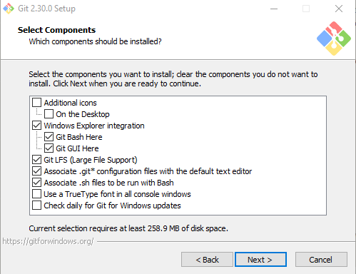
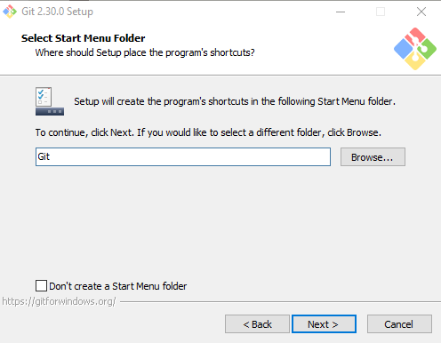
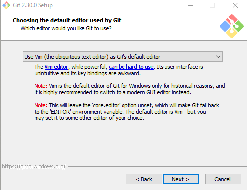
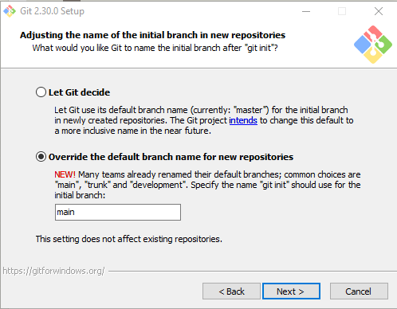
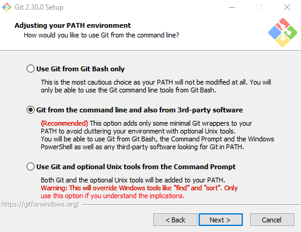
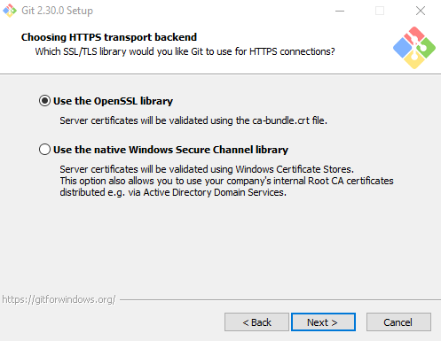
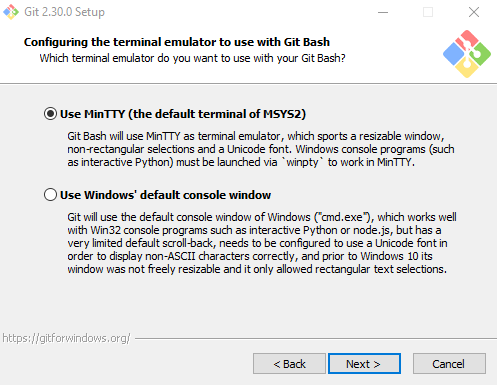
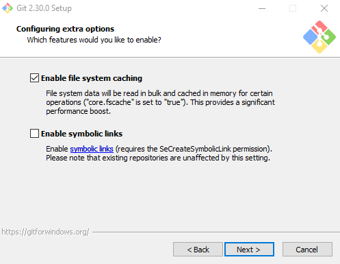

```{r setup, include=FALSE}
knitr::opts_chunk$set(echo = TRUE)
```

<br>

# Installation notes

Here are some tips for installing Git in Windows. You can find the most recent version of the software [here](https://git-scm.com/download/win). The following screenshots show the options I recommend selecting during the installation process.

After agreeing to the terms of service, click **Next**.

### Select components



<br>

### Select Start Menu Folder



<br>

### Choosing the default editor



<br>

### Adjusting the name of the initial branch



<br>

### Adjusting your PATH Environment



<br>

### Choosing HTTPS transport backend



<br>

### Configuring the terminal emulator



<br>

### Choose the default behavior of git pull


<br>

### Choose a credential helper


<br>

### Configuring extra options



<br>

### Configuring experimental options


<br>


