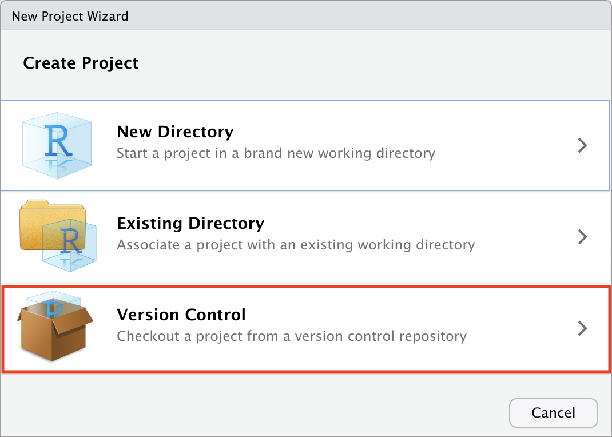
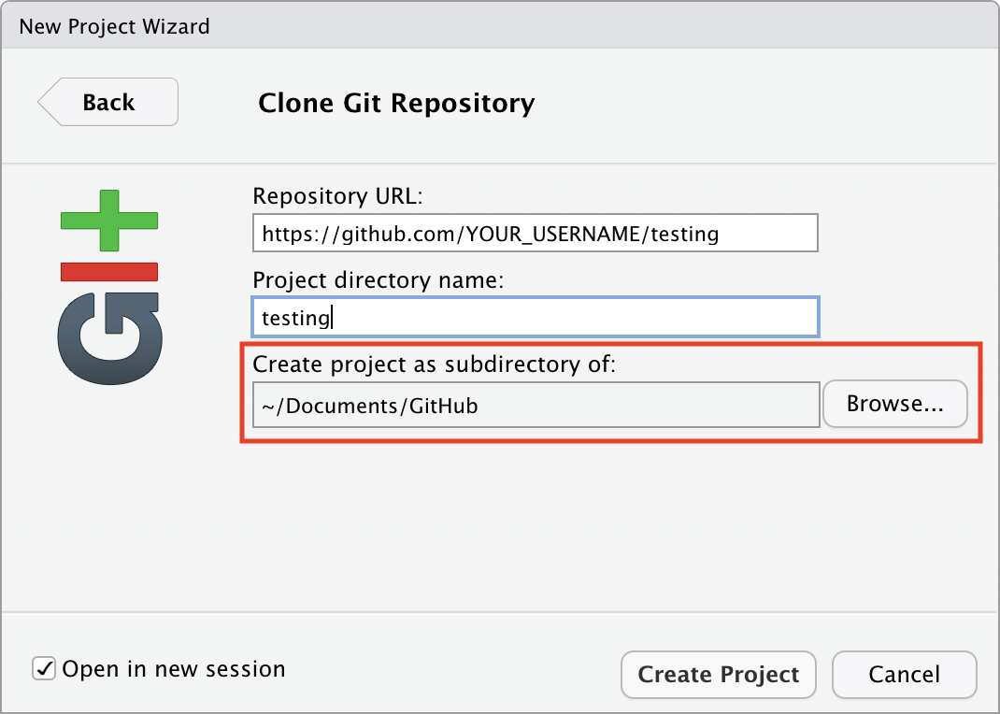
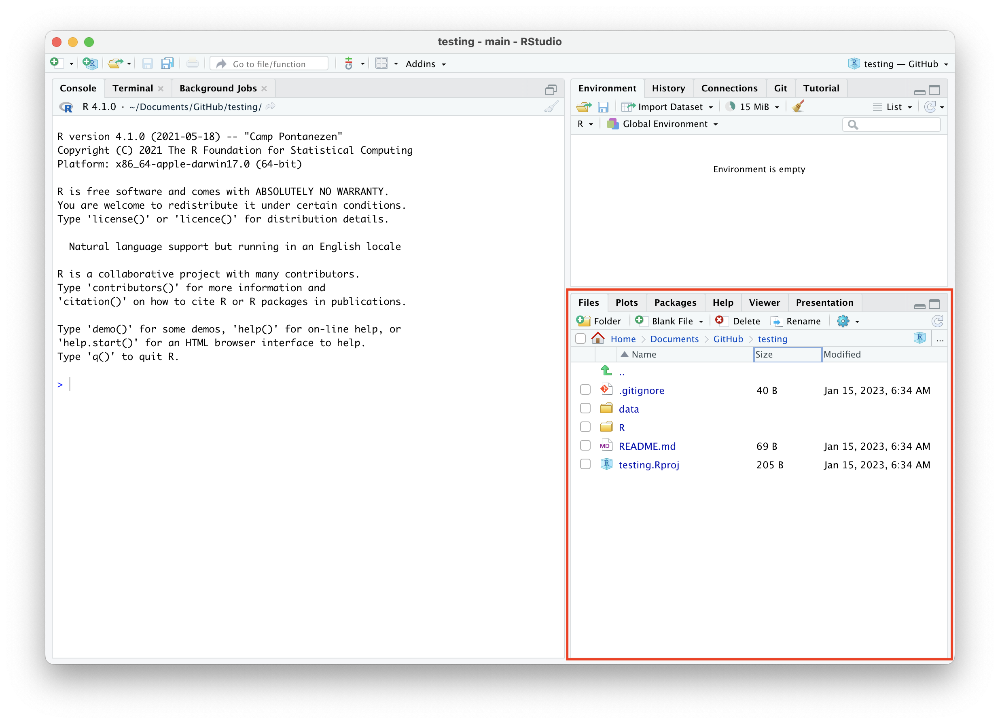
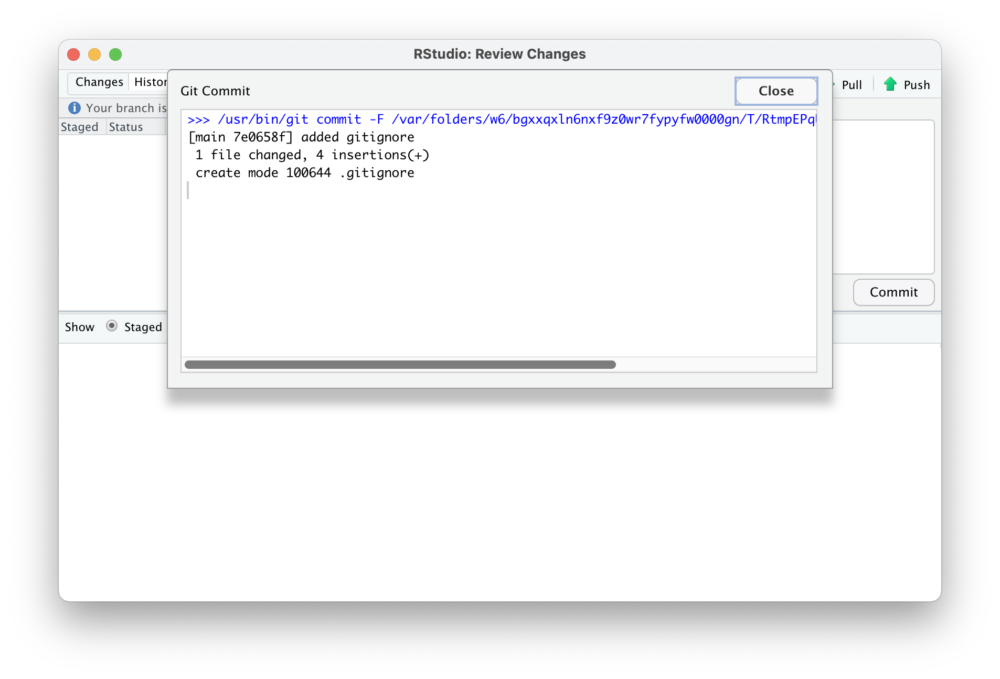
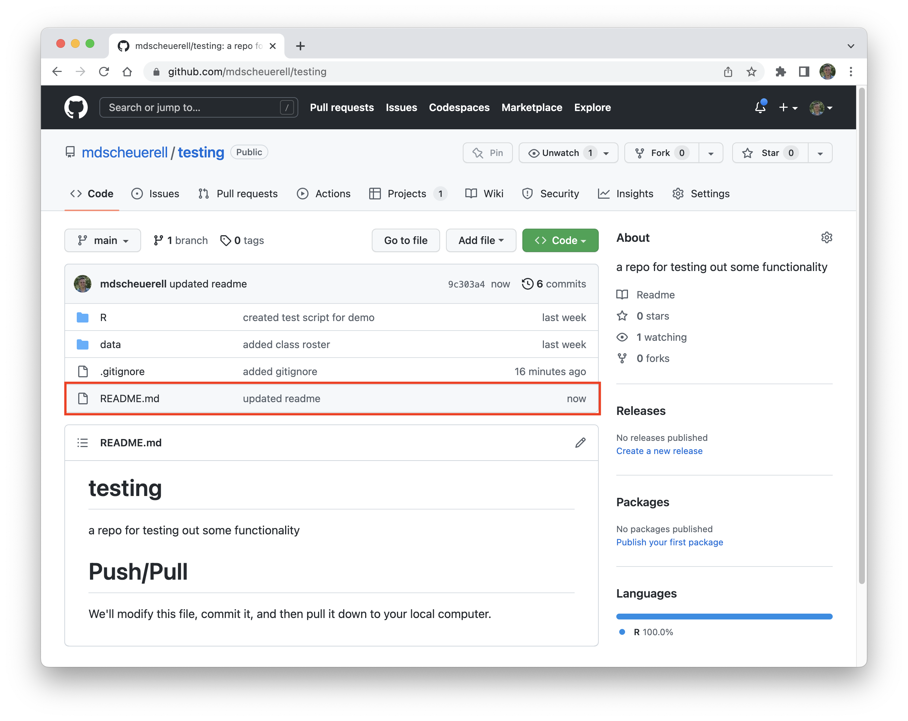
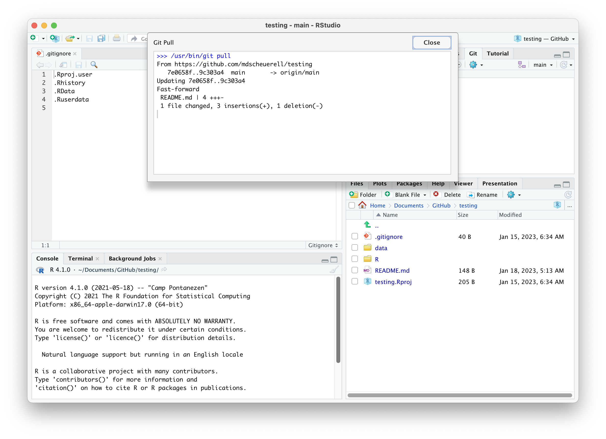

```{r setup, include=FALSE}
knitr::opts_chunk$set(echo = TRUE)
```

<br>

# Remote repositories

Remote repositories like GitHub allow you to store you code, data, and other information in a convenient online location. However, most of the time you will want to work on your personal computer and take advantage of a nicer programming interface, or so-called *integrated development environment* (IDE) like **RStudio**. Using remotes also allows for easier collaboration among people working in different places. This lesson will introduce you to working with remote repositories and show how to move your files back and forth from the cloud to a local computer. In general, our model for this process looks something like this.


***

# Create a project in **RStudio**

There are several ways to connect a remote repository to your local computer. Here we will see how to do so from within **RStudio**. **RStudio** provides a nice interface for using Git for version control via "Projects". Note that these are different than the [GitHub Projects we learned about here](https://fish497.github.io/website/lectures/week_02/lec_04_intro_github.html#Projects).

1. Navigate to the **testing** repo we created on GitHub in the lesson on [Intro to GitHub](https://fish497.github.io/website/lectures/week_02/lec_04_intro_github.html). Highlight and copy the full URL from your browser's address bar.


2. Start **RStudio**

3. Select *File* --> *New Project...*, which will bring up a dialogue box.

4. Select **Version Control**



<br>

5. Select **Git**


<br>

6. In the **Repository URL** box, copy/paste the full repo address from GitHub (note that `YOUR_USERNAME` in the location below should be *your* **GitHub** user name):


<br>

7. Tab to the next box **Project directory name**, which should auto-fill with the repo name `testing`.

8. Select the directory location where you'd like this to live. I **strongly** suggest choosing a location that is not under some other version control software such as **Dropbox**.



<br>

9. Check the box in the lower left that says "Open in new session" and then click on the **Create Project** button.


<br>

10. **RStudio** will open a new instance with all of the project files listed. You are now ready to do work with your project in **RStudio**. (Note that the files shown in your project may look different than the image below.)


***

# Working on remotes from RStudio

There are several things to note here in **RStudio** (note that your views may differ depending on how you have the window panes set up). In the **Files** tab, you should see a `README.md` file plus the **R** and **data** folders we that we previously created from within GitHub. In addition, you should see a `.gitignore` and a `testing.Rproj` file.



<br> 

Click on the `.gitignore` file to display its contents in the code pane. You should see 4 file extensions listed there:

```
.Rproj.user
.Rhistory
.RData
.Ruserdata
```


<br>

This `.gitignore` file contains information about the things that you **don't** want **Git** to pay attention to when tracking different versions of your files and folder contents. For example, some people want to exclude `.html` files that are generated by `.Rmd` source files, or environment files unique to **R** and **RStudio**. You can see a list of common options for **R** [here](https://github.com/github/gitignore/blob/master/R.gitignore).

***

# Using Git from RStudio

Now locate the **Git** tab in the pane with other tabs for **Environment**, **History**, etc. and click on it. You should see both the `.gitignore` and `testing.Rproj` files listed there with an empty box and 2 yellow question marks to the left of each of their names. This is the **Git** staging area and **Git** shows these 2 files as new (i.e., it's a graphical means for showing the results of `git status`).


<br>

## Add a file to staging

Go ahead and click the check box in the column marked "Staged" to the left of the `.gitignore` file and you will see that a green **A** appears in the column marked "Status". This is equivalent to typing `git add .gitignore` via command-line **Git**.


## Commit a file

Now click on the "Commit" button just above the file name, which will bring up a new commit window.


<br>


<br>

There are several important things to pay attention to here. The first is the menu bar across the top, which has buttons for "Changes" and "History" in the upper left, and "Pull" and "Push" in the upper right. At the moment, the "Changes" button is active, so you can see the contents of the `.gitignore` file displayed below in green. In this case, the file is brand new to **Git**, so everything is highlighted in green. Later you will see how this changes.


<br>

Now go ahead and click on the "History" button just to the left of the "Changes" button, which will bring up a log of your commit history. In the example below, the last file committed was `ex_data.csv` that we had previously created and committed directly from **GitHub**. You can see information about the the commit author, the date, and the first 7 characters from the unique commit SHA.


<br>

Now click back on the "Changes" tab and type a *short but informative* commit message in the box in the upper right. When you are finished, click the **Commit** button in the lower right. This is the equivalent of typing `git commit -m "added gitignore"` via command-line **Git**.


<br>

**RStudio** now pops open a commit window that displays the commit command and the top and the resulting reply from **Git**:

```
[main d20897b] added gitignore
 1 file changed, 4 insertions(+)
 create mode 100644 .gitignore
```



<br>

Go ahead and click the "Close" button in the upper right, which will return you to the main commit window. Close that window, which will return you to the main **RStudio** viewer. Note that now the `.gitignore` file has disappeared from the **Git** tab, and only the `testing.Rproj` file remains.


<br>

# Pushing to GitHub

Now that we've committed our `.gitignore` file to history, we can *push* it up to our remote repo on **GitHub**. To do so in **RStudio**, you click on the green up arrow.


<br>

Now you will see a smaller **Git Push** window with the following information from **Git**.

```
>>> /usr/bin/git push origin HEAD:refs/heads/main
To https://github.com/mdscheuerell/testing
   226daed..d20897b  HEAD -> main
```

The first line is the actual **Git** command for pushing to a remote repo, and the second and third lines are the results of that command.


<br>

You've now successfully pushed a change on your local computer to your remote repo on **GitHub**.

## Personal access token (PAT)

Assuming this is your first time working with a remote repo on **GitHub**, you were very likely to have been asked to enter your password when attempting to push from your local computer up to **GitHub**. There's a good

## Viewing your changes on GitHub

You can now check to see that your committed `.gitignore` file was indeed pushed up to **GitHub**. Switch over to your browser and navigate back to the **testing** repo at `https://github.com/YOUR-USER-NAME/testing`. You will now see the `.gitignore` file listed along with the `README.md` file and the other folders. Next to the file name, you will also see the commit message you used and a time stamp for how long ago you made the commit and push. (Note: if you don't see the file, try refreshing the view on your browser.)


<br>

***

# Pulling from GitHub

Now let's see how to *pull* changes from a remote repo to your local computer. To do so, we'll make some changes to our `README.md` file on **GitHub**, commit them, and then pull them down. Go ahead and click on the pencil icon in the upper right to edit the `README.md` file, which will bring up the editing window.


<br>

Make a few changes to the file and then scroll down to the bottom where you can commit those changes.

<br>


<br>

Type a *short but informative* commit message and press the green **Commit changes** button.


<br>

Click on either the **testing** link or eh **Code** tab to return to the main repo. Here you will see the commit message and time stamp of your newly changed file, as well as its contents.



<br>

Now return to **RStudio** and look in the **Git** tab for the blue downward arrow. This is how you *pull* files from your remote repo to your local project.


<br>

Go ahead and click on the pull arrow, which will open up a **Git Pull** window with the following information (note that the alpa-numeric codes on the 3rd and 4th lines will likely differ from your output):

```
>>> /usr/bin/git pull
From https://github.com/mdscheuerell/testing
   d20897b..4222226  main       -> origin/main
Updating d20897b..4222226
Fast-forward
 README.md | 10 +++-------
 1 file changed, 3 insertions(+), 7 deletions(-)
```

The first line is the actual **Git** command and the remaining lines are what **Git** is reporting back from `git pull`, including the file name and its contents.



<br>

Go ahead and close this window and then click on the `README.md` file in the **File** viewer, which will display its contents in an editing window. Notice that it reflects the recent changes you made to the file from **GitHub**


<br>

# Workflow notes

## Begin by pulling

Proper version control requires you to keep all of your local and remote repositories synced with one another. Thus, whenever you begin working on a project in **RStudio** (or elsewhere, for that matter), you should ***always begin by pulling any changes from your remote repo into your RStudio project***.

## End with pushing

Similarly, when you are finished editing all of your local files, you should ***always end by committing those changes and pushing them up to your remote repo***.


 


