```{r setup, include=FALSE}
knitr::opts_chunk$set(echo = TRUE)
```

<br>

# Background

This document demonstrates some of the workflows we saw in class [here](https://fish497.github.io/website/lectures/week_03/lec_08_workflows.html). All of these workflows have some pros and cons. It's up to you and your team as to which one you adopt. Also note that your preferences might change, depending on the composition of your team and the task at hand.

***

# Centralized workflow

A centralized workflow uses a single repo for all changes to the project. All team members pull from and push to the same repo.

Imagine John sits down to work on his new **testing** project that Mary and Sam have been working on as well. The first thing John does is **pull** from the remote repository.


<br>

Everything is up to date, so John works on the **R** script for doing some simple math operations. He adds 2 lines to the script to demonstrate a subtraction operation, and then saves his changes.

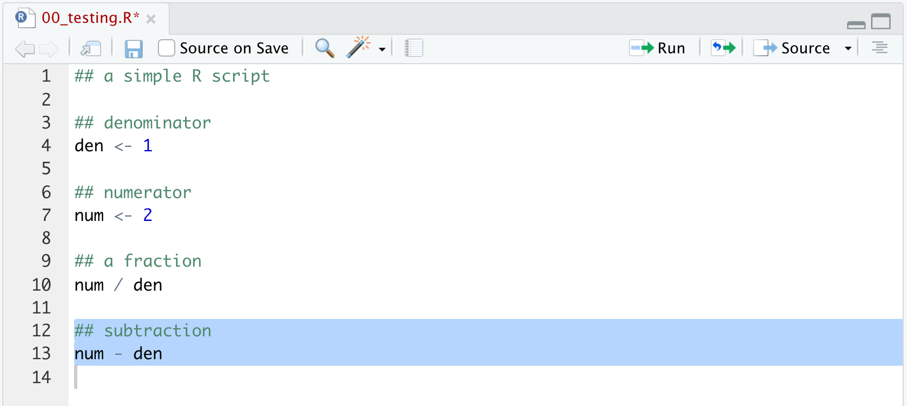

<br>

After basking in the glow of his wonderful new code, John decides he should take a break for awhile, so he commits his changes.

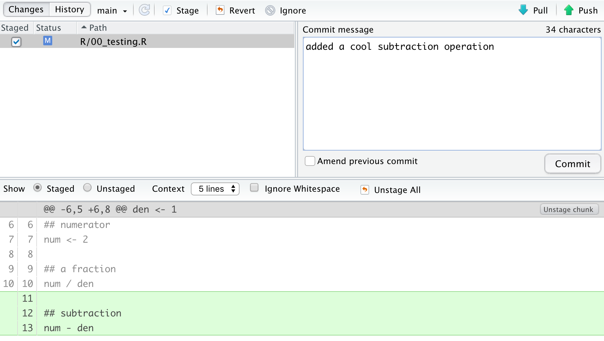

<br>


<br>

The last step before John takes a break is to **push** his local commit up to the shared repo on **GitHub**.


<br>

Oops--that did not go as expected! What went wrong? Well, **Git** is telling us that there are some changes on the remote repo that John does not have in his local copy. How did that happen? It turns out that Mary was also working on the project at the same time as John. In between the time that John sat down and pulled the changes from the remote repo (there were none at the time), Mary made some changes to the script, committed them, and pushed them to the remote repo. In looking at the error message from **Git**, John notices that it suggests he should **pull** the changes and integrate them into his own script.

John goes ahead and pulls Mary's recent changes to his local repo, which issues another warning about a so-called *merge conflict* in `R/00_testing.R` that John will have to fix.

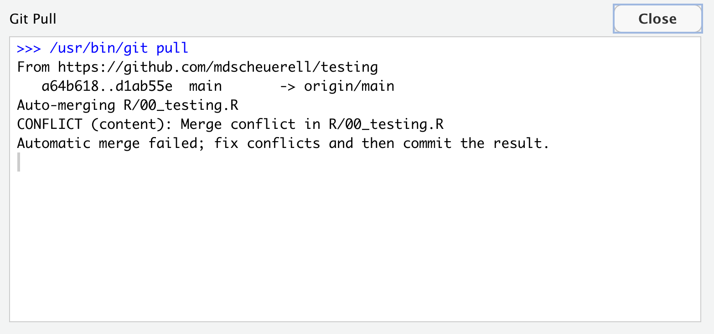

<br>

When John inspects his version of `00_testing.R` he sees that **Git** has added some information to the script, which brackets the new changes that both John and Mary made:

```
<<<<<<< HEAD
## subtraction
num - den
=======
## addition
num + demo
>>>>>>> d1ab55e3cf1979efd0a61954305f742cfbb38e11
```


<br>

You can think of these new lines as "conflict dividers". The `=======` line is the center of the conflict. Everything between `<<<<<<< HEAD` and `=======` is content that exists in the local repo to which the `HEAD` ref is pointing. Everything between `=======` and `>>>>>>> d1ab55e3cf1979efd0a61954305f742cfbb38e11` is content that is present in the remote repo.

At this point, it would be a good idea for John to contact Mary and find out what her plans are, so he can avoid this problem in the future. After confirming that Mary is done making changes for awhile, John can return to resolving the current merge conflict. To do so, John inspects the new changes that Mary made and decides if he wants to merge them into his version of the file, or whether he wants to discard them. In this case, John is happy with the new addition operation that Mary made, so he accepts them by simply deleting the conflict dividers.


<br>

Now John can commit his resolved changes and push them to the remote repo.


<br>


<br>

Now John is all set on his side, but Mary should make sure that she pulls John's changes to her local repo before she starts working on the script again.

This scenario does not necessarily require two or more collaborators. For example, I know from personal experience that someone can do some work on a computer in their office, commit those changes, and then forget to push them before heading home. Upon arriving home, you could pull your changes to your laptop, make additional changes, and then commit and push them to the remote. Upon returning back to the office, you can encounter problems with committing a pushing those changes you forgot about the day before.

***

# Feature branch workflow

The feature branch workflow is designed around multiple *branches* within a repo. These branches can contain copies of files on the `main` branch, and are typically used for the development of specific features.

There are two different ways to create a new branch. The first is from **GitHub** itself. To do so, navigate to the remote repo and click on the button marked **main** in the upper left. This will open a dialogue box with a line for you to find or create a branch. Go ahead and type the name of the new branch (e.g., `develop`) and then hit "return".

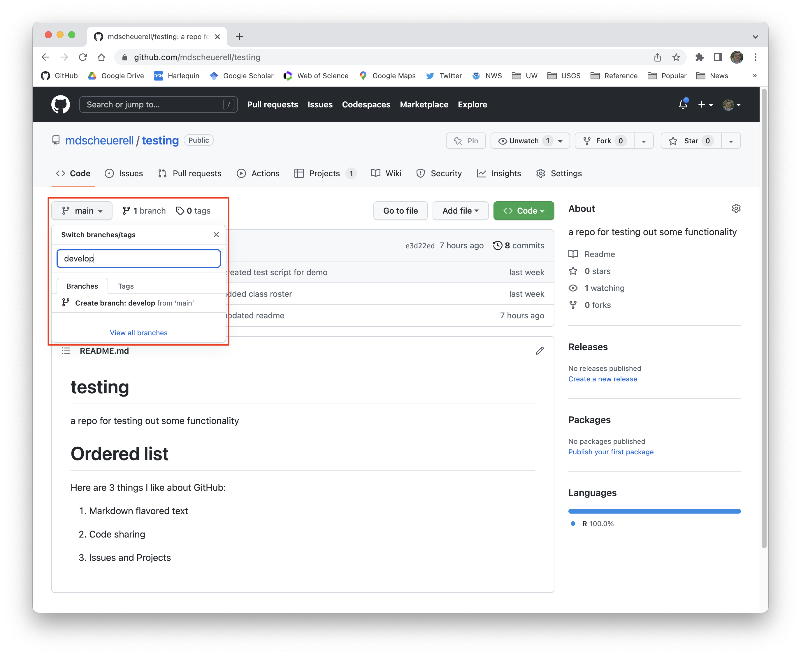

<br>

The second option for creating a new branch, which we'll follow here, is to do so from within **RStudio**. Go ahead and click on the purple button with 2 rectangles and a diamond in the **Git** pane, which will bring up a dialogue window where you can enter the name of the new branch. We'll call it `develop` and press the **Create** button when we're done.


<br>

At this point, you'll see a message window from **Git** telling you it created a new branch and switched over to it with `git checkout -B develop`. The next line says that **Git** pushed all of your local files to the `develop` branch on the remote **GitHub** repo. You should also note that **Git** is suggesting you create a so-called *pull request* to move changes from the `develop` branch into the `main` branch by navigating to your remote repo on GitHub. 

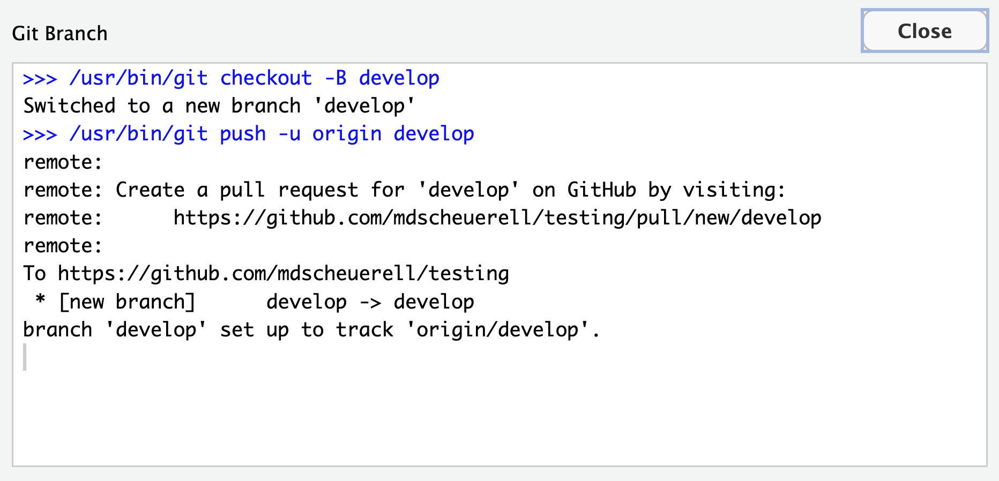

<br>

Let's go ahead and make a small change to our **R** test script (note that the following assumes you have not already made these changes in the above section on **Centralized workflow**). After doing so, we'll commit and push the changes on the `develop` branch up to our remote repo on **GitHub**.


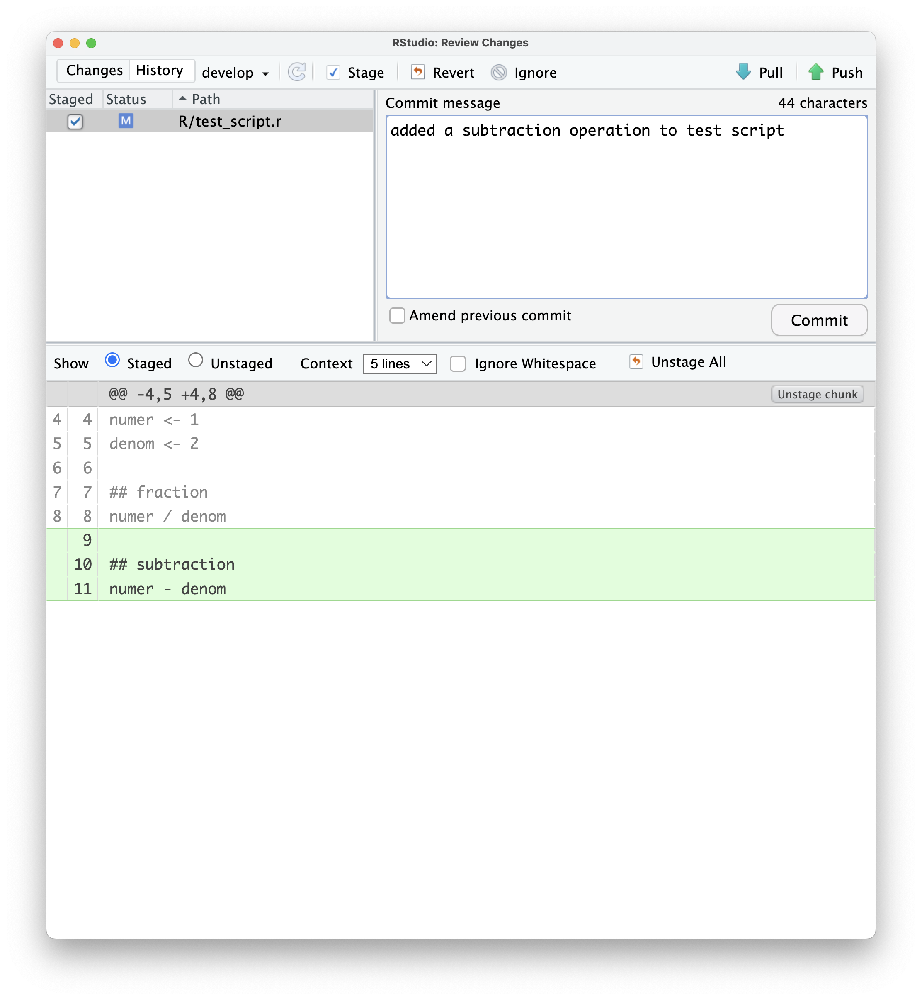


<br>

Now let's take the advice we received earlier and navigate to our repo on **GitHub**. Upon arriving there, we see a message that "**develop** had recent pushes less than a minute ago". To the right of that is a green button marked **Compare & pull request**.

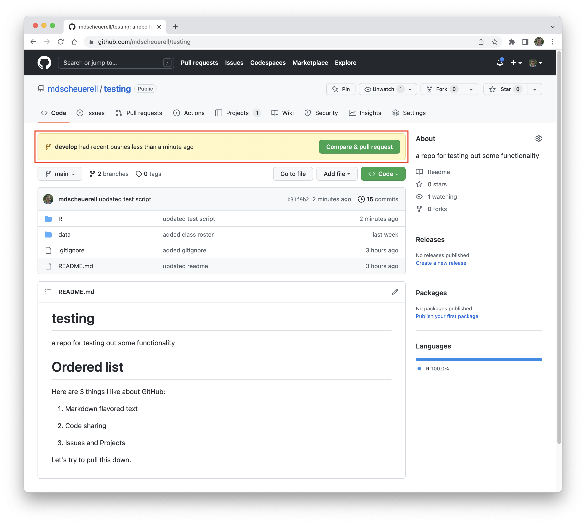

<br>

Go ahead and click on the green **Compare & pull request** button, which will take you to a page to *open a pull request*. At the top you will see some information about the branches from which and to where the changes will be merged, along with a note about the branches being okay to merge. If you scroll down the page, you'll see the changes that were committed, when they were made, and who did it.

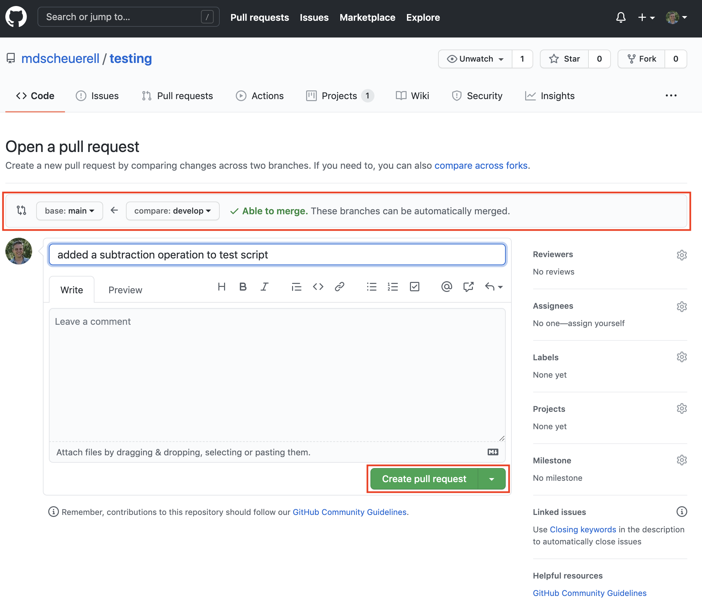

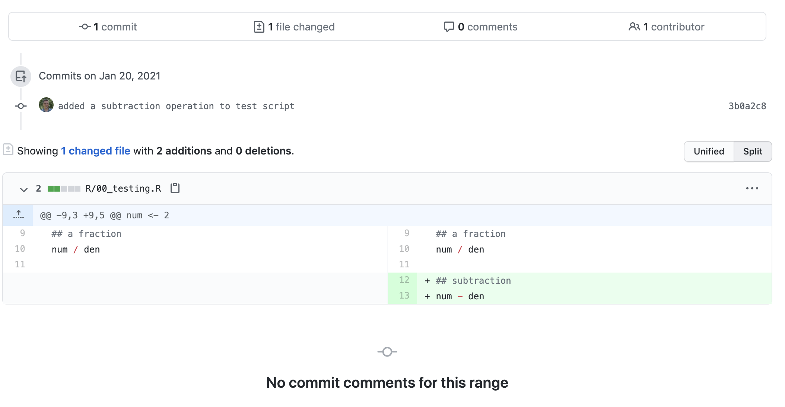

<br>

Now click on the green **Create pull request** button, which will take you to another page where you can review any comments (here there are none) and merge the pull request. In the middle of the page, you'll see a note about **This branch has no conflicts with the base branch** and a green button labeled **Merge pull request**. Go ahead and push that button.


<br>

At this point, the window will switch over to asking you to confirm the merge. Go ahead and click on the green **Confirm merge** button.

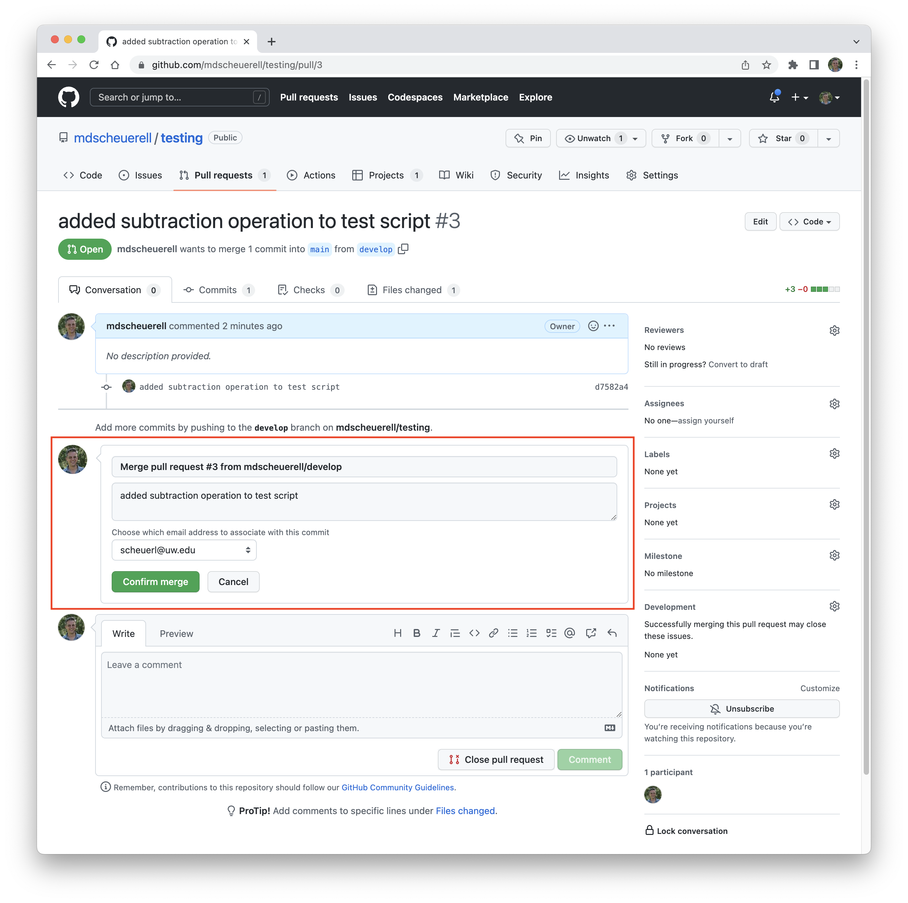

<br>

After doing so, **GitHub** will now report **Pull request successfully merged and closed** (you'll also notice that the green **Open** oval below the name of the pull request has changed to a purple **Merged** oval). **GitHub** also tells you that "You’re all set—the `develop` branch can be safely deleted."


<br>

If your branch was created solely for the purpose of working on a specific feature, then you can go ahead and delete it. If, however, you want to maintain a development (or other) branch, then you can just ignore this message and keeping working on it as well.

***

# Forking workflow

Recall that a forking workflow is commonly used when a developer is *not* a member of the project/organization on **GitHub**. This workflow allows the developer to work with a copy of the owner's repo and potentially submit a pull request for the owner to consider adopting the changes.

## Step 1: Fork the repo

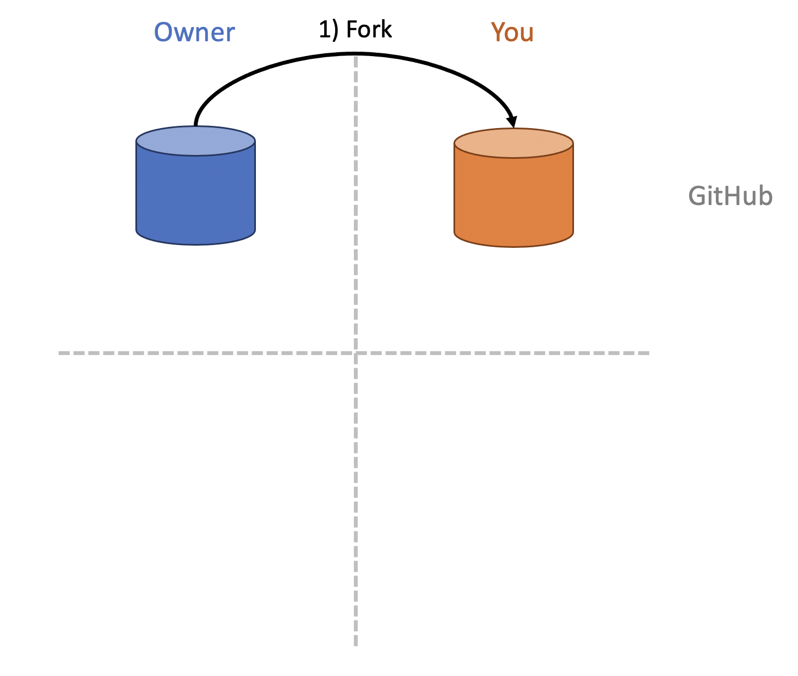

<br>

To fork a repo, navigate to its location on **GitHub** and look for the **Fork** button in the upper right. Press that button, which will bring up a dialogue box asking you where you would like to fork the repo. Click on the user or organization where you'd like to fork the repo and **GitHub** will do the rest.


<br>

You will now see a new forked version of the original repository with some information in the upper left about its location and from where it came. You'll also see some information above the repo contents about the current branch being even with the "upstream" source.

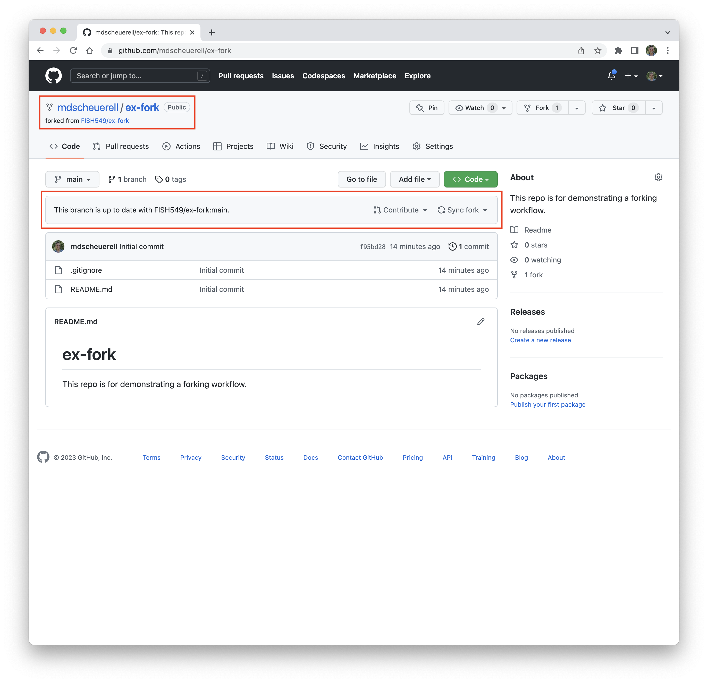

<br>

## Step 2: Clone the repo


<br>

Now you should clone the remote repo to a local repo by creating a new project in **RStudio** based upon the newly forked repo. Click [here](https://fish497.github.io/website/lectures/week_02/lec_06_git_remotes.html) if you need a reminder as to how to do that.

<br>

## Step 3: Add remote repo


<br>

At this point, your local copy of the remote repo can only pull changes from your remote at 

`https://github.com/USER/ex-fork`

where `USER` is you. Unfortunately there is no way to update your remote repo directly from the owner's repo at

`https://github.com/FISH497/ex-fork`.

Instead, we have to set up our local repo to pull changes from the owner's remote repo and then we can push those up to our remote copy. By convention, we will refer to the owner's repo as the `upstream` repo, but you could give it any name.

At this point you have 2 options for adding the `upstream` repo.

### Option 1: Command line

Navigate to the folder/directory on your computer where your local repository exists and type the following in **Terminal** (Mac) or **Git Bash** (Windows):

```
git remote add upstream https://github.com/FISH497/ex-fork
```

### Option 2: RStudio

Open up your project in **Rstudio** and click on the "New branch" button in the **Git** pane (i.e., the button with the 2 purple rectangles and a diamond).

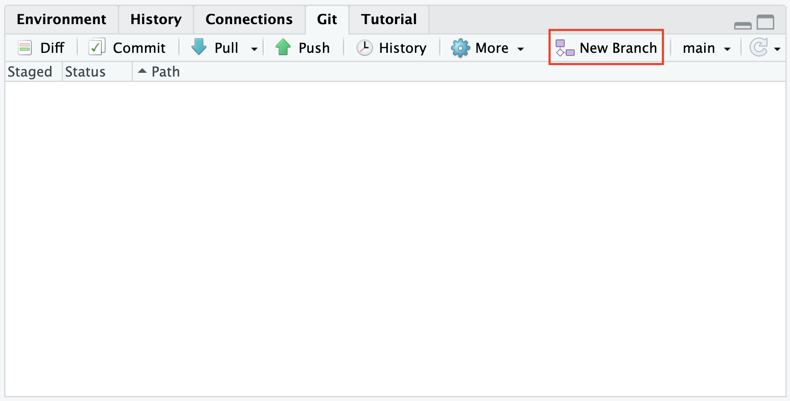

<br>

Next, click on the button labeled "Add remote...".


<br>

In the "Remote Name:" box, type `upstream`. In the "Remore URL:" box, enter the name of the **owner's** repo you forked in Step 1: `https://github.com/FISH497/ex-fork` (you can copy/paste if you'd like). When you are finished, click the **Add** button.


<br>

Go ahead and click on the **Cancel** button (don't worry, everything is still OK).

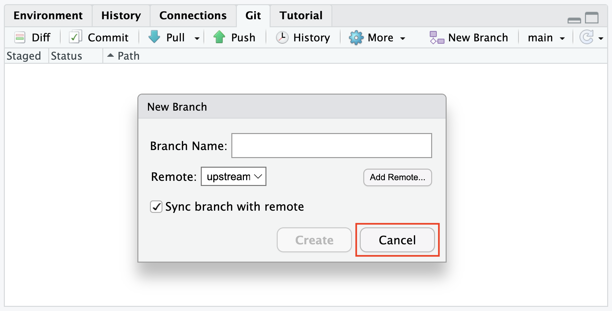

<br>

Now you need to verify that the remote `upstream` is set up properly. To do that, click on the **Terminal** tab in your Console pane.


<br>

At the command prompt, type this:

```
$ git remote -v
```

which should return the following, where `USER` is your user name.

```
origin  https://github.com/USER/ex-fork (fetch)
origin  https://github.com/USER/ex-fork (push)
upstream        https://github.com/FISH497/ex-fork (fetch)
upstream        https://github.com/FISH497/ex-fork (push)
```

<br>

## Step 4: Make local changes


<br>

Now you are ready to make any changes you'd like to the files or folders in your local repo. However, **before doing so**, make sure to **pull** any changes that might have been made to the owner's `upstream` remote. 

To do so, again navigate to the **Terminal** tab in **RStudio** and type:

```
$ git pull upstream main --ff-only
```

If nothing has changed, you'll see a message like this:

```
From https://github.com/FISH497/ex-fork
 * branch            main       -> FETCH_HEAD
 * [new branch]      main       -> upstream/main
Already up to date.
```

### Setting the local branch

In this example, if you examine either the owner's original repo or your forked copy on **GitHub**, you'll notice that they both contain 2 branches: `main` and `develop`. However, if you inspect the branches in your current project in **Rstudio**, you'll see that only `main` exists there.

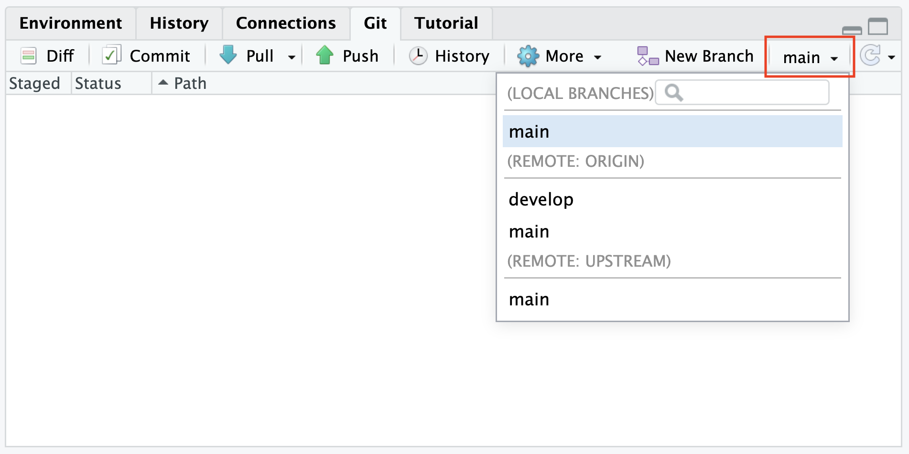

<br>

To set the local branch to `develop` (where we'd like to do our work), click on `develop` under (REMOTE: ORIGIN):


<br>

which will bring up a message box from **Git** informing you that you've created and switched over to a new branch called `develop`.

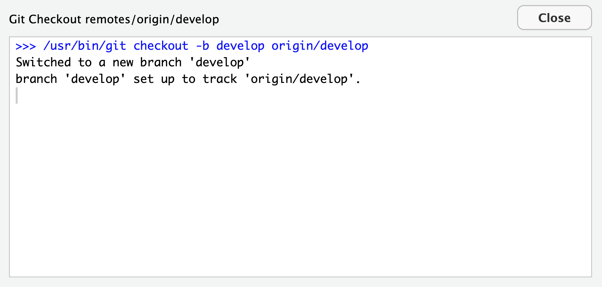

<br>

Go ahead and close the window and you will see that the branch name in the **Git** pane of **RStudio** is set to `develop`. If you again click on the `develop` button it will now show that you can track the `develop` and `main` branches on

1. your local repo

2. your remote origin (located at `https://github.com/USER/ex-fork`)

3. your remote upstream (located at `https://github.com/FISH497/ex-fork`)

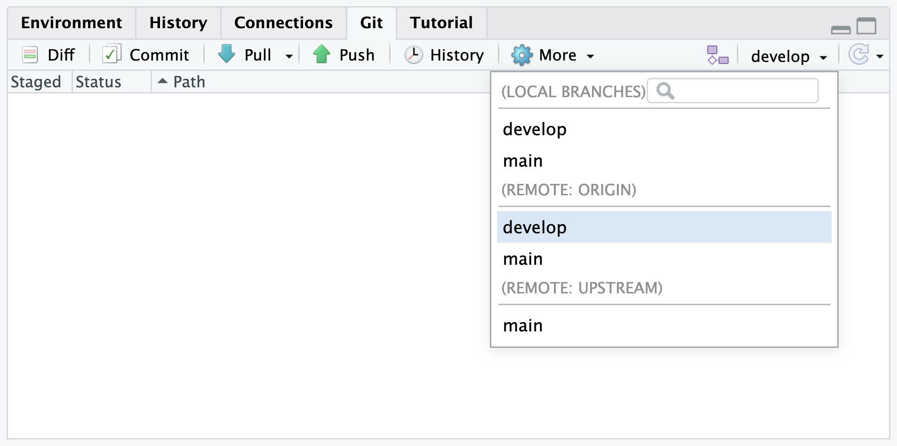

<br>

Let's create a new file in our local repo so we have something to commit and push to our own remote repo, and then ultimately submit it as a pull request to the original repo's owner (here `FISH497`).

Go ahead and make a simple **R** script and commit it (I'm calling mine `simple_addition.R`).


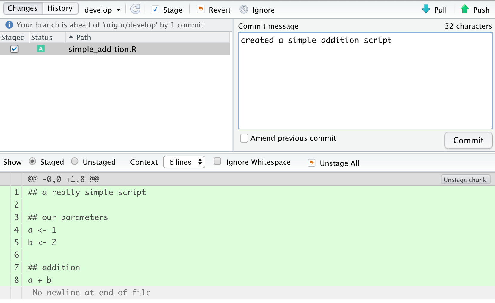

<br>

## Step 5: Push to GitHub


<br>

Now it's time to push your simple script to your own remote located at

`https://github.com/USER/ex-fork`

<br>

## Step 6: Submit a pull request


<br>

Navigate to your forked repo on **GitHub** where you'll see a message about this branch having a recent push and a new green button labeled **Compare & pull request**.


<br>

Now you can open a pull request by clicking on the green **Compare & pull request** button. This will take you to the standard page for a pull request, just as we saw in the **Feature branch** workflow above. In this case, however, there is additional information about

* the repo location (here it's the `upstream` at `https://github.com/FISH497/ex-fork`)

* both the *branches* (here `develop`) and *locations* of the repositories

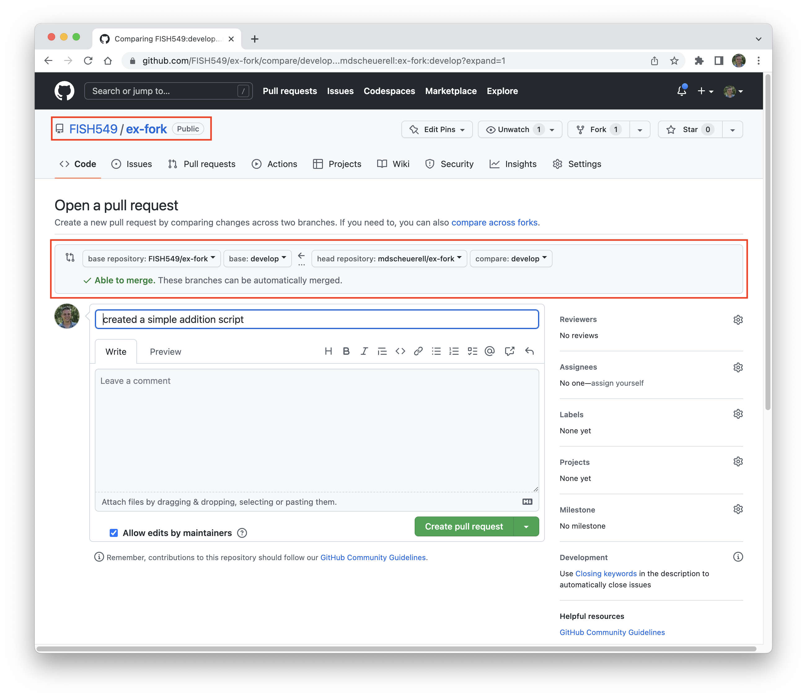

<br>

It's good practice to give your pull request an informative title and add some additional information about the substance of the pull request, so that the owner of the original repo has some understanding of what you've done. After that, you can click on the green **Create pull request** button, which will take you to a page showing the details of your pull request. 

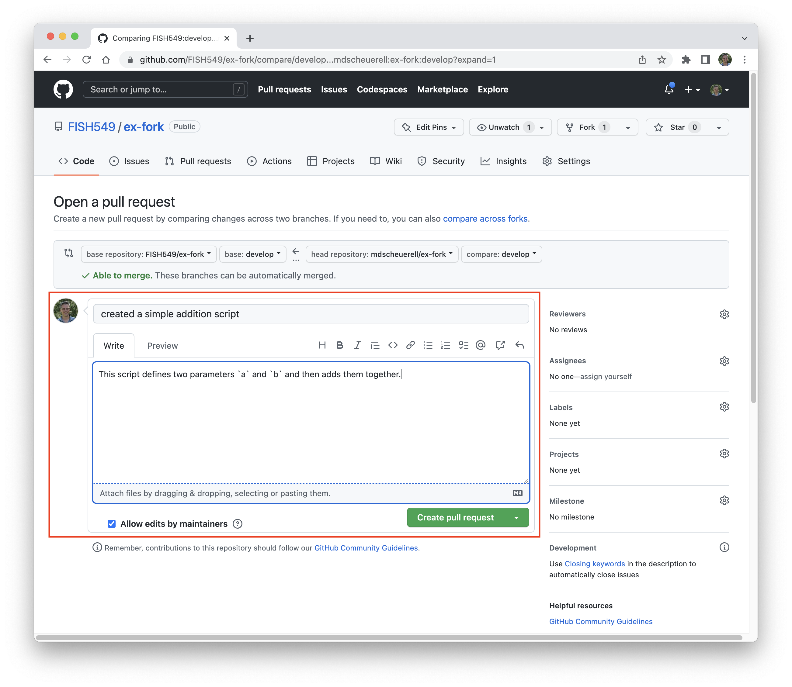

<br>

No you just have to wait for the repo's owner to review the pull request and either accept it as is, or come back to you with additional comments or requests for changes.


