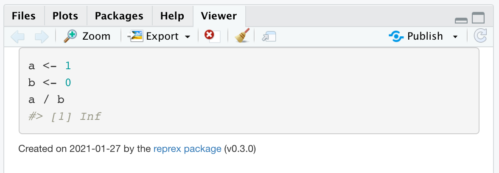
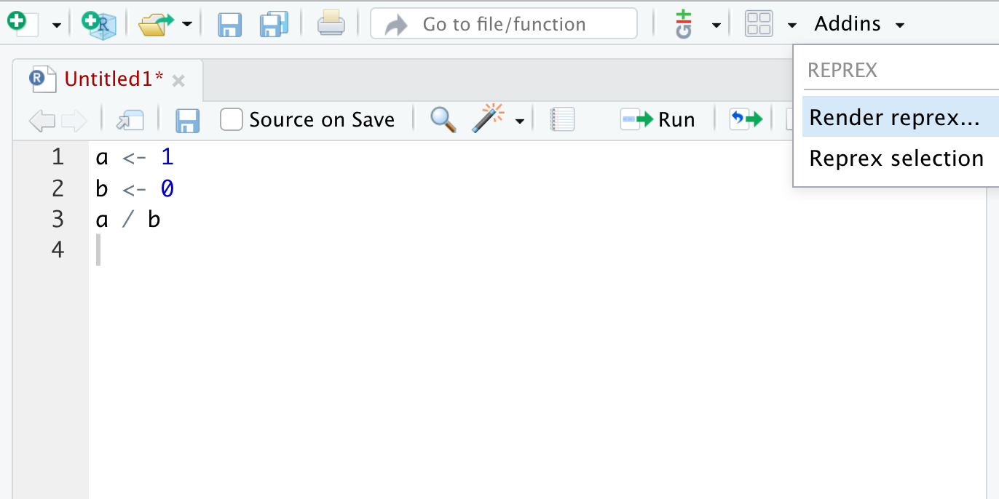
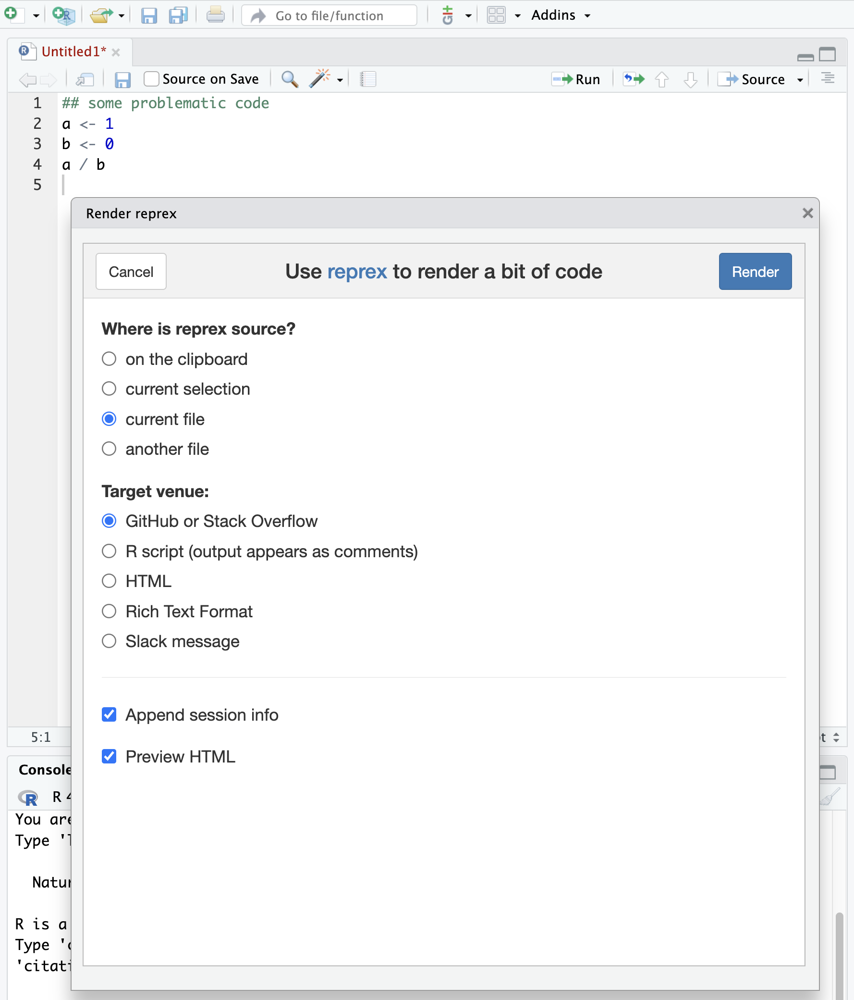

```{r setup, include=FALSE}
knitr::opts_chunk$set(echo = TRUE, 
                      fig.align = "center", out.width = '90%')
```

<br>

# Motivation

There is a good chance that you've already had to ask someone for help with a question related to some aspect of data science. For example, 

* What does this error mean?

* Why can I not reproduce what you've done?

* How do I [fill in the blank]?

* Is there an existing package that allows me to [fill in the blank]?

The bad news is that these types of questions may follow you around throughout your career. The good news, however, is that there is a large community of people willing to help you find the solutions you need.

***

# Minimal, reproducible example

When you get stuck on a problem and need some advice, others will be able to better provide assistance if you include information that 

1. they can easily understand, and

2. they can use to reproduce the problem.

This process is variously referred to as creating a

* minimal, **rep**roducible **ex**ample (reprex)

* **m**inimal, **c**omplete and **v**erifiable **e**xample (mcve)

* **m**inimal, **w**orkable **e**xample (mwe)

The bottom line is that you should

* Use the least amount of code possible to produce the problem (minimal)

* Provide *everything* (code, data) someone would need to reproduce your problem (complete)

* Verify that the code you're about to share reproduces the problem (reproducible)

In addition, you should phrase your question in manner that is polite and free of jargon or other language constructs that might confuse people. The data science community is global, so recognize that someone reading your question might not speak English as a first language. Also consider that others may very well stumble across your question, and hopefully the correct answer, years after it was solved. As such, using plain, descriptive language in the title and body of a post will allow others to find it when searching for answers. For example, [this problem](https://stackoverflow.com/questions/36634641/formatting-table-headings-in-rmarkdown) I posted on Stack Overflow in 2016 has since received over 1000 views!

## Minimal

There tends to be a strong negative correlation between the length of your code and the likelihood that someone will 1) read all the way through it, and 2) actually be able to solve your problem. Therefore, you should consider the following points.

* Consider creating a new script, including *only those elements germane to the problem* 

* Remove extraneous information that doesn't influence the problematic code

* Use simple, descriptive names for parameters, variables, and functions

* Include meaningful comments in your code to help others understand what you're trying to accomplish

* Take advantage of your IDE's options to create nicely formatted code (e.g., uses spaces--not tabs--for indents; in **RStudio** use `command+I` on a Mac or `ctrl+I` in Windows)

## Complete

It's important to include **all** of the information necessary to reproduce the problem *within the question itself*. Don't put other people in a position where their first response to you is a request for more information. In addition, please consider the following advice.

* If there are data involved, include a small subset of the data along with any necessary code

* Break your problem down into small code blocks and include a description of each block's purpose

* It's OK to include an image or figure in your question, but

* **Do not** use images of code; rather, copy/paste the actual code so others don't have to re-type anything

* Include information or links to other problems/solutions that you've tried or are referencing

## Reproducible

In order to help you, other people will need to verify that they can indeed reproduce the problem you're having. Phrases like "Help!", "This won't work!", or "Why does this happen?" don't offer much information. Instead, use descriptive language that gets to the question at hand, including:

* Explain what the expected behavior should be

* Provide the exact wording of any error messages

* Indicate which line(s) of code produce(s) the problem

* Use a brief, descriptive summary of your problem as the title of your question

You should also double-check that your example reproduces the problem. As such, it's good practice to quit **RStudio** (or other software) and restart it from scratch. If possible, consider testing your example on another computer or operating system.

## Metainfo

In addition to minimal, complete, and reproducible code (and possibly data), you should also include information about your larger work environment. This includes:

* Your operating system (Mac, Windows, Linux) and its version

* Versions of your software (**R**, packages); `sessionInfo()` and `packageVersion("package-name-here")` are both helpful functions


***

# Creating a "reprex"

Creating a reproducible example (reprex) can be a lot of work, but so is answering other people's questions. As Jenny Bryan says, "Help me help you." Here are some options for helping to create a reprex.

## Using `dput()`

Copying/pasting code is relatively easy, but trying to include any data necessary to create a complete reprex can be tricky. In general, including a `.csv` file or other data format is difficult without pointing someone to an external source, link, etc. Fortunately, the `dput()` function in **R** provides a convenient way of writing all of the information in a data frame in a compact manner.

Here's an example of using `dput()` on the [Palmer penguins data set](https://github.com/allisonhorst/palmerpenguins). This data set is actually quite large, so we'll only use the first 10 rows of the data frame.

```{r dput_palmer}
## load the library
library(palmerpenguins)

## get the data & inspect them
data(package = 'palmerpenguins')
head(penguins)

## write the data
dput(penguins[1:10,])
```

The output from `dput()` may look a bit strange, but it's **R**'s way of storing the information in a data frame. You can now copy/paste the output above into a post with your code and someone could simply assign it to an object and it will render just fine.

```{r dget_penguins}
## assign output to an object
dat <- structure(list(species = structure(c(1L, 1L, 1L, 1L, 1L, 1L, 
1L, 1L, 1L, 1L), .Label = c("Adelie", "Chinstrap", "Gentoo"), class = "factor"), 
    island = structure(c(3L, 3L, 3L, 3L, 3L, 3L, 3L, 3L, 3L, 
    3L), .Label = c("Biscoe", "Dream", "Torgersen"), class = "factor"), 
    bill_length_mm = c(39.1, 39.5, 40.3, NA, 36.7, 39.3, 38.9, 
    39.2, 34.1, 42), bill_depth_mm = c(18.7, 17.4, 18, NA, 19.3, 
    20.6, 17.8, 19.6, 18.1, 20.2), flipper_length_mm = c(181L, 
    186L, 195L, NA, 193L, 190L, 181L, 195L, 193L, 190L), body_mass_g = c(3750L, 
    3800L, 3250L, NA, 3450L, 3650L, 3625L, 4675L, 3475L, 4250L
    ), sex = structure(c(2L, 1L, 1L, NA, 1L, 2L, 1L, 2L, NA, 
    NA), .Label = c("female", "male"), class = "factor"), year = c(2007L, 
    2007L, 2007L, 2007L, 2007L, 2007L, 2007L, 2007L, 2007L, 2007L
    )), row.names = c(NA, -10L), class = c("tbl_df", "tbl", "data.frame"
))

## inspect the object
dat
```

<br>

## The `reprex` package

The process of creating a reprex can also introduce unintended mistakes in your code during a copy/paste or retyping. As an instructor at UBC, Jenny Bryan found herself responding to hundreds of issues and questions per semester, so she (and others) created the [`reprex` package](https://reprex.tidyverse.org/).

### `reprex` from the command line

Begin by loading the `reprex` package.

```
library(reprex)
```

Select the code you're interested in and copy it to the clipboard:

```
a <- 1
b <- 0
a / b
```

Type `reprex()` at the **R** command prompt.

```
> reprex()
```

If you're using **RStudio**, you'll see a preview of your rendered reprex in the **Viewer** pane.



Your code, its result, and some additional information about the date and `reprex` version are all now sitting on your clipboard and available for pasting somewhere for help (see [below](#where)). In the background, `reprex` produces this chunk of code:

````
`r ''````{r}
a <- 1
b <- 0
a / b
#> [1] Inf
```
````

There are a number of additional options you can pass to `reprex()` that will format the output for a particular forum for help (e.g., `venue = gh` for GitHub) or to also include the session information (e.g., `session_info = TRUE`).

### `reprex` in RStudio

`reprex` is also designed to work seamlessly within **RStudio** and will do most of the work for you. To do so, access it via the **Addins** pulldown menu (click [here](https://rstudio.github.io/rstudioaddins/) to learn more about **RStudio** addins).



<br>

This brings up a popup window with choices about where the code is located, the target venue for help, and whether you want to append the session information. Make your desired selections and click on the blue **Render** button in the upper right, which will copy all of the information to your clipboard and also display in the **Viewer** pane.



<br>

***

# Where to get help {#where}

Now that you know *how* to ask for help, let's consider some places *where* you can find help. One of the first things I often do is to simply use Google to search for my problem or error message. Sometimes you can find the answer rather quickly, but often you'll be presented with an array of possible solutions that require you to read through the various questions and corresponding answers that others have posed. In the end, your desire for a quick resolution can be countered by the time you'll spend combing through lots of extraneous information. Therefore, you might want to consider these other options.

## Colleagues

Your friends, colleagues, advisor, and committee members can be a great resource for help. Asking people you know can be much less intimidating than engaging with anonymous strangers. Turning to your officemate and asking them for help can be quick and also gratifying for them if they were able to help. Many lab groups have Slack channels dedicated to `coding` or `programming`, so consider asking there as well.

## RStudio community

The **RStudio** community provides a [nice forum](https://community.rstudio.com/) for people to ask questions specific to **R**, **RStudio**, and various packages (e.g., the "tidyverse"). The people tend to be compassionate and caring--they genuinely want to help rather than simply espousing their knowledge to whomever will listen.

## Twitter

In general, Twitter is a great source of information on **R** and data science. I follow lots of people who are developers and users of **R** and various packages (e.g., [Hadley Wickham](https://twitter.com/hadleywickham), [Jenny Bryan](https://twitter.com/JennyBryan), [Mara Averick](https://twitter.com/dataandme), [Kara Woo](https://twitter.com/kara_woo), [Thomas Lin Pedersen](https://twitter.com/thomasp85)). Although it's difficult to squeeze a reprex into 280 characters, you can share links to locations where you've posted a reprex (e.g., a [GitHub Gist](https://gist.github.com/)). Also consider checking in on the [#rstats](https://twitter.com/search?q=%23RStats) hashtag or including it in a post asking for help.

## GitHub

In some cases, you may encounter a problem or discover a bug in a particular **R** package. Although [CRAN](https://cran.r-project.org/) is the primary location for hosting pacakges, many developers also maintain **GitHub** repos for their packages. These developers typically ask people to file an issue with the stipulation that you be polite and follow some general guidelines. Issues along the lines of "this doesn't work" or "why won't you update this" have a pretty good chance of being ignored. Very few people are paid to develop and maintain packages, so treat their time and effort with respect.

## Stack Overflow

If you tried searching for an answer to your problem, there's a good chance you've come across some posts on [Stack Overflow](https://stackoverflow.com/), or "SO" as it's often referred. SO has keywords or tags that people can use to highlight the software or packages they're using (e.g., "R", "dplyr"), which allows you to filter results. SO also has a reputation of being an intimidating forum with often snarky comments on posts. However, if you've taken the time to create a good reprex, you shouldn't encounter any problems.


