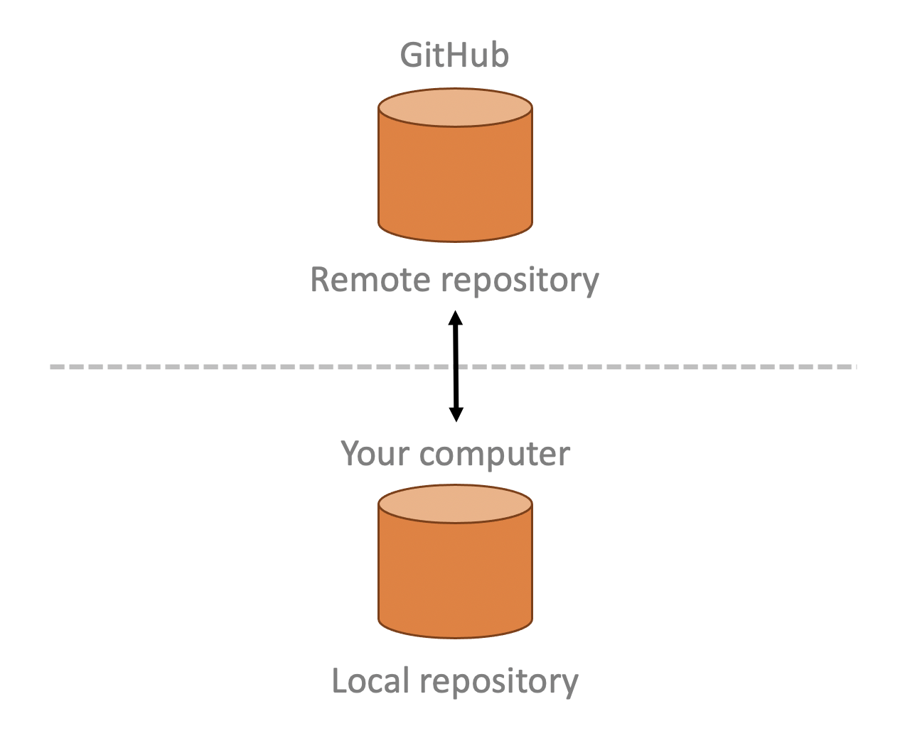
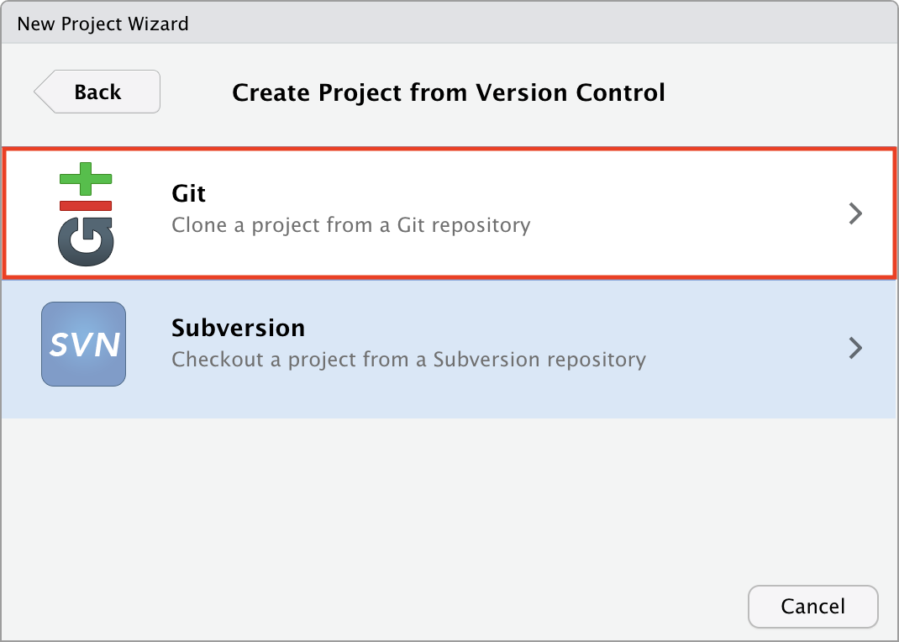
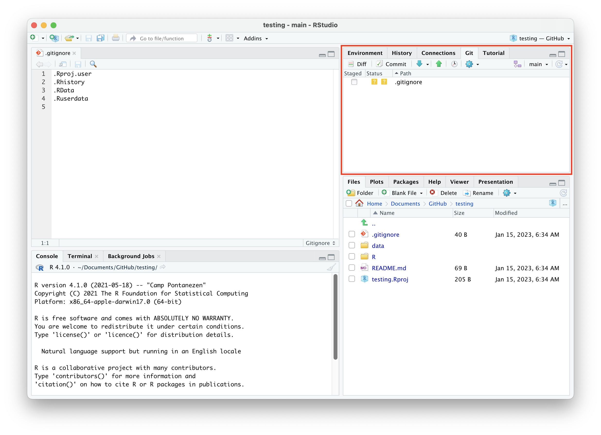
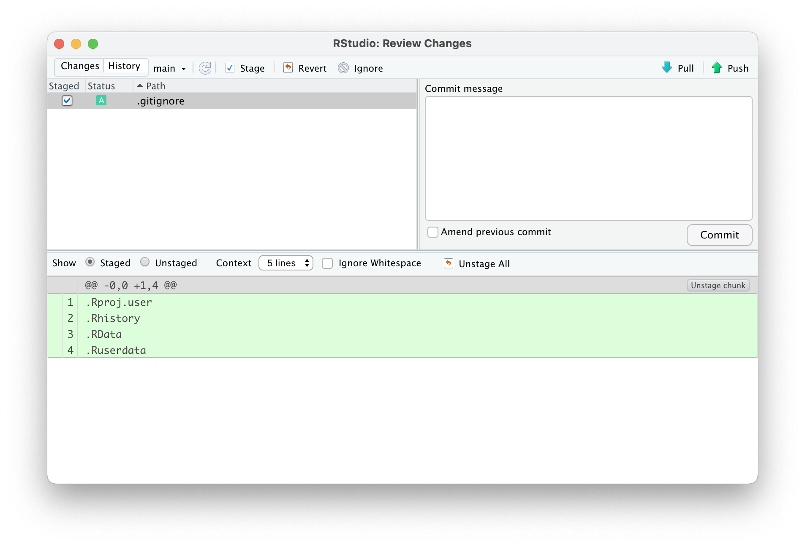
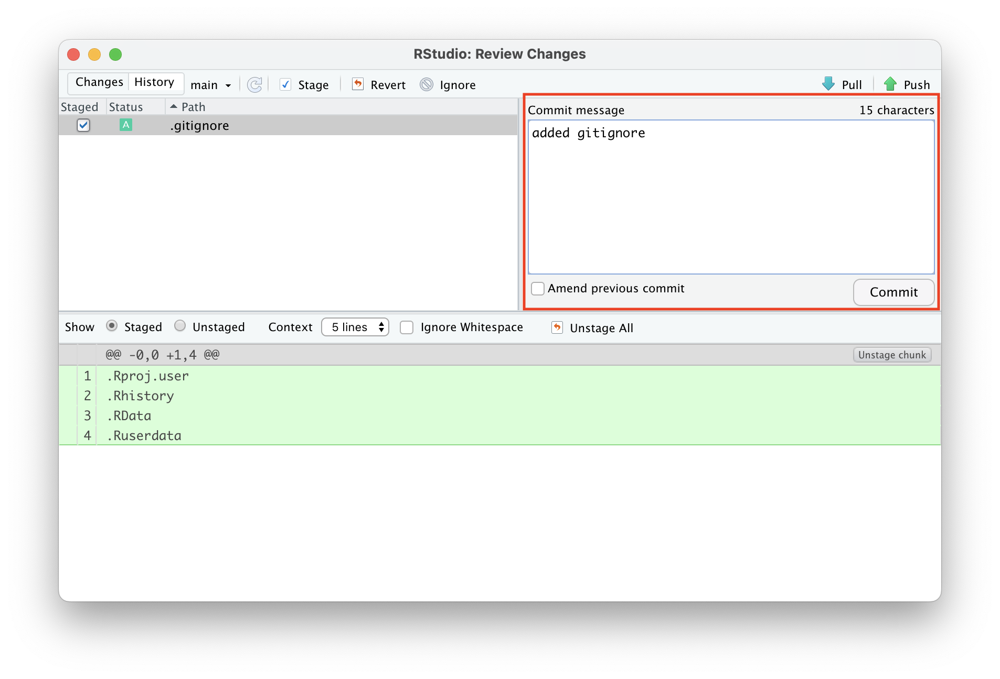
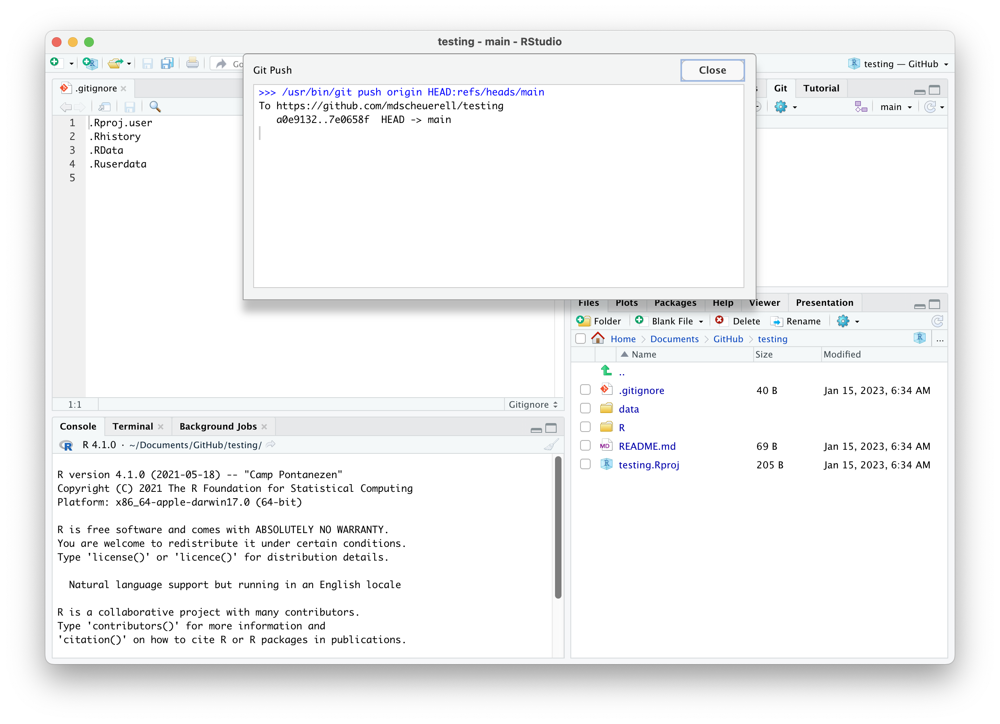
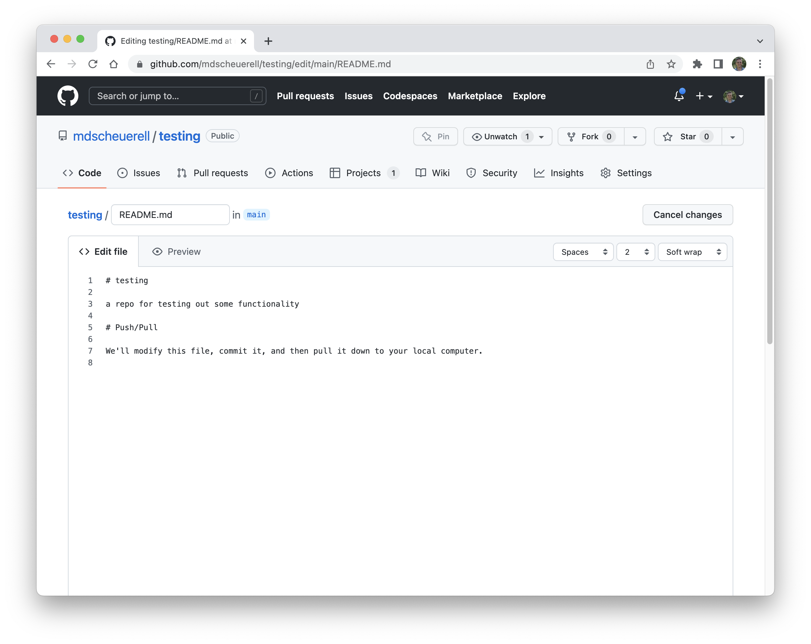

```{r setup, include=FALSE}
knitr::opts_chunk$set(echo = TRUE)
```

<br>

# Remote repositories

Remote repositories like GitHub allow you to store you code, data, and other information in a convenient online location. However, most of the time you will want to work on your personal computer and take advantage of a nicer programming interface, or so-called *integrated development environment* (IDE) like RStudio. Using remotes also allows for easier collaboration among people working in different places. This lesson will introduce you to working with remote repositories and show how to move your files back and forth from the cloud to a local computer. In general, our model for this process looks something like this.



***

# Create a project in RStudio

There are several ways to connect a remote repository to your local computer. Here we will see how to do so from within RStudio. RStudio provides a nice interface for using Git for version control via "Projects". Note that these are different than the [GitHub Projects we learned about here](lec_04_intro_github.html#Projects).

::: task

* Navigate to the **testing** repo we created on GitHub in the lesson on [_Intro to GitHub_](lec_04_intro_github.html).

* Highlight and copy the full URL from your browser's address bar.

:::

<br>


::: task

* Open RStudio and select *File* > *New Project...*, which will bring up a dialogue box.

* Select **Version Control**

:::

<br>

{ width=60% }

<br>

::: task

Select **Git**

:::

<br>

{ width=60% }

<br>

::: task

In the **Repository URL** box, paste the full repo address from GitHub that you copied above.

:::

::: note

`YOUR_USERNAME` in the location below should be *your* GitHub user name.

:::

<br>

{ width=60% }

<br>

::: task

* Tab to the next box, **Project directory name**, which should auto-fill with the repo name `testing`.

* Select the directory location where you'd like this project to live.

:::

::: tip

Mark **strongly** suggests choosing a location that is not under some other version control software such as **Dropbox**.

:::

<br>

{ width=60% }

<br>

::: task

Check the box in the lower left that says "Open in new session" and then click on the **Create Project** button.

:::

<br>

{ width=60% }

<br>

::: success

RStudio will open a new instance with all of the project files listed. 

:::

::: tip

Some of the files shown in your project may look different than the image below.

:::

<br>


***

# Working on remotes from RStudio

There are several things to note here in RStudio (note that your views may differ depending on how you have the window panes set up). In the **Files** tab, you should see a `README.md` file plus the `/R/` and `/data/` folders we that we previously created from within GitHub. In addition, you should see a `.gitignore` and a `testing.Rproj` file.


<br> 

::: task

Click on the `.gitignore` file to display its contents in the code pane. You should see 4 file extensions listed there.

:::

```
.Rproj.user
.Rhistory
.RData
.Ruserdata
```


<br>

This `.gitignore` file contains information about the things that you **don't** want Git to pay attention to when tracking different versions of your files and folder contents. For example, some people want to exclude `.html` files that are generated by `.Rmd` source files, or environment files unique to RStudio and RStudio. 

::: tip

You can see a list of common ignore options for RStudio [here](https://github.com/github/gitignore/blob/master/R.gitignore).

:::

***

# Using Git from RStudio

One of the nice features about RStudio is that you can interact directly with Git without have to switch back and forth between the R console and the terminal window.

::: task

Locate the Git tab in the pane with other tabs for **Environment**, **History**, etc. and click on it.

:::




<br>

You should see the `.gitignore` file listed there with an empty box and 2 yellow question marks to the left of its name. This is the Git staging area where Git is currently showing this file as new (i.e., it's a graphical means for showing the results of `git status`).

## Add a file to staging

::: task

Click the check box in the column marked "Staged" to the left of the `.gitignore` file and you will see that a green **A** appears in the column marked "Status" (i.e., this is equivalent to typing `git add .gitignore`).

:::


## Commit a file

::: task

Click on the "Commit" button just above the file name, which will bring up a new commit window.

:::


<br>




<br>

::: note

There are several important things here. The first is the menu bar across the top, which has buttons for "Changes" and "History" in the upper left, and "Pull" and "Push" in the upper right. At the moment, the "Changes" button is active, so you can see the contents of the `.gitignore` file displayed below in green. In this case, the file is brand new to Git, so everything is highlighted in green. Later you will see how this changes.

:::


<br>

::: task

Click on the "History" button just to the left of the "Changes" button, which will bring up a log of your commit history. 
:::

::: note

In the example below, the last file committed was `ex_data.csv` that we had previously created and committed directly from GitHub. You can see information about the the commit author, the date, and the first 7 characters from the unique commit SHA.

:::


<br>

::: task

* Click on the "Changes" button and type a *short but informative* commit message in the box in the upper right (e.g., "added gitignore").

* When you are finished, click the **Commit** button in the lower right (i.e., this is the equivalent of typing `git commit -m "added gitignore"` via the command line).

:::




<br>

::: note

RStudio will now pop open a commit window displaying the commit command at the top and the resulting reply from Git:

:::

```
[main 7e0658f] added gitignore
 1 file changed, 4 insertions(+)
 create mode 100644 .gitignore
```


<br>

::: task

Click the "Close" button in the upper right, which will return you to the main commit window. Close that window, which will return you to the main RStudio viewer. 

:::

::: note

The `.gitignore` file has disappeared from the Git tab because it's just been committed.

:::


<br>

# Pushing to GitHub

Now that we've committed our `.gitignore` file to history, we can *push* it up to our remote repo on GitHub. 

::: task

Click on the green up arrow, which is the RStudio symbol for `git push`.

:::


<br>

::: note

You should see a smaller **Git Push** window with the following information from Git.

:::

```
>>> /usr/bin/git push origin HEAD:refs/heads/main
To https://github.com/mdscheuerell/testing
   a0e9132..7e0658f  HEAD -> main
```

::: tip

The first line is the actual Git command for pushing to a remote repo, and the second and third lines are the results of that command.

:::




<br>

::: success

You've now pushed a change on your local computer up to your remote repo on GitHub.

:::


## Viewing your changes on GitHub

You can now check to see that your committed `.gitignore` file was indeed pushed up to GitHub.

::: task

Switch over to your browser and navigate back to the **testing** repo at `https://github.com/YOUR-USER-NAME/testing`.

:::

::: note

You should now see the `.gitignore` file listed along with the `README.md` file and other folders we created previously. Next to the file name, you will also see the commit message you used and a time stamp for how long ago you made the commit and push.

:::

::: tip

If you don't see the file, try refreshing the view on your browser.

:::


<br>

***

# Pulling from GitHub

Now let's see how to *pull* changes from a remote repo to your local computer. To do so, we'll make some changes to our `README.md` file on GitHub, commit them, and then pull them down. 

::: task

Click on the pencil icon in the upper right to edit the `README.md` file, which will bring up the editing window.

:::


<br>

::: task

Make a few changes to the file and then scroll down to the bottom where you can commit those changes.

:::




<br>

::: task

Type a *short but informative* commit message and press the green **Commit changes** button.

:::


<br>

::: task

Click on either the **testing** link at the top or the **Code** tab below you username to return to the main repo. Here you will see the commit message and time stamp of your newly changed file, as well as its contents.

:::


<br>

::: tip

Return to RStudio and look in the **Git** tab for the blue down arrow. This is how you *pull* files from your remote repo to your local project.

:::


<br>

::: task

Click on the pull arrow, which will open up a **Git Pull** window with information similar to the following (note that the text specifics will differ from your output):

:::

```
>>> /usr/bin/git pull
From https://github.com/mdscheuerell/testing
   7e0658f..9c303a4  main       -> origin/main
Updating 7e0658f..9c303a4
Fast-forward
 README.md | 10 +++-------
 1 file changed, 3 insertions(+), 7 deletions(-)
```

::: tip

The first line is the actual Git command and the remaining lines are what Git is reporting back from `git pull`, including the file name and its contents.

:::


<br>

::: task

Close the Git Pull window and then click on the `README.md` file in the **File** viewer, which will display its contents in an editing window. Notice that it reflects the recent changes you made to the file from GitHub.

:::


<br>

# Workflow notes

## Begin by pulling

Proper version control requires you to keep all of your local and remote repositories synced with one another. Thus, whenever you begin working on a project in RStudio (or elsewhere, for that matter), you should ***always begin by pulling any changes from your remote repo into your RStudio project***.

## End with pushing

Similarly, when you are finished editing all of your local files, you should ***always end by committing those changes and pushing them up to your remote repo***.

