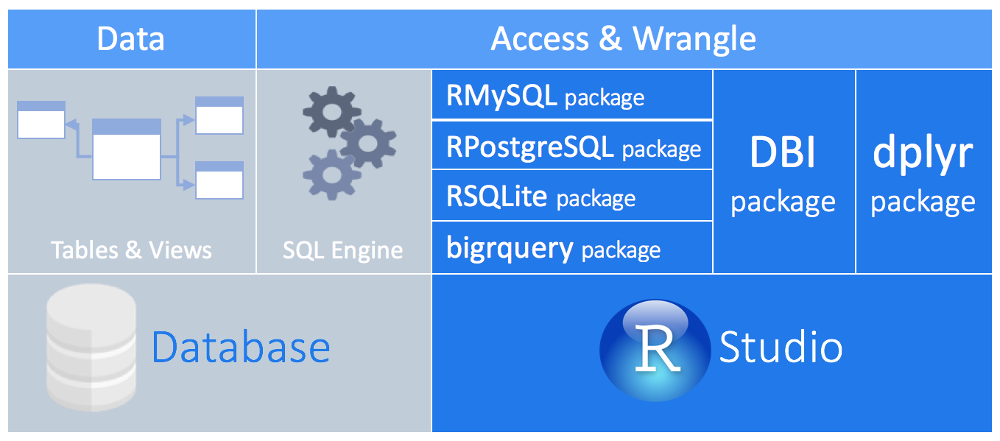
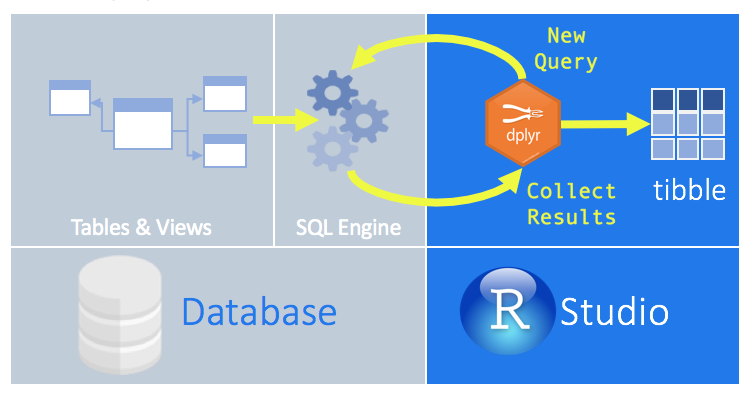

```{r setup, include=FALSE}
knitr::opts_chunk$set(echo = TRUE,
                      fig.align = "center", out.width = '70%')
```


<br>

# Overview 

These notes will walk you through the process of connecting to a remote database and running some simple queries on the database using the verb-like functions in some common R packages. If you'd like to review the process of creating a new PostgreSQL database, adding some files, and querying the database using tools other than R, please look [here](lec_14_intro_databases.html).

The following figure courtesy of Posit shows a high-level overview of our process. Recall that a database is a collection of tables and views created and manipulated using _Structured Query Language_ (SQL). Specifically, we use a _relational database management system_ to create relational databases using SQL (eg, PostgreSQL). One could then use SQL to access and wrangle data directly with the database or, as we'll see here, one could use R packages to connect to a database and interact with it completely within RStudio.

<br>
```{r, echo = FALSE}

```
<br>


# Remote databases

As we discussed previously, most databases are hosted on a server to which users connect remotely. To do so, one could use a dedicated IDE, such as **pgAdmin** shown [here](lec_14_intro_databases.html#Getting_oriented_in_pgAdmin). Alternatively, as we'll see here, you can use various R packages within RStudio to connect to a remote database.


## Connecting to a database

To _connect_ to our remote database, we'll use two packages:

1) **{DBI}**
2) **{RPostgres}**

```{r load_conect, message = FALSE}
## load packages for db connection
library(DBI)
library(RPostgres)
```

When connecting remotely to a database, the user typically needs to provide several pieces of information. These include:

* Hostname  
* Port  
* Database name
* Username
* Password

Here is the information you'll need to connect to the remote Lake Washington database:

```
Hostname: p.nxh57cg2izb6dbv27dykuuxztq.db.postgresbridge.com
Port:     5432
Database: lake_wa
Username: postgres
Password: FGE9jBmVIuizl0ImuR9N9rPer5hXAfuIifvkAazJC59EG5zhf8bIZUU3LTrN13Eo
```


```{r db_connect}
## connect to the remote db
db_con <- dbConnect(drv = Postgres(), 
                 dbname = "lake_wa", 
                 host = "p.nxh57cg2izb6dbv27dykuuxztq.db.postgresbridge.com", 
                 port = "5432", 
                 user = "postgres", 
                 password = "FGE9jBmVIuizl0ImuR9N9rPer5hXAfuIifvkAazJC59EG5zhf8bIZUU3LTrN13Eo")
```

# Interacting with a db

We [saw previously](lec_15_intro_databases.html) how to interact with a database using regular SQL commands. Alternatively, we can use the **{dplyr}** package to interact with databases directly by translating the **{dplyr}** functions in the form of verbs into SQL queries. This allows you to interact directly with the database from within R. Other advantages of this approach are:

* Use SQL to run the data transformations within the database itself.

* All of your code is written in R. Because **{dplyr}** is used to communicate with the database, there is no need to alternate between languages or tools to perform the data exploration.

The following figure courtesy of Posit shows conceptually our process of using **{dplyr}** to interact with a remote SQL database.

<br>
```{r, echo = FALSE}

```
<br>

In addition, we can use the related **{dbplyr}** to convert R commands into actual SQL commands, or simply pass raw SQL commands if you want a more sophisticated query. So, to _interact_ with our remote database, we'll use two related packages:

1) **{dplyr}**
2) **{dbplyr}**

```{r load_pkgs_qry, message = FALSE}
## load packages for db queries
library(dplyr)
library(dbplyr)
```

## List of tables

Let's take a look at the tables contained in our Lake Washington database so we can begin thinking about how to approach an exploratory analysis. To do so, we can use `DBI::dbListTables()` to list the names of remote tables accessible through our connection.

```{r list_tbl}
## list the available tables
dbListTables(db_con)
```

Here we can see that there are `r length(dbListTables(db_con))` tables in our database, which is a bit odd because we only added 2 of them: `limno` and `pdo`.

What's up with the others beginning with `pg_stat`? Those tables contain metadata about the database itself.


## Retrieve a table

Conveniently, we can use `dplyr::tbl()` to retrieve a table from a remote database and assign it to an object, if we'd like. Let's inspect the 2 tables containing metadata.

```{r inspect_pg_stat_tables}
## inspect metadata tables
tbl(db_con, from = "pg_stat_statements_info")
tbl(db_con, from = "pg_stat_statements")
```


# Exploratory analysis

## Lake Washington

Let's take an exploratory look at some of the limnological^[If you didn't already know, "limnology" refers to the study of inland waters. Some people mistakenly define it as the study of _fresh_ water, but limnologists certainly study saline lakes as well (e.g., Great Salt Lake).] data from Lake Washington, an urban lake forming the eastern boundary of Seattle (see map [here](https://www.google.com/maps/@47.629098,-122.243267,11z?entry=ttu&g_ep=EgoyMDI1MDIyNS4wIKXMDSoASAFQAw%3D%3D)). We can also check out the monthly time series of the [Pacific Decadal Oscillation](https://www.ncei.noaa.gov/access/monitoring/pdo/).

<div class="boxy boxy-blue boxy-clipboard-list">
**Task:** Get the limnology table from our database and assign it to `limno`.
</div>

```{r get_limno_tbl}
## get the `limno` table from the db
limno <- tbl(db_con, from = "limno")
```

<div class="boxy boxy-blue boxy-clipboard-list">
**Task:** Take a look at the data contained in `limno`.
</div>

```{r peep_limno_tbl}
## inspect the `limno` table
limno
```

The columns ("fields" in database parlance) are as follows:

* `year`: calendar year
* `month`: month of year
* `temp`: water temperature (C)
* `tp`: concentration of total phosphorus (micrograms/L)
* `ph`: pH of the water
*	`cryptomonas`: counts of the phytoplankton _Cryptomonas_
*	`diatoms`: counts of diatoms
*	`greens`: counts of green algae
*	`bluegreens`: counts of bluegreen algae (cyanobacteria)
*	`unicells`: counts of the unicellular phytoplankton
*	`other_algae`: counts of all other phytoplankton combined
*	`conochilus`: counts of the colonial rotifer _Conochilus_
*	`cyclops`: counts of the cyclopoid copepod _Cyclops_
*	`daphnia`: counts of _Daphnia_
*	`diaptomus`: counts of the calanoid copepod _Calanus_
*	`epischura`: counts of the calanoid copepod _Epischura_
*	`leptodora`: counts of the predatory crustacean _Calanus_
*	`neomysis`: counts of the predatory crustacean _Neomysis_
*	`non_daphnid_cladocerans`: counts of non-Daphnid cladocerans
*	`non_colonial_rotifers`: counts of non-colonial rotifers

<div class="boxy boxy-blue boxy-clipboard-list">
**Task:** Find out the range of years in the database.
</div>

```{r}
## unique years of data
unique(limno$year)
```

What happened here? We can clearly see values (of class `integer`) listed in our view, but the above call returns `NULL`.

Because we're working with a remote database, all operations are "lazy", meaning they don't do anything until we formally _request_ the data.

<div class="boxy boxy-blue boxy-clipboard-list">
**Task:** Assign `limno` to a local **R** object with `collect()`.
</div>

```{r}
## create a local copy of the table
limno <- collect(limno)
```

<div class="boxy boxy-blue boxy-clipboard-list">
**Task:** Check again for the range of years in the database.
</div>

```{r}
## unique years of data
unique(limno$year)

## how many years of data?
unique(limno$year) |> length()
```

### Convert field classes

If you look closely at the classes for all of the non-date related fields, you'll see that they're currently all `character`'s. This can be traced back to the `NA`'s in the database itself. Before we can do any real operations on them, we'll need to convert them to class `numeric`. This is easily done using the {tidyverse}.

<div class="boxy boxy-blue boxy-clipboard-list">
**Task:** Use `mutate_if()` to convert `character` to `numeric`.
</div>

```{r}
## convert data types to `numeric`
limno <- limno |>
  mutate_if(is.character, as.numeric)
```

<div class="boxy boxy-red boxy-exclamation">
**Note:** R will respond with a warning about `NAs introduced by coercion`, which you can ignore.
</div>


### Time series of temperature

Let's extract and plot the monthly time series of water temperature for the 20 years from 1970-1989. To begin, we'll create a new `date` column based on `year` and `month` so we can better use `ggplot()`. 

<div class="boxy boxy-blue boxy-clipboard-list">
**Task:** Use `lubridate::make_date()` to create a new `date` field.
</div>

```{r}
## if necessary, install {lubridate}
# install.package(lubridate)

## create new `date` field; assume first day of year
limno <- limno |>
  mutate(date = lubridate::make_date(year, month))
```

Now we can filter the table to choose the correct timespan and plot the temperature.

<div class="boxy boxy-blue boxy-clipboard-list">
**Task:** Filter the table and plot the time series of temperature.
</div>

```{r}
## load ggplot2
library(ggplot2)

limno |>
  # choose years 1970-1989
  filter(year >= 1970 & year <= 1989) |>
  # plot the time series of temperature
  ggplot(aes(x = date, y = temp)) +
  geom_line() + 
  xlab("\nTime") +
  ylab("Temperature (C)\n") +
  theme_gray(base_size = 16)
```

