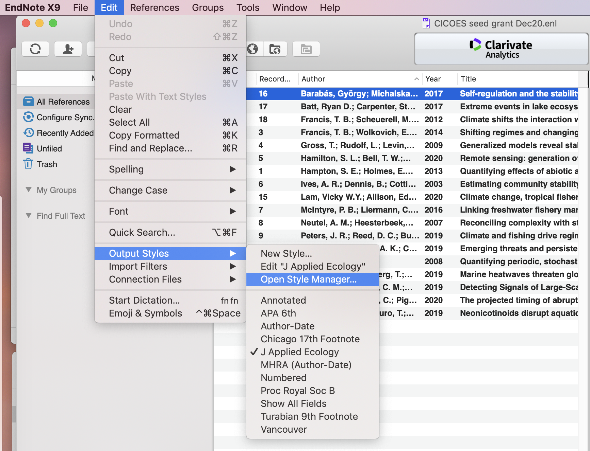
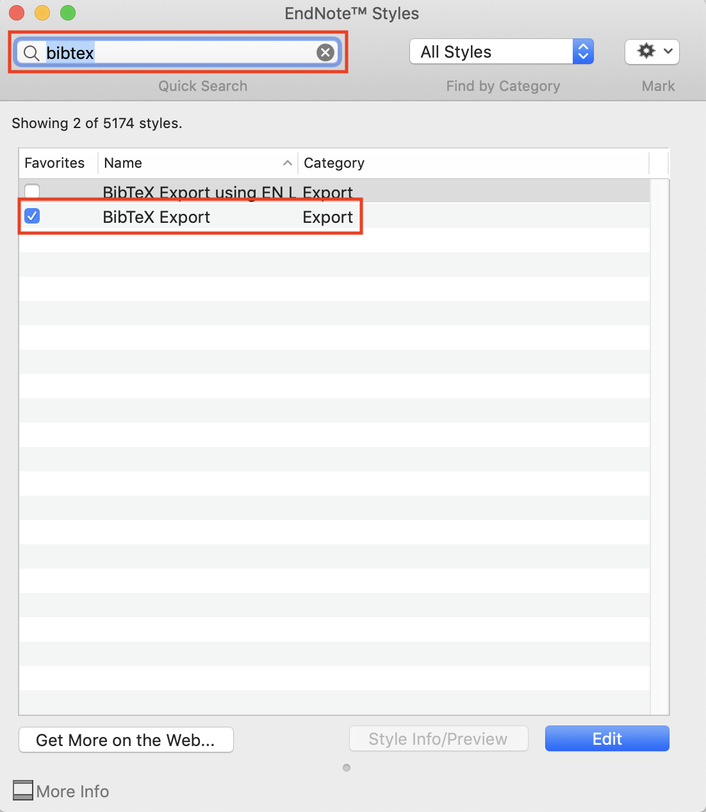
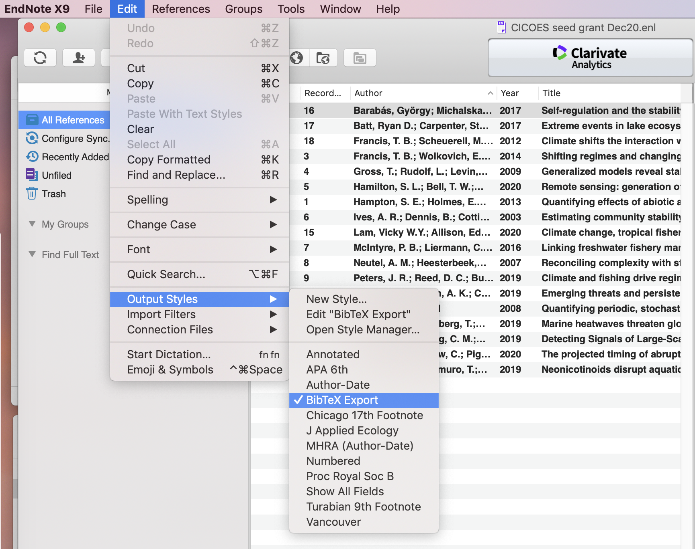
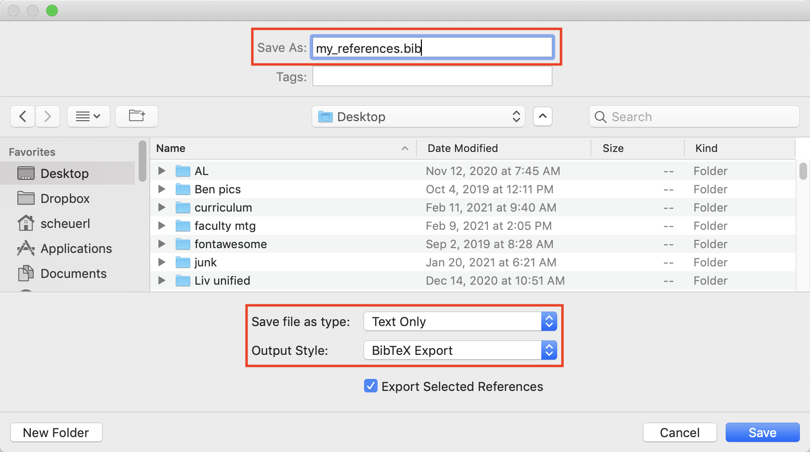
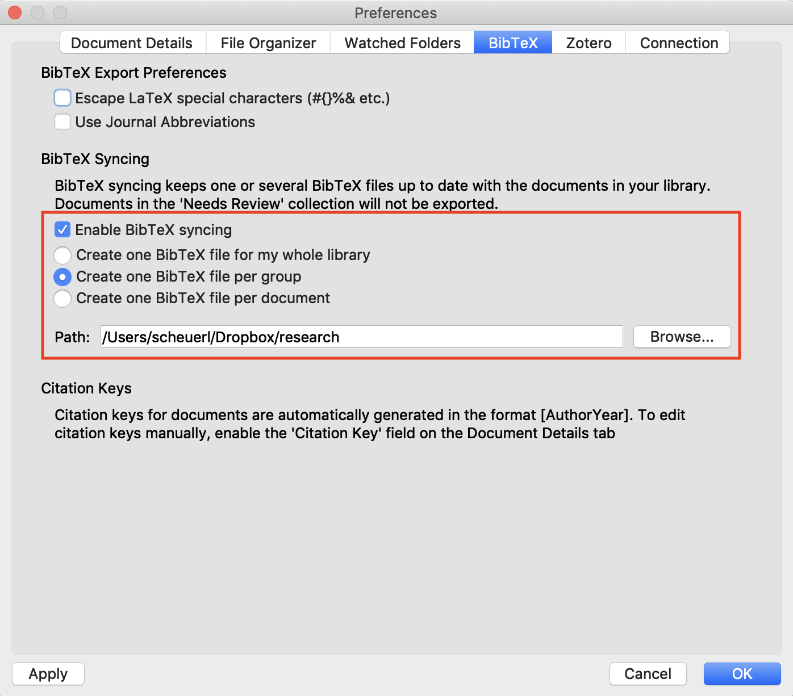

```{r setup, include=FALSE}
knitr::opts_chunk$set(echo = TRUE)
library(magrittr)
```

***

# Background

Writing documents in **R Markdown** is relatively straightforward once you know [some of the basics](intro_rmarkdown.html). You can create many different formats, including `.pdf`, `.html`, and `.doc`, and customize them in a variety of ways.


***

# Templates

There are a number of existing templates available in the [**rticles**](https://github.com/rstudio/rticles) package that you can use for knitting your document to a specific style in `.pdf` format. For `.html` formats, there are a variety of "themes" [available as well](https://www.datadreaming.org/post/r-markdown-theme-gallery/). For example, this document was created with the `readable` theme.

***

# Equations

You can write nicely formatted equations in **R Markdown** using **LaTeX** language constructs. Although the initial leap into **LaTeX** can be a bit daunting, it gets much easier with some practice and help from the many guides available online (eg, [math](latex_math_sheet.pdf) and [document](latex_cheat_sheet.pdf)).

Here are a few things to help you get started (with examples below):

* The default typeface is italic, which is commonly used to indicate a scalar; vectors and matrices are typically denoted with **bold** face, but you'll need special coding to indicate them as such;

* Sub- and superscripts are denoted by `_` and `^`, respectively; any text/number longer than one character/digit must be enclosed in curly braces `{}`

## Inline

You can include equations inline by enabling the "inline math mode" through the use of a single dollar sign (`$`) at the beginning and end of the equation. For example,

```
The errors are normally distributed, such that $e_{i,j} \sim \text{N}(0, \sigma^2)$.
```

will render as

"The errors are normally distributed, such that $e_{i,j} \sim \text{N}(0, \sigma^2)$."

## Stand alone

In many cases, you may want to have your equations set apart from the text on lines by themselves. To do this in Markdown, begin and end the equation block with 2 dollar signs (`$$`). If you want equations on multiple lines, use `\\` to indicate a line break. For example,

````
$$
y_{i,j} = \alpha + \beta x_{i,j} + e_{i,j} \\
e_{i,j} \sim \text{N}(0, \sigma^2)
$$
````

will render to

$$
y_{i,j} = \alpha + \beta x_{i,j} + e_{i,j} \\
e_{i,j} \sim \text{N}(0, \sigma^2)
$$

and 

````
$$
\mathbf{x}_t = \mathbf{B} \mathbf{x}_{t-1} + \mathbf{C} \mathbf{c}_t + \mathbf{w}_t \\
\mathbf{y}_t = \mathbf{Z} \mathbf{x}_t + \mathbf{a} + \mathbf{v}_t
$$
````

would give

$$
\mathbf{x}_t = \mathbf{B} \mathbf{x}_{t-1} + \mathbf{C} \mathbf{c}_t + \mathbf{w}_t \\
\mathbf{y}_t = \mathbf{Z} \mathbf{x}_t + \mathbf{a} + \mathbf{v}_t
$$

You can also use some additional **LaTeX** options inside the equation block for additional formatting options. For example, the `aligned` command can be used with an ampersand `&` to align multiple equations, such that 

````
\begin{aligned}
  y &= 2x + x^2 + 3 \\
    &= x(2 + x) + 3
\end{aligned}
````

yields

$$
\begin{aligned}
  y &= 2x + x^2 + 3 \\
    &= x(2 + x) + 3
\end{aligned}
$$

### Multiline equations in pdf

It turns out that pandoc won't properly render multiline equations in `.pdf` format when demarking them with double dollar signs (`$$`). Instead, you'll need to use the **LaTeX** commands `\begin{equation}` and `\end{equation}` to set them apart. For example, 

````
\begin{equation}
y_{i,j} = \alpha + \beta x_{i,j} + e_{i,j} \\
e_{i,j} \sim \text{N}(0, \sigma^2)
\begin{equation}
````

will render to

\begin{equation}
y_{i,j} = \alpha + \beta x_{i,j} + e_{i,j} \\
e_{i,j} \sim \text{N}(0, \sigma^2)
\end{equation}

It turns out that this format works with `.html` formats as well, so you may just want to get in the habit of using this form.

***

# Tables

There are several ways to create tables in **R Markdown** documents, but they vary in format based on your chosen output format. For `.html` documents, you can create simple tables with pipes (`|`) and colons (`:`). For example,

```
| Tables        | Are           | Cool  |
| ------------- |:-------------:| -----:|
| col 3 is      | right-aligned | $1600 |
| col 2 is      | centered      |   $12 |
| col 1 is      | left-aligned  |    $1 | 
```

will result in

| Tables        | Are           | Cool  |
| ------------- |:-------------:| -----:|
| col 3 is      | right-aligned | $1600 |
| col 2 is      | centered      |   $12 |
| col 1 is      | left-aligned  |    $1 | 

Note that the above code has been formatted for easier reading, but you wouldn't have to do that. For example, 

```
| Tables | Are | Cool |
| --- |:---:| ---:|
| col 3 is | right-aligned | $1600 |
| col 2 is | centered | $12 |
| col 1 is | left-aligned | $1 | 
```

will give the same result

| Tables | Are | Cool |
| --- |:---:| ---:|
| col 3 is | right-aligned | $1600 |
| col 2 is | centered | $12 |
| col 1 is | left-aligned | $1 | 

## kableExtra

You can create much fancier tables with the **kableExtra** package (click [here](https://cran.r-project.org/web/packages/kableExtra/vignettes/awesome_table_in_html.html) for the vignette with lots of examples). For example, the following code will create a table with striped rows, custom column widths, and a scroll box.

```{r kableExtra}
## load package
library(kableExtra)

## create exanple data frame
tbl_txt <- palmerpenguins::penguins[1:20, c(1, 2, 8, 7, 6)]
colnames(tbl_txt) <- c("Species", "Island", "Year", "Sex", "Body mass")

## generate table
kable(tbl_txt, format = "html",
      caption = "Table 1. An example of a `kableExtra` table.",
      align = "ccccr", escape = FALSE) %>%
  kable_styling(bootstrap_options = "striped",
                full_width = FALSE,
                position = "left") %>%
  column_spec(c(1,3,4,5), width = "6em") %>%
  column_spec(2, width = "12em") %>%
  scroll_box(height = "300px", extra_css = "border-style: none;")
```


***

# Figures

Another of Markdown's strengths is its ability to render high-quality figures. This can be done by either inserting links to saved figures/images as shown above, or executing **R** code to do so. For example, this code

````
`r ''````{r xy_plot}
set.seeed(123)
n <- 100
x <- runif(nn, 0, 10)
e <- rnorm(nn)
y <- 1 + 0.5 * x + e
plot(x, y)
```
````

would produce the following plot

```{r xy_plot, echo = FALSE}
set.seed(497)
n <- 100
x <- runif(n, 0, 10)
e <- rnorm(n)
y <- 1 + 0.5 * x + e
plot(x, y)
```

You can also add chunk options to change the figure's size, location, etc. For example,

````
`r ''````{r xy_plot, fig.height = 4, fig.width = 4, fig.align = "center"}
set.seed(497)
n <- 100
x <- runif(n, 0, 10)
e <- rnorm(n)
y <- 1 + 0.5 * x + e
plot(x, y)
```
````

would instead yield

```{r xy_plot_2, echo = FALSE, fig.height = 4, fig.width = 4, fig.align = "center"}
set.seed(497)
n <- 100
x <- runif(n, 0, 10)
e <- rnorm(n)
y <- 1 + 0.5 * x + e
plot(x, y)
```

***

# References

**R Markdown** is set up to use **BibTeX**-style references and format the citations accordingly. To do so, you'll need to have your references in a **BibTeX** library with a `.bib` extension. 

## Creating a `.bib` file

One option is to manually create reference entries, but there are several methods for exporting references from reference management software, such as **EndNote** or **Zotero**.

### Export from Zotero

To export your citations from **Zotero**, do the following

* Select the library you wish to export  
* From the menu, choose  `File > Export Library`  
* On the next screen, choose `BibTeX` from the dropdown menu & click `OK`  
* Navigate to the directory where you want to save your file & save it with a `.bib` suffix  

### Export from EndNote

To export a reference library from **EndNote**, do the following

* From the main menu, select `Edit > Output Styles > Open Style Manager...`



* Enter "bibtex" into the search bar at the top of the pop-up window and check the box next to `BibTeX Export`

* Close the window when you're finished



* From the main menu, select `Edit > Output Styles` and check the `BibTeX Export` option



* From the main menu, select `File > Export...`

* Make sure to give your filename a `.bib` suffix and verify that the options `Text only` and `BibTeX Export` are selected

* Click **Save** when you're finished



### Export from Mendeley

To export a reference library from **Mendeley**, do the following

* Go to the Mendeley `Preferences` menu  

* Click on the BibTeX tab  

* Check the box next to `Enable BibTeX syncing`  

* Click the radio button next to `Create one BibTeX file per group`

* Change the `Path` to your desired location for the library files

* Click **OK** when you are finished



## Citations

### YAML

The first step in getting properly formatted citations and references in **R Markdown** documents is to specify two pieces of information in the documents YAML:

1) the name of of the `.bib` file containing the references

2) the name of the style file that specifies how the references will be formatted in the printed docuement.

So, for example, the information for this document is

```
bibliography: "references.bib"
csl: "ecology.csl"
```

You can download just about any journal's style file [here](https://www.zotero.org/styles).


## In-text

There are two options for citations in **R Markdown** documents, both based upon the standard `Author Year` format. **BibTeX** entries have a "citekey" that begins with `@` by which they can be referenced. So, for example, if we had this reference in our `.bib` library

```
@Article{Smith_2021,
  year = {2021},
  publisher = {The Ecological Society of America},
  volume = {123},
  number = {2},
  pages = {1-10},
  author = {Sarah Smith and Joe Johnson},
  title = {Probably the best paper ever written},
  journal = {Ecology},
}
```

we could use `[@Smith_2021]` to format the in-text reference as "(Smith and Johnson 2021)", or we could use `@Smith_2021` to format the in-text reference as "Smith and Johnson (2021)".


***

# `knitcitations` package

[Carl Boettiger](https://www.carlboettiger.info/) and colleagues have created a really neat package called **knitcitations** for creating and citing **BibTeX**-style references via several mechanisms. To begin, you load the package and then use the `cleanbib()` function to remove any old `.bib` files.

```{r load_knitcitations}
## load the package
library("knitcitations")

## clean out any existing .bib files
cleanbib()

## set pandoc for formatting
options("citation_format" = "pandoc")
```

## Cite by DOI

You can cite an article by its DOI, using either `citep()` or `citet()`, and the full citation information will be gathered automatically. For example, the inline command

```{r eval = FALSE}
`r citep("10.1890/11-0011.1")`
```

will do two things:

1) create an `(Author[s] Year)` inline citation that looks like **`r citep("10.1890/11-0011.1")`**

2) create the following **BibTeX** reference that can be cited elsewhere using `[@Abrams_2012]` or `@Abrams_2012`: 

```
@Article{Abrams_2012,
  doi = {10.1890/11-0011.1},
  url = {https://doi.org/10.1890/11-0011.1},
  year = {2012},
  month = {feb},
  publisher = {Wiley},
  volume = {93},
  number = {2},
  pages = {281--293},
  author = {Peter A. Abrams and Lasse Ruokolainen and Brian J. Shuter and Kevin S. McCann},
  title = {Harvesting creates ecological traps: consequences of invisible mortality risks in predator{\textendash}prey metacommunities},
  journal = {Ecology},
}
```

On the other hand, the inline command

```{r eval = FALSE}
`r citet("10.1098/rspb.2013.1372")`
```

will do two things:

1) create an `Author[s] (Year)` inline citation that looks like **`r citet("10.1098/rspb.2013.1372")`**

2) create the following **BibTeX** reference that can be cited elsewhere using `[@Boettiger_2013]` or `@Boettiger_2013`: 

```
@Article{Boettiger_2013,
  doi = {10.1098/rspb.2013.1372},
  url = {https://doi.org/10.1098/rspb.2013.1372},
  year = {2013},
  month = {sep},
  publisher = {The Royal Society},
  volume = {280},
  number = {1766},
  pages = {20131372},
  author = {Carl Boettiger and Alan Hastings},
  title = {No early warning signals for stochastic transitions: insights from large deviation theory},
  journal = {Proceedings of the Royal Society B: Biological Sciences},
}
```


## Cite by URL

Not all the literature we may wish to cite includes DOIs, such as **arXiv** preprints, Wikipedia pages, or other academic blogs. `{knitcitations}` can produce citations from any URL using the Greycite API. For example, we can use the call 

```{r, eval = FALSE}
`r citep("http://knowledgeblog.org/greycite")`
```

to generate the citation to the Greycite tool, which will render as **`r citep("http://knowledgeblog.org/greycite")`** and produce the following **BibTeX** reference that can be cited elsewhere using `[@greycite32194]` or `@greycite32194`.

```
@Misc{greycite32194,
  url = {http://knowledgeblog.org/greycite},
  title = {Greycite},
  journal = {Knowledge Blog},
  year = {2012},
  howpublished = {\url{http://knowledgeblog.org/greycite}},
  author = {Phillip Lord},
  archived = {http://greycite.knowledgeblog.org/?uri=http%3A%2F%2Fknowledgeblog.org%2Fgreycite, http://wayback.archive.org/web/http://knowledgeblog.org/greycite},
}
```

## Cite **BibTeX** objects directly

We can also cite **BibTeX** objects directly, such as those that **R** provides for citing packages using the `citation()` function. So, for example, here are the citations for the `{knitr}` package

```{r}
citation("knitr")
```

We can use the following inline command

```{r, eval = FALSE}
`r citep(citation("knitr"))`
```

to generate the 3 **BibTeX** objects as

```
@InCollection{Xie_2014,
  booktitle = {Implementing Reproducible Computational Research},
  editor = {Victoria Stodden and Friedrich Leisch and Roger D. Peng},
  title = {knitr: A Comprehensive Tool for Reproducible Research in {R}},
  author = {Yihui Xie},
  publisher = {Chapman and Hall/CRC},
  year = {2014},
  note = {ISBN 978-1466561595},
  url = {http://www.crcpress.com/product/isbn/9781466561595},
}

@Book{Xie_2015,
  title = {Dynamic Documents with {R} and knitr},
  author = {Yihui Xie},
  publisher = {Chapman and Hall/CRC},
  address = {Boca Raton, Florida},
  year = {2015},
  edition = {2nd},
  note = {ISBN 978-1498716963},
  url = {https://yihui.org/knitr/},
}

@Manual{Xie_2020,
  title = {knitr: A General-Purpose Package for Dynamic Report Generation in R},
  author = {Yihui Xie},
  year = {2020},
  note = {R package version 1.30},
  url = {https://yihui.org/knitr/},
}
```

and also create the citation

**`r citep(citation("knitr"))`**

We can now cite the package with normal **BibTeX** entries and pandoc will correctly avoid duplicating the author's name. For example,

`[@Xie_2014; @Xie_2015; @Xie_2020]`

will produce

**[@Xie_2014; @Xie_2015; @Xie_2020]**

Similarly, we can cite references that are already included in our `.bib` file using the standard notation, such that

`[@Boettiger_2013]` or `@Boettiger_2013`

will render as

**[@Boettiger_2013]** or **@Boettiger_2013**


## Re-using **BibTeX** keys

When `citep()` or `citet()` are called, they automatically generate a **BibTeX** key in the format `AuthorLastName_Year`. We can then use this key to cite a reference without remembering its DOI. For example,

```{r, eval = FALSE}
`r citep("Abrams_2012")` 
```

will simply create the citation

**[@Abrams_2012]**


## Creating the references cited section

Creating the final references cited section is straightforward. All we have to do is call the function `write.bibtex()` with the name of the `.bib` file and the references will be cited with the formatting specified in the `.cls` file supplied in the document's YAML. For example, we can generate the references cited section  from the citations in this tutorial with the following:

```{r, eval = FALSE}
## create ref cited section
write.bibtex(file = "references.bib")
```

## References

```{r, echo = FALSE, message = FALSE}
## create ref cited section
write.bibtex(file = "references.bib")
```

