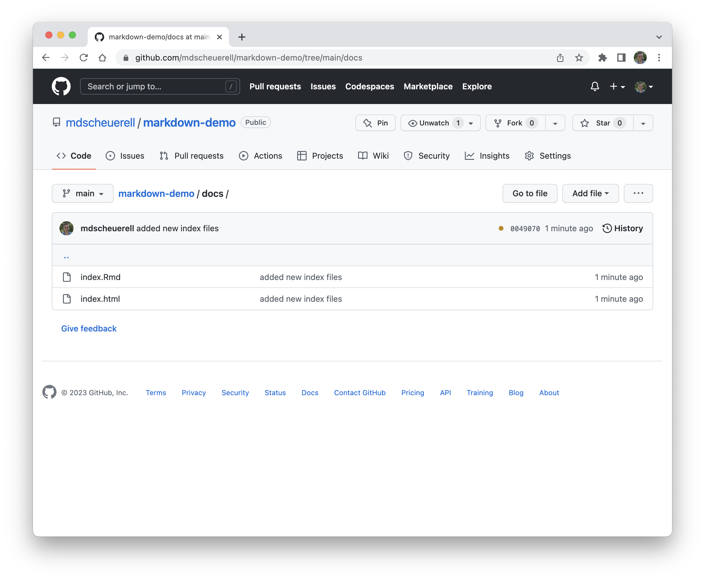
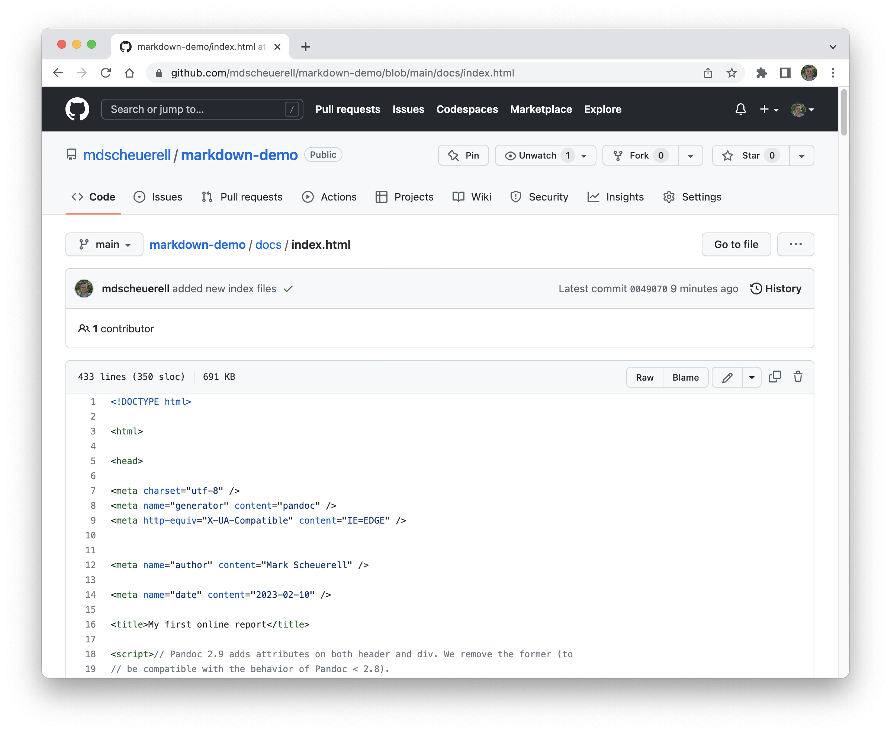

```{r setup, include=FALSE}
knitr::opts_chunk$set(echo = TRUE)
library(magrittr)
```

***

# Background

Writing documents in **R Markdown** is relatively straightforward once you know [some of the basics](intro_rmarkdown.html). You can create many different formats, including `.pdf`, `.html`, and `.doc`, and customize them in a variety of ways.


***

# Templates

There are a number of existing templates available in the [**rticles**](https://github.com/rstudio/rticles) package that you can use for knitting your document to a specific style in `.pdf` format. For `.html` formats, there are a variety of "themes" [available as well](https://www.datadreaming.org/post/r-markdown-theme-gallery/). For example, this document was created with the `spacelab` theme.

::: task

Open RStudio and from the menu options select **File > New File > R Markdown...**

:::

::: tip

You can change the **Title**, **Author**, and **Date**, fields here, but we'll do that later.

:::

{ width=70% }

<br>

::: task

Leave the **Default Output Format** as `HTML` and click on **OK**.

:::

::: success

You now have a new `.Rmd` file ready for editing, which includes some placeholder text and code blocks.

:::


<br>

***

# Document layout

## Front Matter (YAML)

Every Markdown document begins with a section of plain text written in [YAML](https://en.wikipedia.org/wiki/YAML) ("YAML Ain't Markup Language"). This block of human readable code is used to define some of the document's metadata such as the title, author, and date. It is also used to specify the document's format (eg, HTML or pdf) and its layout (eg, theme, font).

::: tip

The front matter is defined in a block of text that begins and ends with 3 dashes `---`.

:::

Here is the YAML for our new simple HTML document:

```
---
title: "Untitled"
author: "Mark Scheuerell"
date: "7 February 2025"
output: html_document
---
```

The YAML can include a lot more information as well, including fields for various pre-defined themes, a table of contents, adding citations and formatting references, and whether to use other files as formatting templates. For example, here is the YAML for this document with today's class notes:

```
---
title: "Using R Markdown for reporting"
subtitle: "Part 1"
date: "<br>7 February 2025"
output:
  html_document:
    theme: spacelab
    highlight: textmate
    css: ../lecture_inst.css
    code_download: true
    toc: true
    toc_float: true
    toc_depth: 3
---
```

***

# Knitting your file

The process of creating a nicely formatted document (e.g., `html`, `.pdf`) from the raw markdown code in the `.Rmd` file is known as _knitting_. You can knit a `.Rmd` file from the R command line, but the easiest way in RStudio is to simply click the **Knit** button at the top of the editing pane.

::: tip

Clicking on the downarrow to the right of the **Knit** button brings up some additional options.

:::


<br>

::: task

Click on the **Knit** button to render your `.Rmd` file as a `.html` file.

:::

::: note

Knitting a `.Rmd` file automatically saves it. The first time you click **Knit**, you will be prompted for the filename and location where you want to save the file.

:::


::: success

You now have a knitted `.html` file.

:::

## Make some changes

Let's make some changes to our markdown document and knit them.

::: task

Add a title, subtitle, and table of contents (toc) to the YAML.

:::

::: note

The indentation and colons in the YAML subfields are necessary.

:::

```
---
title: "Creating online reports"
subtitle: "A markdown demonstration"
author: "Mark Scheuerell"
date: "10 February 2023"
output:
  html_document:
    toc: true
    toc_float: true
    toc_depth: 3
---
```

::: task

Add a level-1 and level-3 header to your document.

:::


<br>

::: task

Click the **Knit** button to see your changes.

:::


::: tip

The table of contents will change as you scroll down through the sections and float along the left side.

:::


***

# Publishing reports online

Now that we've seen how to create an HTML report using R Markdown, let's publish a report online so that it can be shared with and viewed by others.

## Create a new repo

::: task

* Navigate to GitHub and create a new _public_ repo called `markdown-demo`.

* Add a `README.md` file and an R `.gitignore` file as well (you can skip a license file).

* Click the green **Create repository** button when you're ready.

:::


::: task

Click on the **Settings** button in the upper right.

:::


::: task

Click on the **Pages** button on the left side.

:::


::: task

Click on the **None** button under the **Branch** heading and swith it to **main**.

:::


::: task

Click on the **/ (root)** button under the **Branch** heading and swith it to **/docs**.

:::


::: task

When you're ready, click on the **Save** button.

:::


::: success

Your repo is now set to use GitHub Pages for displaying HTML files.

:::


## Create an RStudio project

::: task

Create a new project in RStudio from the `markdown-demo` repo you just created.

:::

::: task

Open a new R Markdown document and give it a title. Select the **HTML** format and click **OK** when you're done.

:::

{ width=70% }

::: task

Save your new document in a new subfolder within your `markdown-demo` project called `docs` with the filename `index.Rmd`.

:::

::: tip

When you click **Save**, your markdown document will be knit automatically.

:::


::: note

You should now see a `/docs` folder in the RStudio file pane. Click on it and you will see your `index.Rmd` and `index.html` files there. 

:::

{ width=70% }

{ width=70% }

::: task

Commit your changes to the `index.Rmd` and `index.html` files.

:::


::: task

Push your commit when done.

:::


## Viewing your document

Now that we've pushed our basic HTML report to GitHub, we should be able to view it online.

::: task

Navigate back your `markdown-demo` repo on GitHub and you'll see the `/docs` folder containing the `index.Rmd` and `index.html` files you just pushed.

:::





::: note

If you click on the `index.html` file, you'll notice that it just displays the raw HTML code rather than a nicely formatted website.

:::




::: tip

GitHub cannot render HTML files in a normal repo, but you can view your new document by navigating to `https://USERNAME.github.io/markdown-demo/` where `USERNAME` is your GitHub username.

:::


::: tip

You can add a link to your newly rendered document by edited the main page of your repo.

:::

::: task

Click on the small gear icon in the upper right, which will bring up a window to edit some aspects of your repo.

:::


::: task

* In the **Website** field, type or copy/paste the link to your rendered site, which should be `https://USERNAME.github.io/markdown-demo/` where `USERNAME` is your GitHub username. 

* Click on the green **Save changes** button when you're done.

:::


::: success

Your repo has now been updated to include a direct link to your properly rendered HTML report.

:::


::: tip

You can easily share your online report with others by copying/pasting the link in the **About** field into a message, issue, etc.

:::

<br>

## Updating your report

You now have an online document that you can update by making changes in your RStudio project and pushing them to GitHub.

::: tip

Adding information about a document's version or the date it was last updated can be helpful to you and others. We'll see [next time](lec_21_markdown_2.html) how to do so.

:::

<br>

***

# Endnote

Now that you have seen how to create HTML reports and display them online, you're ready to add more details such as equations, code blocks, figures, tables, etc.

::: tip

You can refer to [this primer](https://fish549.github.io/website/lectures/week_07/intro_rmarkdown.html) for some additional information on formatting R Markdown documents.

:::

