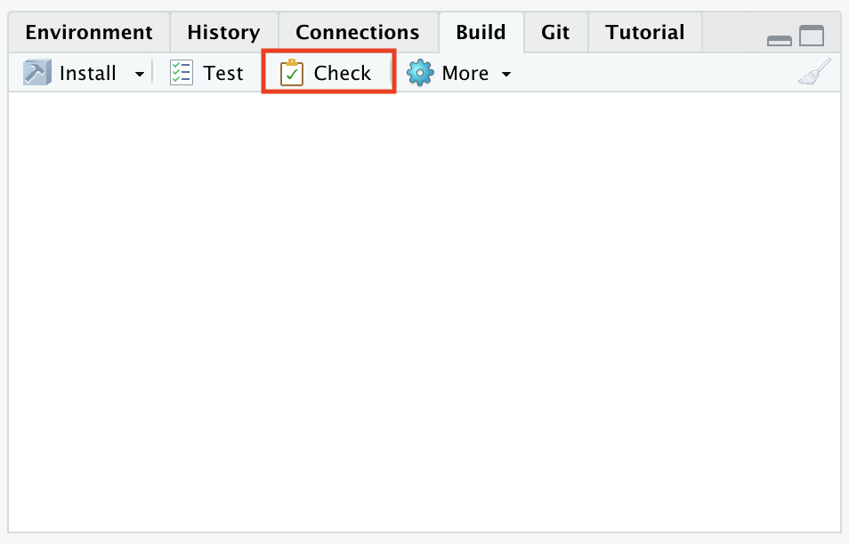
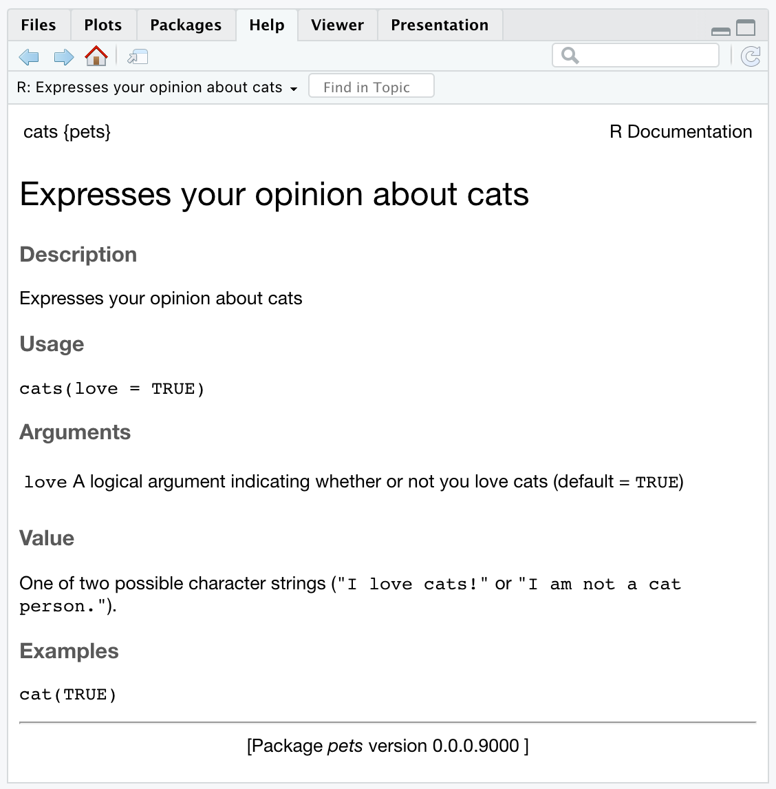
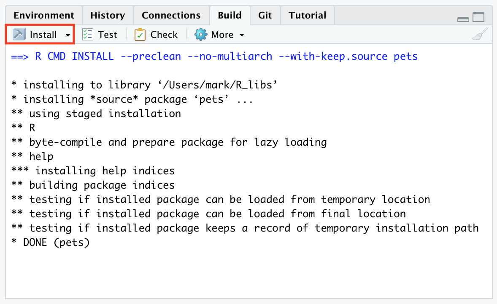

```{r setup, include=FALSE}
knitr::opts_chunk$set(echo = TRUE)
```

***

# Background

If you think about your typical R script within a project, you probably have a series of calls to various functions (and subsequent assignments of their output to object names) that follow a purposeful path to an endpoint. Similar to how an article conveys scientific ideas to others, a package allows us to distribute a specific workflow to others. 

For many of us, our first encounter with R packages is via those that come bundled with the base installation of R and allow us access to functions like `mean()` and `plot()`. In essence, packages allow us to expand the functionality of base R while still enforcing some standards (e.g., many of you will have experience with the various functions in the `{tidyverse}` collection).

Here is some common terminology with respect to R packages:

* *Package*: An extension of the base R system with code, data [optional], and documentation combined together in a standard format (e.g., [`{MARSS}`](https://cran.r-project.org/web/packages/MARSS/index.html)).

* *Library*: A directory/folder containing installed packages (e.g., the location you would pass to the argument `lib` in the `install.packages()` function).

* *Repository*: A website providing packages for installation (e.g., [CRAN](https://cran.r-project.org/web/packages/available_packages_by_name.html)).

* *Source*: The original version of a package with human-readable text and code.

* *Binary*: A compiled version of a package with computer-readable text and code.

* *Base packages*: Part of the R source tree, maintained by **R Core**.

* *Recommended packages*: Part of every R installation, but not necessarily maintained by **R Core**.

* *Contributed packages*: All of the remaining packages contributed by the user community.

***

# Functions

Functions form the basis for R packages. In general, an R function has the following structure

```{r package_layout, eval = FALSE}
function_name <- function(arguments) {
  error checks
  commands to execute
  return(something)
}
```

So, for example, here is a simple function that adds 2 numbers together and returns the result:

```{r func_add}
add <- function(x, y) {
  ## verify x & y are numbers
  if(!is.numeric(x) | !is.numeric(y)) {
    stop("`x` and `y` must be numbers")
  }
  ## add the 2 numbers
  z <- x + y
  ## return the result
  return(z)
}
```

When building packages, we will also include some additional information that describes what the function does and how it works. This information will become part of the help documentation that is returned when someone types `?function_name`.

***

# Getting started

## GitHub repository

Fortunately for us, there are variety of tools available to assist us in developing and producing packages.


::: task

* Create a new, public repository on **GitHub** called `pets`.

* Populate the repo with

  - a brief `README.md`;

  - a `.gitignore` file.

(You can skip the license for now.)

:::

::: task

Create a new project in **RStudio** based upon this repo.

:::


***

# Create package framework

Once upon a time you had to work through all of the steps to building a package unassisted. Fortunately for us, the `{devtools}` package will automate many of the steps.

::: note

You will need both the `{devtools}` and `{usethis}` packages for this exercise.

:::

::: task

At the R command prompt, load the `{devtools}` package, which will respond with a message about also loading the `{usethis}` package.

:::

```{r, eval = FALSE}
> library(devtools)
Loading required package: usethis
```

We're now ready to create a framework for building our package. Before doing so, however, we need to locate the folder/directory where you created the `pets` project.

::: task

At the R command prompt, find the location of the working directory.

:::

```{r getwd, eval = FALSE}
> getwd()
```

```
## [1] "/Users/mark/Documents/GitHub/FISH549/pets"
```

::: task

Copy the result (including the quotation marks), which you will need for the next step.

:::

::: task

Now execute the following command at at the R command prompt, where `pasted/folder/from/previous/step` is the result from the `getwd()` call above.

:::

```{r create_pkg, eval = FALSE}
> create_package("pasted/folder/from/previous/step")
```

You should see R responding with a bunch of information about your new package framework, followed by a prompt asking if you'd like to overwrite the pre-existing file `pets.Rproj`.

```{r create_pkg_results, eval = FALSE}
✓ Setting active project to '/Users/mark/Documents/GitHub/FISH549/pets'
✓ Creating 'R/'
✓ Writing 'DESCRIPTION'
Package: pets
Title: What the Package Does (One Line, Title Case)
Version: 0.0.0.9000
Authors@R (parsed):
    * First Last <first.last@example.com> [aut, cre] (YOUR-ORCID-ID)
Description: What the package does (one paragraph).
License: `use_mit_license()`, `use_gpl3_license()` or friends to
    pick a license
Encoding: UTF-8
LazyData: true
Roxygen: list(markdown = TRUE)
RoxygenNote: 7.1.1
✓ Writing 'NAMESPACE'
Overwrite pre-existing file 'pets.Rproj'?

1: Definitely
2: Negative
3: Nope

Selection: 3
✓ Leaving 'pets.Rproj' unchanged
✓ Adding '^pets\\.Rproj$' to '.Rbuildignore'
✓ Adding '.Rproj.user' to '.gitignore'
✓ Adding '^\\.Rproj\\.user$' to '.Rbuildignore'
✓ Opening '/Users/mark/Documents/GitHub/FISH549/pets/' in new RStudio session
✓ Setting active project to '<no active project>'
```

::: task

Go ahead and select any of the options that look like `Nope`, `No way`, `Not now`, etc. (Note that these options will vary each time you do this, so don't worry if yours don't mirror the options below.)

:::

::: note

After making your selection, **RStudio** will open a new instance of your `pets` project.

:::

## Directory structure

Wow, that's a lot of information. What just happened here?

First, you should notice that several new files and a folder have been added to your directory. These include:

* `.Rbuildignore`: a list of files that we'll need to have around, but that should be excluded when building the package from source; at present this contains `^pets\.Rproj$` and `^\.Rproj\.user$`

* `DESCRIPTION`: provides metadata about your package, the contents of which were shown above when you ran `create_package()`

* `NAMESPACE`: declares the functions your package exports for external use and the external functions your package imports from other packages

* `/R`: an empty folder where we'll put our `.R` files that contain our function definitions

::: tip

Files beginning with a `.` are generally hidden from view. If you cannot see any listed in the **Files** pane, click on the drop-down menu with the gear icon (it might say "More" next to it if your window is large enough). Select `Show Hidden Files` at the bottom of the menu to display them.

:::

## Restart RStudio

At this point, go ahead and quit both instances of the **RStudio** `pets` project. Navigate to the `pets.Rproj` file in the folder/directory where you set up the project initially, and double-click it to restart your project (or just select your project from the drop-down menu in the upper right).

::: task

After restarting **RStudio**, you will need to reload `{devtools}`.

:::

```{r reload_devtools, eval = FALSE}
> library(devtools)
Loading required package: usethis
```

***

# Write a function

As mentioned above, the basis of R packages is functions. Let's go ahead and create a new function called `cats()`.

::: task

Type `use_r("cats)` to create a script within the `/R` directory called `cats.R` where we can define our new function.

:::

```{r use_r, eval = FALSE}
> use_r("cats")
✔ Setting active project to '/Users/mark/Documents/GitHub/FISH549/pets'
• Modify 'R/cats.R'
• Call `use_test()` to create a matching test file
```

::: note

Later we'll come back the advice to create a matching test file with `use_test()`.

:::

Now we can write our function definition. 

::: task

* Copy/paste the following code into the `cats.R` file.

* When you are finished, save the file.

:::

```{r define_cats, eval = FALSE}
cats <- function(love = TRUE) {
  if(love == TRUE) {
    msg <- "I love cats!"
  }
  else {
    msg <- "I am not a cat person."
  }
  return(print(msg))
}
```

## Try our function

Now that we've defined a new function, it's a good idea to try it out. Although we could just highlight the code and execute it in the normal R environment, there is a function `load_all()` that will help us better simulate the building, installing, and attaching our new `cats` package. As a package accumulates more functions, `load_all()` gives you a much more accurate sense of how the package is developing than simply testing functions defined in the global workspace. `load_all()` also allows much faster iteration than actually going through the process of building, installing, and attaching the package.

::: task

Call `load_all()` at the command prompt and the function will respond that it's loading the `{pets}` package.

:::

```{r load_all, eval = FALSE}
> load_all()
ℹ Loading pets
```

::: task

Go ahead and try out our new function.

:::

```{r define_cats_2, echo = FALSE, eval = FALSE}
cats <- function(love = TRUE) {
  if(love == TRUE) {
    msg <- "I love cats!"
  }
  else {
    msg <- "I am not a cat person."
  }
  return(print(msg))
}
```

```{r try_cats, echo = FALSE, eval = FALSE}
cats(TRUE)
cats(FALSE)
cats(1)
cats("a")
```

```{r cats_test_1, eval = FALSE}
> cats()  # default argument is `love = TRUE`
[1] "I love cats!"
> cats(TRUE)
[1] "I love cats!"
> cats(FALSE)
[1] "I am not a cat person."
```

::: success

Our function works!

:::

## Informal testing

We will set up some more formal function testing later, but let's see what happens when we don't use the function as it was intended.

```{r cats_test_2, eval = FALSE}
> cats(1)
[1] "I love cats!"
> cats(2)
[1] "I am not a cat person."
> cats("meh")
[1] "I am not a cat person."
```

What happened here? Why didn't R throw an error or warning when we didn't include a logical argument of `TRUE` or `FALSE`?

* In the first case, `1` is equivalent to `TRUE` in R, so it returns the result as if `cats(TRUE)`.

* In the second and third cases, our function definition only involves a check whether the argument is `TRUE`. If not, the default behavior is to return the result `"I am not a cat person."`

These tests suggest that although our function works as expected, we might want to add some additional checks on the input argument.

## Commit our changes

This is a good time to go ahead and commit the files we created as part of `create_package()` and our definition of the `cats()` function. Make sure to give your commit(s) a short but descriptive name(s).

***

# Checking a function

At this point, we have reason to believe that `cats()` works as expected, but we should really verify that all of the elements of the entire `pets` package indeed work. This may seem a bit silly to check after such a small addition or change, but it's good to establish the habit of checking our work often.

The standard method for checking a package's functionality is to run the command `R CMD check` in the **Terminal**. However, we can make us of the `check()` function in `{devtools}` to do so without leaving **RStudio**. 

::: note

`check()` produces ***a lot*** of output under the categories of `Documenting`, `Building`, and `Checking`.

:::

::: task

Run `check()` at the command prompt.

:::

```{r run_check, eval = FALSE}
> check()
══ Documenting ═════════════════════════════════════════════════════════════
ℹ Updating pets documentation
ℹ Loading pets

══ Building ════════════════════════════════════════════════════════════════
Setting env vars:
• CFLAGS    : -Wall -pedantic -fdiagnostics-color=always
• CXXFLAGS  : -Wall -pedantic -fdiagnostics-color=always
• CXX11FLAGS: -Wall -pedantic -fdiagnostics-color=always
• CXX14FLAGS: -Wall -pedantic -fdiagnostics-color=always
• CXX17FLAGS: -Wall -pedantic -fdiagnostics-color=always
• CXX20FLAGS: -Wall -pedantic -fdiagnostics-color=always
✔  checking for file ‘/Users/mark/Documents/GitHub/FISH549/pets/DESCRIPTION’ ...
─  preparing ‘pets’:
✔  checking DESCRIPTION meta-information ...
─  checking for LF line-endings in source and make files and shell scripts
─  checking for empty or unneeded directories
   Removed empty directory ‘pets/man’
─  building ‘pets_0.0.0.9000.tar.gz’
   
══ Checking ════════════════════════════════════════════════════════════════
Setting env vars:
• _R_CHECK_CRAN_INCOMING_REMOTE_: FALSE
• _R_CHECK_CRAN_INCOMING_       : FALSE
• _R_CHECK_FORCE_SUGGESTS_      : FALSE
• NOT_CRAN                      : true
── R CMD check ─────────────────────────────────────────────────────────────
─  using log directory ‘/private/var/folders/w6/bgxxqxln6nxf9z0wr7fypyfw0000gn/T/Rtmp3HNU44/pets.Rcheck’
─  using R version 4.2.2 (2022-10-31)
─  using platform: x86_64-apple-darwin17.0 (64-bit)
─  using session charset: UTF-8
─  using options ‘--no-manual --as-cran’
✔  checking for file ‘pets/DESCRIPTION’
─  this is package ‘pets’ version ‘0.0.0.9000’
─  package encoding: UTF-8
✔  checking package namespace information
✔  checking package dependencies (1.4s)
✔  checking if this is a source package ...
✔  checking if there is a namespace
✔  checking for executable files ...
✔  checking for hidden files and directories
✔  checking for portable file names
✔  checking for sufficient/correct file permissions
✔  checking serialization versions
✔  checking whether package ‘pets’ can be installed (1s)
✔  checking installed package size
✔  checking package directory
✔  checking for future file timestamps ...
W  checking DESCRIPTION meta-information ...
   Non-standard license specification:
     `use_mit_license()`, `use_gpl3_license()` or friends to pick a
     license
   Standardizable: FALSE
✔  checking top-level files
✔  checking for left-over files
✔  checking index information ...
✔  checking package subdirectories ...
✔  checking R files for non-ASCII characters ...
✔  checking R files for syntax errors ...
✔  checking whether the package can be loaded ...
✔  checking whether the package can be loaded with stated dependencies ...
✔  checking whether the package can be unloaded cleanly ...
✔  checking whether the namespace can be loaded with stated dependencies ...
✔  checking whether the namespace can be unloaded cleanly ...
✔  checking loading without being on the library search path ...
✔  checking dependencies in R code ...
✔  checking S3 generic/method consistency (366ms)
✔  checking replacement functions ...
✔  checking foreign function calls ...
✔  checking R code for possible problems (1.9s)
✔  checking for missing documentation entries ...
─  checking examples ... NONE
✔  checking for non-standard things in the check directory
✔  checking for detritus in the temp directory
   
   See
     ‘/private/var/folders/w6/bgxxqxln6nxf9z0wr7fypyfw0000gn/T/Rtmp3HNU44/pets.Rcheck/00check.log’
   for details.
   
   
── R CMD check results ────────────────────────────────────────────────── pets 0.0.0.9000 ────
Duration: 7.2s

❯ checking DESCRIPTION meta-information ... WARNING
  Non-standard license specification:
    `use_mit_license()`, `use_gpl3_license()` or friends to pick a
    license
  Standardizable: FALSE

0 errors ✔ | 1 warning ✖ | 0 notes ✔
```

::: tip

It is **very important** to read over all of this information, as it will report the things that passed the check as well as any warnings or errors encountered in the process. 

:::

Here we see that we have 0 errors, 1 warning, and 0 notes. The warning says,

`Non-standard license specification`

which is OK for now, as we'll address that later.

::: tip

You can also run a package check via the **Build** pane in **RStudio**.

:::

{ width=70% }


***

# Edit `DESCRIPTION` file

The `DESCRIPTION` file provides some metadata about a package, including the package name, its title, author, etc. Your `DESCRIPTION` file should look something like this:

```
Package: pets
Title: What the Package Does (One Line, Title Case)
Version: 0.0.0.9000
Authors@R: 
    person("First", "Last", , "first.last@example.com", role = c("aut", "cre"),
           comment = c(ORCID = "YOUR-ORCID-ID"))
Description: What the package does (one paragraph).
License: `use_mit_license()`, `use_gpl3_license()` or friends to pick a
    license
Encoding: UTF-8
Roxygen: list(markdown = TRUE)
RoxygenNote: 7.2.1
```

Let's go ahead and make the following changes:

::: task

Change the package title to `Evaluates Your Feelings About Pets`.

:::

::: tip

The convention is to use Title Case for package titles.

:::

::: task

Add your first and last names, and your email address. You can leave the `role` as is and delete the `comment` field asking about your `ORCID`.

:::

::: tip

Write some descriptive text about the package in the `Description` field. For example, `Pets are awesome companions. Some people are fans of cats, others not so much.`

:::

When finished, your `DESCRIPTION` file should look something like this:

```
Package: pets
Title: Evaluates Your Feelings About Pets
Version: 0.0.0.9000
Authors@R: 
    person(given = "Mark",
           family = "Scheuerell",
           role = c("aut", "cre"),
           email = "mark@uw.edu")
Description: Pets are awesome companions. Some people are fans of cats, others not so much.
License: `use_mit_license()`, `use_gpl3_license()` or friends to pick a
    license
Encoding: UTF-8
Roxygen: list(markdown = TRUE)
RoxygenNote: 7.2.1
```

***

# Add a license

It's best practice to add a license to our package so let's go ahead and do that (we'll use the MIT license).

::: task

Use the helper function `use_mit_license()` to create a license and make sure to use your own name in the argument.

:::

```{r add_license, eval = FALSE}
> use_mit_license("Mark Scheuerell")
✔ Setting License field in DESCRIPTION to 'MIT + file LICENSE'
✔ Writing 'LICENSE'
✔ Writing 'LICENSE.md'
✔ Adding '^LICENSE\\.md$' to '.Rbuildignore'
```

::: task

Open up the newly created `LICENSE` file and confirm it has the current year and your name.

:::

```
YEAR: 2025
COPYRIGHT HOLDER: Mark Scheuerell
```

::: tip

`use_mit_license()` will also put a copy of the full license in `LICENSE.md` and add this file to `.Rbuildignore`.

:::


***

# Writing documentation

If you're like Mark, you often rely on a function's documentation to help you understand the arguments to a function and the value(s) that the function returns. This is typically done via a question mark preceding the function name (e.g., `?print`). Writing this documentation used to be a bit onerous, but now it's easy to add documentation to a package using the `{roxygen2}` package. To do so, we'll add a special form of comment above our function definition in `cats.R`, which we'll denote with a `#'`. 

::: task

Open the `cats.R` script and make sure your cursor is at the very top . From your **RStudio** menu, select **Code > Insert Roxygen Skeleton**.

:::

::: tip

Your `cats.R` file should now look like following.

:::

```
#' Title
#'
#' @param love 
#'
#' @return
#' @export
#'
#' @examples
cats <- function(love = TRUE) {
  if(love == TRUE) {
    msg <- "I love cats!"
  }
  else {
    msg <- "I am not a cat person."
  }
  return(print(msg))
}
```

Let's go over the different elements of the function's documentation skeleton that we just inserted.

* `Title`: A short descriptive phrase of what the function does.

* `@param`: One or more arguments to the function (here there is only one: `love`) and its/their description(s).

* `@return`: A description of what the function returns.

* `@export`: Tells `roxygen2` to add this function to the `NAMESPACE` file so it's accessible to users.

* `@examples`: One or more coded examples of how the function is used.

### Title

::: task

Replace `Title` with something more descriptive like `Expresses your opinion about cats`.

:::

```
#' Expresses your opinion about cats
#'
#' @param love 
#'
#' @return
#' @export
#'
#' @examples
cats <- function(love = TRUE) {
  if(love == TRUE) {
    msg <- "I love cats!"
  }
  else {
    msg <- "I am not a cat person."
  }
  return(print(msg))
}
```

### Parameters

Our `{roxygen}` skeleton already contains the one parameter in our function `love`, but we can go ahead and add an explicit description of this argument. It's often a good idea to also include what, if any, the default argument is.

::: task

In the `#' @param` field after `love`, add ```A logical argument indicating whether or not you love cats (default = `TRUE`)```.

:::

```
#' Expresses your opinion about cats
#'
#' @param love A logical argument indicating whether or not you love cats (default = `TRUE`)
#'
#' @return
#' @export
#'
#' @examples
cats <- function(love = TRUE) {
  if(love == TRUE) {
    msg <- "I love cats!"
  }
  else {
    msg <- "I am not a cat person."
  }
  return(print(msg))
}
```

### Return

It's good practice to tell the user what they should expect from a function. This is admittedly a rather simple function, which is easy to decipher, but other functions will not be nearly as transparent.

::: task

In the `#' @return` field , add ```One of two possible character strings (`"I love cats!"` or `"I am not a cat person."`)```.

:::

```
#' Expresses your opinion about cats
#'
#' @param love A logical argument indicating whether or not you love cats (default = `TRUE`)
#'
#' @return One of two possible character strings (`"I love cats!"` or `"I am not a cat person."`).
#' @export
#'
#' @examples
cats <- function(love = TRUE) {
  if(love == TRUE) {
    msg <- "I love cats!"
  }
  else {
    msg <- "I am not a cat person."
  }
  return(print(msg))
}
```

### Export

You can leave this blank, as the default behavior is all we need here.

### Examples

This is an optional element of the documentation. If you include `@examples` without any actual code, you will get a warning about `@examples requires a value`. In this case, we can add a really simple example:

::: task

Add `cats(TRUE)` to the `#' @examples ` field.

:::

```
#' Expresses your opinion about cats
#'
#' @param love A logical argument indicating whether or not you love cats (default = `TRUE`)
#'
#' @return One of two possible character strings (`"I love cats!"` or `"I am not a cat person."`).
#' @export
#'
#' @examples cats(TRUE)
cats <- function(love = TRUE) {
  if(love == TRUE) {
    msg <- "I love cats!"
  }
  else {
    msg <- "I am not a cat person."
  }
  return(print(msg))
}
```

::: tip

Make sure to save `cats.R` after modifying the `{roxygen}` skeleton.

:::


## Assemble the documentation

Now that we've written the function's documentation, we need to pass it along to the `cats.Rd` file in the help manual. To do so, we can use the `document()` function.

::: task

Run `document()` at the command prompt to create the function documentation.

:::

```{r document_help, eval = FALSE}
> document()
Updating pets documentation
ℹ Loading pets
Writing NAMESPACE
Writing cats.Rd
```

::: tip

There should be a new folder in your project directory called `/man`, which stands for "manual". This is where the help files live.

:::

::: task

Open up the `/man` folder and inspect the contents of `cats.Rd`. It should look like the following.

:::

```
% Generated by roxygen2: do not edit by hand
% Please edit documentation in R/cats.R
\name{cats}
\alias{cats}
\title{Expresses your opinion about cats}
\usage{
cats(love = TRUE)
}
\arguments{
\item{`love`}{A logical argument indicating whether or not you love cats (default = \code{TRUE})}
}
\value{
One of two possible character strings (\code{"I love cats!"} or \code{"I am not a cat person."}).
}
\description{
Expresses your opinion about cats
}
\examples{
cats(TRUE)
}
```

::: task

Check that everything worked as planned by previewing our help file with `?cats`.

:::

```{r test_help, eval = FALSE}
> ?cats
ℹ Rendering development documentation for "cats"
```

::: tip

Your help tab should look like this.

:::

{ width=70% }


### Examine `NAMESPACE` file

When we called `document()` above to convert the special **Roxygen** comments in `cats.R` into `man/cats.Rd`, it also updated the `NAMESPACE` file based on the `@export` line found in the `roxygen` comments.

::: task

Open up your `NAMESPACE` file and verify that its contents look like this.

:::

```
# Generated by roxygen2: do not edit by hand

export(cats)
```

***

# Check & install

Now is a good time to re-run our diagnostic checks.

::: task

Call `check()` again, which should return no errors or warnings.

:::

```{r re-check, eval = FALSE}
> check()
══ Documenting ═════════════════════════════════════════════════════════════
ℹ Updating pets documentation
ℹ Loading pets

══ Building ════════════════════════════════════════════════════════════════
Setting env vars:
• CFLAGS    : -Wall -pedantic -fdiagnostics-color=always
• CXXFLAGS  : -Wall -pedantic -fdiagnostics-color=always
• CXX11FLAGS: -Wall -pedantic -fdiagnostics-color=always
• CXX14FLAGS: -Wall -pedantic -fdiagnostics-color=always
• CXX17FLAGS: -Wall -pedantic -fdiagnostics-color=always
• CXX20FLAGS: -Wall -pedantic -fdiagnostics-color=always
✔  checking for file ‘/Users/mark/Documents/GitHub/FISH549/pets/DESCRIPTION’ ...
─  preparing ‘pets’:
✔  checking DESCRIPTION meta-information ...
─  checking for LF line-endings in source and make files and shell scripts
─  checking for empty or unneeded directories
─  building ‘pets_0.0.0.9000.tar.gz’
   
══ Checking ════════════════════════════════════════════════════════════════
Setting env vars:
• _R_CHECK_CRAN_INCOMING_REMOTE_: FALSE
• _R_CHECK_CRAN_INCOMING_       : FALSE
• _R_CHECK_FORCE_SUGGESTS_      : FALSE
• NOT_CRAN                      : true
── R CMD check ─────────────────────────────────────────────────────────────
─  using log directory ‘/private/var/folders/w6/bgxxqxln6nxf9z0wr7fypyfw0000gn/T/Rtmp3HNU44/pets.Rcheck’
─  using R version 4.2.2 (2022-10-31)
─  using platform: x86_64-apple-darwin17.0 (64-bit)
─  using session charset: UTF-8
─  using options ‘--no-manual --as-cran’
✔  checking for file ‘pets/DESCRIPTION’
─  this is package ‘pets’ version ‘0.0.0.9000’
─  package encoding: UTF-8
✔  checking package namespace information
✔  checking package dependencies (3.3s)
✔  checking if this is a source package
✔  checking if there is a namespace
✔  checking for executable files ...
✔  checking for hidden files and directories
✔  checking for portable file names
✔  checking for sufficient/correct file permissions
✔  checking serialization versions
✔  checking whether package ‘pets’ can be installed (1s)
✔  checking installed package size
✔  checking package directory
✔  checking for future file timestamps ...
✔  checking DESCRIPTION meta-information ...
✔  checking top-level files ...
✔  checking for left-over files
✔  checking index information
✔  checking package subdirectories ...
✔  checking R files for non-ASCII characters ...
✔  checking R files for syntax errors ...
✔  checking whether the package can be loaded ...
✔  checking whether the package can be loaded with stated dependencies ...
✔  checking whether the package can be unloaded cleanly ...
✔  checking whether the namespace can be loaded with stated dependencies ...
✔  checking whether the namespace can be unloaded cleanly ...
✔  checking loading without being on the library search path ...
✔  checking dependencies in R code ...
✔  checking S3 generic/method consistency (371ms)
✔  checking replacement functions ...
✔  checking foreign function calls ...
✔  checking R code for possible problems (1.9s)
✔  checking Rd files ...
✔  checking Rd metadata ...
✔  checking Rd line widths ...
✔  checking Rd cross-references ...
✔  checking for missing documentation entries ...
✔  checking for code/documentation mismatches (403ms)
✔  checking Rd \usage sections (522ms)
✔  checking Rd contents ...
✔  checking for unstated dependencies in examples ...
✔  checking examples (547ms)
✔  checking for non-standard things in the check directory
✔  checking for detritus in the temp directory
   
   
── R CMD check results ─────────────────────────────────────────── pets 0.0.0.9000 ────
Duration: 11.3s

0 errors ✔ | 0 warnings ✔ | 0 notes ✔
```

::: success

Everything checks out now!

:::

### Install

::: task

Now that we've verified that our package builds correctly, let's install and try it out with the `install()` function.

:::

```{r install_pkg, eval = FALSE}
> install()
✔  checking for file ‘/Users/mark/Documents/GitHub/FISH549/pets/DESCRIPTION’ ...
─  preparing ‘pets’:
✔  checking DESCRIPTION meta-information ...
─  checking for LF line-endings in source and make files and shell scripts
─  checking for empty or unneeded directories
─  building ‘pets_0.0.0.9000.tar.gz’
   
Running /Library/Frameworks/R.framework/Resources/bin/R CMD INSTALL \
  /var/folders/w6/bgxxqxln6nxf9z0wr7fypyfw0000gn/T//Rtmp3HNU44/pets_0.0.0.9000.tar.gz \
  --install-tests 
* installing to library ‘/Users/mark/R_libs’
* installing *source* package ‘pets’ ...
** using staged installation
** R
** byte-compile and prepare package for lazy loading
** help
*** installing help indices
** building package indices
** testing if installed package can be loaded from temporary location
** testing if installed package can be loaded from final location
** testing if installed package keeps a record of temporary installation path
* DONE (pets)
```

::: tip

At this point you can run `library(pets)` to load the package and use the `cats()` function.

:::

```{r load_pkg, eval = FALSE}
> library(pets)
```

::: tip

You can also install your package via the **Build** pane in **RStudio**.

:::

{ width=70% }

