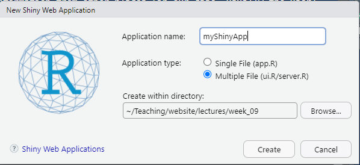
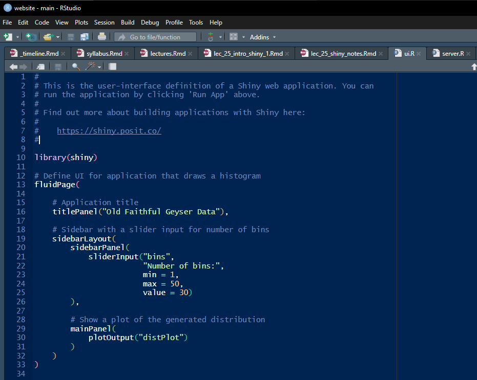
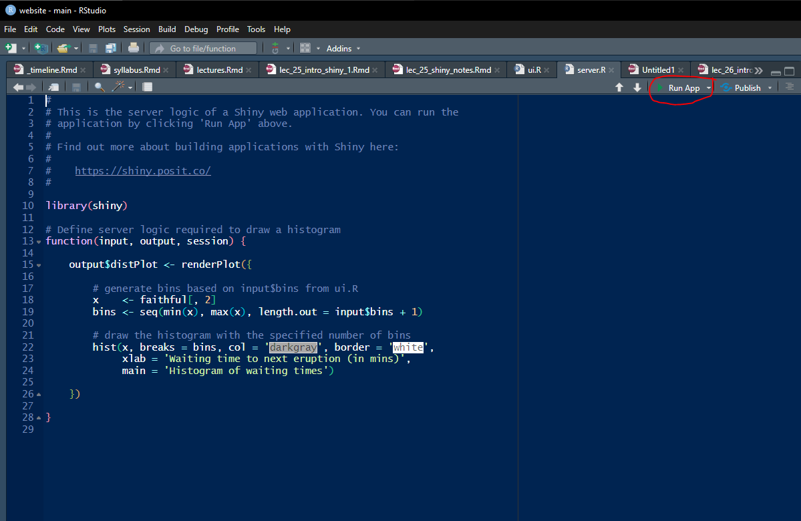
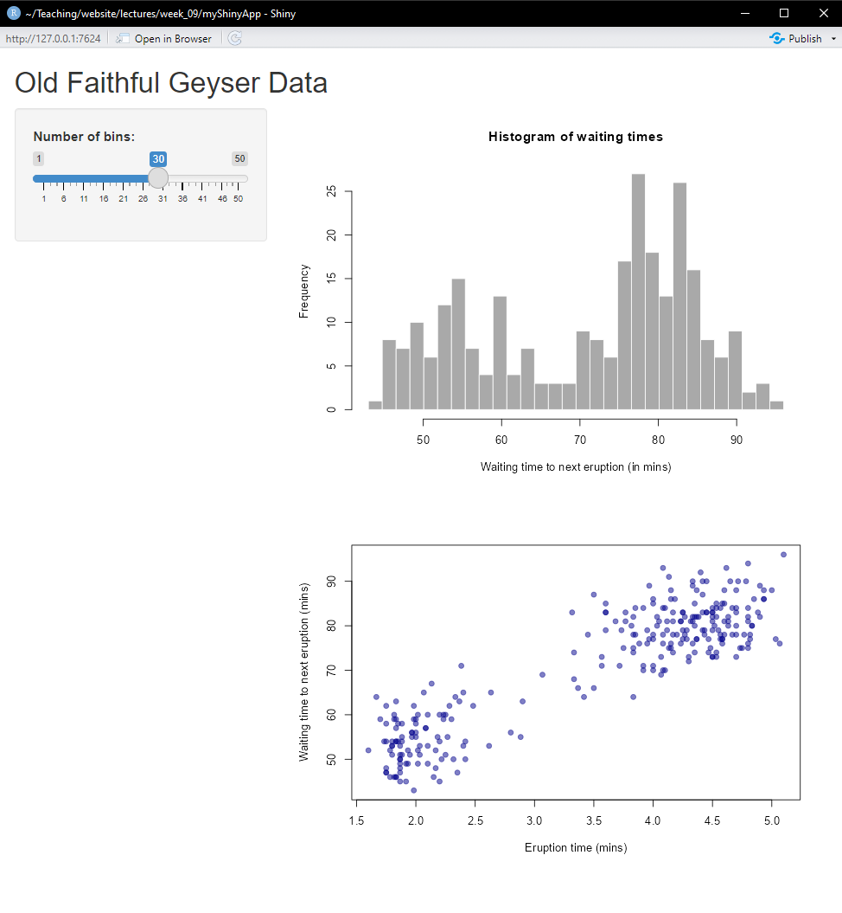
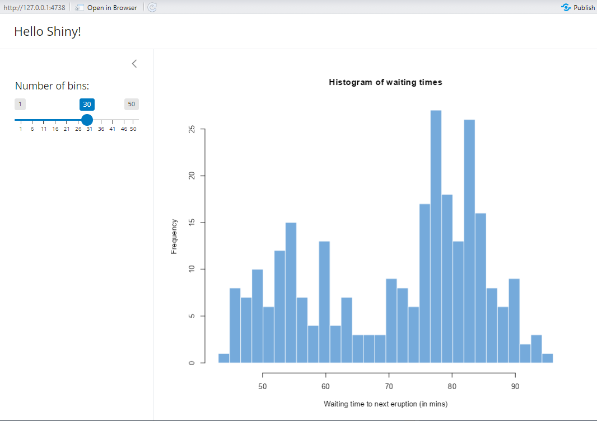
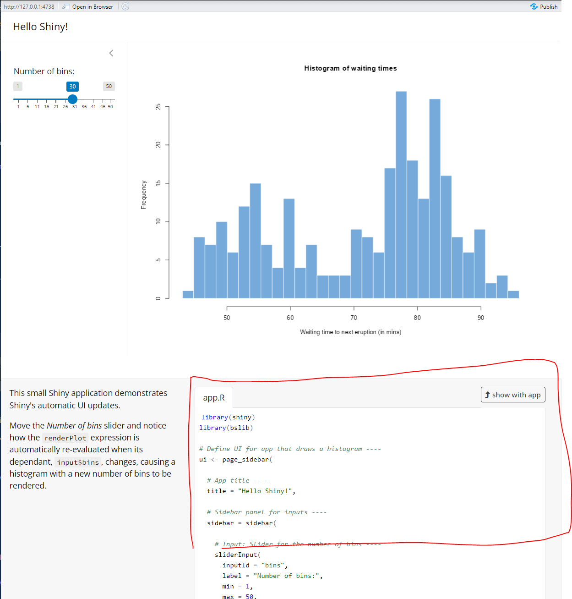

```{r setup, include=FALSE}
knitr::opts_chunk$set(echo = TRUE)
```

<br>

# Lecture 25 (Day 1): Intro to Shiny apps

## What is Shiny?

Shiny apps are not your standard websites!

- Most web pages are a set of static pages that you navigate with links (like this course website!)
- Shiny apps are *reactive* apps, which receive packets of information from other places (in our case, the user-- but it could be other things like databases) and respond to those packets of information in real time.
- Shiny apps are composed of elements (often called *widgets*) that the user interacts with.
- `shiny` is an R package that helps you write Shiny apps. 


- Production-ready apps must be deployed on a server. Posit provides free server instances for Shiny users, but this can also be an instance hosted by your institution. 
- You can also use Shiny to capture the logic within the app and use it to return code that will reproduce certain outputs ([shinymeta](https://github.com/rstudio/shinymeta))
- More on this later, but Shiny apps can also be embedded in things like RMarkdown documents.

***

## Creating a Shiny app


<div class="boxy boxy-blue boxy-clipboard-list">
**Task:** Go to a new RStudio window and go to File --> New File --> Shiny web app. You'll get a pop-up window that asks you to choose an app name and a directory.
</div>

<br>

{ width=90% }

<div class="boxy boxy-blue boxy-clipboard-list">
**Task:** Pick your app name and `Multiple File` and click 'Create'.
</div>

<div class="boxy boxy-orange boxy-lightbulb">
**Note:** The distinction between the 'Multiple File' and 'Single file' options is purely a matter of how you like to work. This choice will not affect functionality.
</div>


-  You will see two scripts, "ui.R" and "server.R".
-  These files are automatically populated with code for a dummy app- sometimes the easiest way to build an app is to start with these building blocks and start changing elements to get the functionality you want. 
-  From either file, you can click "Run App" and it will open a window with the app as it would appear. This button is the equivalent of a call to `runApp()` in the console. 

{ width=90% }

<br>

<div class="boxy boxy-success boxy-check">
**Success:** Voila! You have rendered your first app. As you're building your app, you will end up pressing this button many...many times.
</div>

{ width=90% }


## Adding an element

Now that you have a template shiny app set up, you can build on it!

<div class="boxy boxy-blue boxy-clipboard-list">
**Task:** Let's add a plot element to this app called `EruptionScatter`. Go to server.R and add this to the server:
</div>

```{r eval= FALSE}

  output$EruptionScatter <- renderPlot({
      
      # just a little scatterplot
      plot(faithful$eruptions,faithful$waiting, 
           pch = 19,col = scales::alpha("darkblue",0.5),
           xlab = "Eruption time (mins)", ylab = "Waiting time to next eruption (mins)")
    })
    
```

When you click "Render App", it doesn't appear in the app! Why not? Because we also need to put it in the UI in order for it to appear. After you have been writing code all day, the easiest oversights to make are calling something the wrong type of `render` object or putting something in the server but forgetting to add it to the ui.

<div class="boxy boxy-blue boxy-clipboard-list">
**Task:** You have to tell R what type of output object it is. Add the element `EruptionScatter` to the ui, so that your `mainPanel` section looks like this:
</div>

```{r eval=FALSE}
 mainPanel(
            plotOutput("distPlot"),
            plotOutput("EruptionScatter")
        )
```

<div class="boxy boxy-orange boxy-lightbulb">
**Note:** In order for something to appear in your app, it must be in the ui.R. 
</div>

When you click "Run App," yay! Your new plot element has appear in the UI.

{ width=90% }


<br>

# Lecture 26 (Day 2): Building out and deploying Shiny apps

## Leaflet maps in Shiny

Leaflet makes maps you can serve as standalone HTMLs. You can also embed them in:

- Markdown or Quarto 
- Shiny

They're very flexible! And they're interactive.


## Display modes

Shiny has different display modes. 

### Normal display

The default is `display.mode = "normal"` which returns the usual Shiny looking interface:



### Showcase display

But you can also use `display.mode = "showcase"`, which shows the source code for the app alongside the content. This can be nice for teaching!



## Embedding a Shiny app in a Markdown document

You can embed a Shiny app in a Markdown / Quarto page. 

A Markdown document with shiny widgets and outputs is called an "interactive document."

To make a Markdown document interactive, you add the following to the yaml header:

```{r eval = FALSE}
---
runtime: shiny
output:html_document
---
```


You can do it with an inline definition, like this:

```{r, eval=FALSE}
library(palmerpenguins)
library(ggplot2)
library(shiny)
shinyApp(

  ui = fluidPage(
    selectInput("species", "Species:",
                choices = unique(penguins$species)),
    plotOutput("penguinPlot")
  ),

  server = function(input, output) {
    output$penguinPlot = renderPlot({
      p1 <- ggplot(penguins, aes(x=bill_length_mm, y= bill_depth_mm, color = species)) +
        geom_point() +
        scale_color_brewer(palette = "Dark2") +
        ylab("Bill depth (mm)") +
        xlab("Bill length (mm)")
      p1
    })
  },

  options = list(height = 500)
)
```

To get an embedded app that looks like this:
```{r, echo=FALSE}
library(palmerpenguins)
library(ggplot2)
library(shiny)
shinyApp(

  ui = fluidPage(
    selectInput("species", "Species:",
                choices = unique(penguins$species)),
    plotOutput("penguinPlot")
  ),

  server = function(input, output) {
    output$penguinPlot = renderPlot({
      p1 <- ggplot(penguins, aes(x=bill_length_mm, y= bill_depth_mm, color = species)) +
        geom_point() +
        scale_color_brewer(palette = "Dark2") +
        ylab("Bill depth (mm)") +
        xlab("Bill length (mm)")
      p1
    })
  },

  options = list(height = 500)
)
```

You can also call a Shiny app defined in another directory; it would look like this:

```{r eval=FALSE}
library(shiny)
shinyAppDir(
  system.file("examples/01_hello", package="shiny"),
  options = list(width = "100%", height = 700)
)
```

Note that "showcase mode" (the shiny interface that shows both ui and code at the same time) won't work in Markdown docs.

# Gallery of fun Shiny apps `r emoji::emoji("art")`

Sam Czik's hiking/biking [Strava dashboard](https://samanthacsik.shinyapps.io/strava_dashboard/) (leaflet + flexdashboard)

A cool example of how to use Shiny instead of a lengthy paper appendix to illustrate a point: [Beyond Temperature](https://heatherwelch.shinyapps.io/beyond_temperature/) from the paper *Projecting marine species range shifts from only temperature masks climate vulnerability* by Jennifer McHenry, Heather Welch, Sarah E. Lester, and Vincent Saba

[tidytuesday.rocks](https://nsgrantham.shinyapps.io/tidytuesdayrocks/) by Neal Grantham aggregates #TidyTuesday entries from the internet (and it uses an API!) 

[Sentify](https://rcharlie.shinyapps.io/sentify/) provides effective data viz on large datasets. By Charlie Thompson

A whole gallery of great apps, complete with source code (and a great way to get recognized for your Shiny work!) All the submissions are [here](https://community.rstudio.com/c/shiny/shiny-contest/30) and the winners from the last contest (2021) are [here](https://posit.co/blog/winners-of-the-3rd-annual-shiny-contest/).

## Apps I talked about during Mon/Wed lectures

Novel-gazing, for analyzing your goodreads shelves as if they are ecological communities: https://msiple.shinyapps.io/NovelGazingApp/

[Adopt Don't Shop](https://forum.posit.co/t/adopt-dont-shop-2020-shiny-contest-submission/59166) has sadly been deprecated because the shelter changed their website!

# Resources

- [shiny.posit.co](https://shiny.posit.co/) has great resources for building and deploying Shiny apps in both R and Python(!). 

- Appsilon's virtual Shiny Conference is April 9-11 2025 ([free registration link](https://www.shinyconf.com/))

- [Official Shiny cheatsheet](https://shiny.posit.co/r/articles/start/cheatsheet/)

- [Mastering Shiny](https://mastering-shiny.org/) by Hadley Thee Wickham 

- Colin Fay has several [talks](https://colinfay.me/talks-publications/) on Shiny app workflow and production

## User experience (UX)

Since you're at UW, you can take advantage of UW IT's *UX testing consultations*: [https://uxdesign.uw.edu/consultations.html](https://uxdesign.uw.edu/consultations.html)


## Pilot testing

- if your institution doesn't have UX resources, design pilot testing so that you get helpful feedback on UX:
  - [18F Methods](https://methods.18f.gov/validate/) and [Maze](https://maze.design/guides/usability-testing/questions/) have great lists of testing questions and methods
  - 18F Methods also has an [example agreement](https://methods.18f.gov/participant-agreement/) for testers
  - Depending on the final format, places like  [UsabilityHub](https://usabilityhub.com/) have interfaces that will provide data on clicks and scrolling behavior when testing is remote
  - Check accessibility using the app's URL using the [Web Accessibility Evaluation (WAVE) Tool](https://wave.webaim.org/)