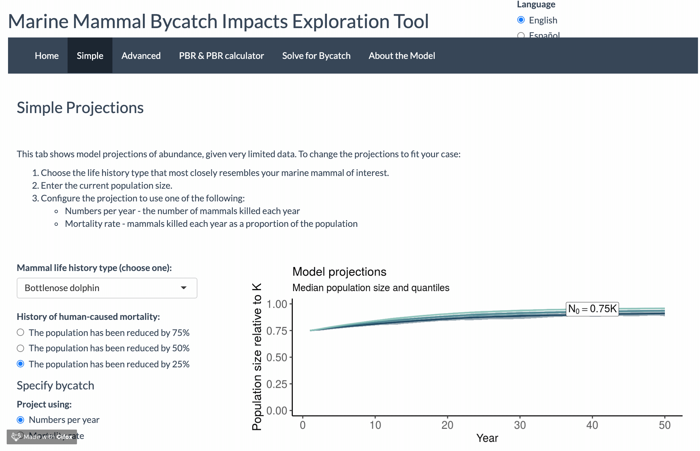
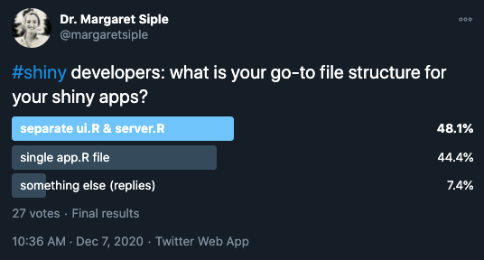
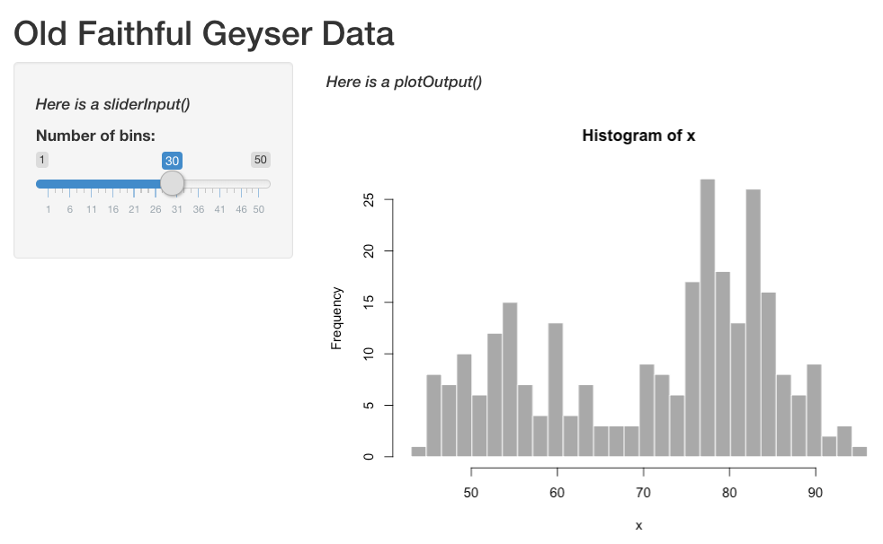

```{r xaringan-themer, include=FALSE, warning=FALSE}
library(xaringanthemer)
style_mono_accent(
  base_color = "#2a5674",link_color = "forestgreen",
  header_font_google = google_font("Source Sans Pro"),
  text_font_google   = google_font("Source Sans Pro", "500", "500i"),
  code_font_google   = google_font("Fira Mono"),
  code_font_size = "0.7rem"
)
##d1eeea,#a8dbd9,#85c4c9,#68abb8,#4f90a6,#3b738f,#2a5674
```

class: center, middle

# Hello! 

---

# Introductions

I am Margaret Siple (I go by Megsie) and I work at NOAA's Alaska Fisheries Science Center in the Groundfish Assessment Program. I live in Beacon Hill with two cats, Molly and Loki.

.pull-left[

]
.pull-right[
  
]

---

# Work and research

INSERT VIDEO OF AKP!

---

# A note about public resources in this presentation

<mark>Many components of this work were made possible by public resources, including 18F. </mark>


---

# Why I learned Shiny


.caption[
**Image:** Jeff Moore
]

---

# Why I learned Shiny




---

# My team at AFSC uses many FISH 549 skills

.pull-left[
**FISH 549 learning goals**

- Using GitHub

- Documenting data

- Using SQL to query databases

- Writing unit tests

- Creating packages and writing unit tests

- Using Markdown to create documentation
]

.pull-right[
**GAP Activities**

`r emoji::emoji("white_check_mark")` We use GH daily, including to [plan survey deployment](https://github.com/afsc-gap-products)

`r emoji::emoji("white_check_mark")`[Documenting data is the story of our lives](https://afsc-gap-products.github.io/gap_products/)

`r emoji::emoji("white_check_mark")`We store bottom trawl survey data in a SQL database

`r emoji::emoji("white_check_mark")`Interior and public packages use unit tests and CI (e.g., [`coldpool`](https://github.com/afsc-gap-products/coldpool))

`r emoji::emoji("white_check_mark")`We use Markdown for software dx, reproducible reports([Bering Sea](https://github.com/afsc-gap-products/gap_bs_data_report), [Gulf of Alaska/Aleutian Islands](https://github.com/MargaretSiple-NOAA/goa-ai-data-reports)), and more 
]


---

# Introductions - FIX LINK

[Here](https://www.menti.com/alhsjbv7aqsq) is a brief poll so I can get to know you.


---

class: center, middle

<sub><sup>Photo: Shaya Lyon</sup></sub>

---

# Applied fisheries management can be like playing music

Each musician has areas where they’re very specialized, and areas where they are clueless

--

What we do is a combination of highly technical skilled work, creativity and multitasking

--

We’re all working together to try to make a big, beautiful thing happen 

---

## To successfully provide scientific advice for fisheries management, we need many components to work together:  

 1) Best available science (+ reproducibility)

 2) Well-defined pathways for implementing advice

 3) Trust and communication between researchers and stakeholders

--

### <mark> Shiny can help us do these things *and* create something beautiful that communicates data and models in a new way. </mark>

---

# Outline

1. `shiny` basics - when to use it, what it's good for

--

2. How to make an app
  
--

3. Lessons learned from developing a Shiny app for management advice

--

If you want practice or you learn well from hands-on examples, check out
[https://github.com/mcsiple/shinyoverview](https://github.com/mcsiple/shinyoverview)

--

There are many other things available in the repo that we won't cover today, but examples are included so you can try them on your own:

> 4. *Live-translating your Shiny apps into other languages using `{shiny.18n}`*

> 5. *Using Shiny to teach remotely with `{learnr}`*

> 6. *Generating Markdown reports from Shiny*


---

# What is Shiny?


---

# When is Shiny useful?

When we want to make R code accessible outside of an R or RStudio environment. For example,

--

- teaching people how to use a package

--

- giving non-experts a way to "get to know" models and data

--

- streamlining certain code-intensive activities (like summarizing and communicating simulation outputs)


---

class: center, middle

Shiny can be a little gnarly at first.


---

# Starting a new Shiny app

Install **shiny**:

```{r eval=FALSE, tidy=FALSE}
install.packages("shiny")
```

From The RStudio IDE, pick `New File -> Shiny Web App`

You can choose between single (**app.R**) or multiple files (**ui.R** and **server.R**)

*Does it matter which one you choose?*
>Not really. Some like the organization of having multiple files `r emoji::emoji("shrug")`



---

# Each Shiny app has two components

.pull-left[
The **`ui`** (user interface) object dictates the appearance of the app. For something to appear in your app, it needs to be in the UI. UI functions write HTML. 

If you put in the console:
```{r eval = FALSE}
shiny::titlePanel("Here is a title")
```

It returns this html:
```{r eval = FALSE}
<h2>Old Faithful Geyser Data</h2>
```
]

---

# Each Shiny app has two components

.pull-left[
The **`ui`** (user interface) object dictates the appearance of the app. For something to appear in your app, it needs to be in the UI. UI functions write HTML. 

If you put in the console:
```{r eval = FALSE}
shiny::titlePanel("Here is a title")
```

It returns this html:
```{r eval = FALSE}
<h2>Old Faithful Geyser Data</h2>
```
]

.pull-right[
The **`server()`** function contains rendering expressions that create the objects to display. 

The server function and UI object are passed to the `shinyApp()` function to create a Shiny app object.
]


---

# ui.R

.pull-left[
The ui looks like this (the "interactive" part is highlighted):


```{r eval=FALSE}
ui <- fluidPage(
    titlePanel("Old Faithful Geyser Data"),
    sidebarLayout(
        sidebarPanel(
*            sliderInput("bins",
                        "Number of bins:",
                        min = 1,
                        max = 50,
                        value = 30)),
        mainPanel(
           plotOutput("distPlot"))
    )
)
```
]

.pull-right[
The corresponding ui looks like this:


]

---

# ui.R

The ui code contains the following information: 

1. The UI type 
  - `fluidPage()` puts elements in rows that can include columns `r emoji::emoji("cake")`
  - `navbarPage()` has a navigation bar `r emoji::emoji("file")`

2. Layout elements (`sidebarLayout()` etc.)

3. Theme information (e.g., `{shinythemes}`)

--

4. Output objects (`plotOutput()`, etc.)

5. Input objects (`sliderInput()`,`fileInput()` etc.) - also called "widgets"

*Input objects link the UI to R code that runs on the server.*

<!-- devtools::install_github("hadley/emo") -->
---

# server.R

The server builds a list-like object called `output`. The contents of `output` can be displayed in the ui.

```{r eval= FALSE}
server <- function(input, output) { 
    output$distPlot <- renderPlot({
        # generate bins based on input$bins from ui.R
        x    <- faithful[, 2]
        bins <- seq(min(x), max(x), length.out = input$bins + 1)
        # draw the histogram with the specified number of bins
        hist(x, breaks = bins, col = 'darkgray', border = 'white')
    })
}
```

---

# **ui.R**/**server.R**

The server builds a list-like object called `output`. `output` objects are displayed in the ui. Here is how they are linked:

.pull-left[
```{r eval= FALSE}
server <- function(input, output) {
*    output$distPlot <- renderPlot({
        # generate bins based on input$bins from ui.R
        x    <- faithful[, 2]
        bins <- seq(min(x), max(x), length.out = input$bins + 1)
        # draw the histogram with the specified number of bins
        hist(x, breaks = bins, col = 'darkgray', border = 'white')
    })
}
```
]

.pull-right[
```{r eval=FALSE}
ui <- fluidPage(
    titlePanel("Old Faithful Geyser Data"),
    sidebarLayout(
        sidebarPanel(
            sliderInput("bins",
                        "Number of bins:",
                        min = 1,
                        max = 50,
                        value = 30)),
        mainPanel(
*           plotOutput("distPlot"))
    )
)
```
]
---


# What's on the server?

R code... mostly `r emoji::emoji("stuck_out_tongue_winking_eye")`

--


---

# server.R

- **Rendering functions** (`renderPlot()`, `renderTable()`, etc.)
  - Build a new object to display every time the inputs change

--

- **Reactive expressions** are "lazy" - they don't execute unless they are specifically called to do something. 
  - `reactive()` caches reactive objects so you can access them later in the server logic -- very important!
  - `eventReactive()` creates reactive objects but only when a specific input changes (e.g., a "Fit this model!" button is clicked)

--

- **Observe expressions** are "eager" - they automatically execute when their dependencies change. Expressions like `observe()` can:
  - autopopulate default values in a form
  - change the range for one input based on another input

---

class: center, middle

# lec_25_26_shiny_notes.Rmd

---

class: center, middle

# Lessons learned from developing `mmrefpoints` and its Shiny tool


---

# The long (and rewarding!) path

- The Ocean Modeling Forum's request: a free, online app that would allow stakeholders to do a scenario analysis for a marine mammal stock of their choice
- International Ttarget audience
- Year 1: Consultation with scientists; building and testing the population dynamics model
- Year 1: Consultation with international stakeholders interested in the tool
- Year 2: Show app to actual web developers (humbling `r emoji::emoji("laughing")`)
- Year 2: Testing with students, stakeholders, other scientists, other developers
- Year 3(?): Publish [R package and app](https://joss.theoj.org/papers/10.21105/joss.03888) in JOSS; present finished product


---

# UI is worth your time

Shiny defaults are not the most intuitive / appealing / accessible version they can be.

--

If you are designing an app for management, a good UI is essential.

--

- my #1 tip: if you have time, pilot test with subject matter experts AND users

--

- use UX resources if they are available!

--
  
- if your institution doesn't have UX resources, design pilot testing so that you get helpful feedback on UX:
  - [18F Methods](https://methods.18f.gov/validate/) and [Maze](https://maze.design/guides/usability-testing/questions/) have great lists of testing questions and methods
  - 18F Methods also has an [example agreement](https://methods.18f.gov/participant-agreement/) for testers
  - Depending on the final format, places like  [UsabilityHub](https://usabilityhub.com/) have interfaces that will provide data on clicks and scrolling behavior when testing is remote
  - Check accessibility using the app's URL using the [Web Accessibility Evaluation (WAVE) Tool](https://wave.webaim.org/)

.content-box-blue[UX = user experience.]

---

# Quick poll

What material would you like to cover on Wednesday? 
Poll [here](https://www.menti.com/alhsjbv7aqsq)

---

class: center, middle

# Fin!

### contact

`r emoji::emoji("email")`: margaret.siple@noaa.gov
`r emoji::emoji("cloud")`: @mcsiple on BlueSky

#### **More Shiny resources:**

[Mastering Shiny](https://mastering-shiny.org/) by Hadley Thee Wickham 

Colin Fay has several [talks](https://colinfay.me/talks-publications/) on Shiny app workflow and production

We love a [cheatsheet](https://shiny.rstudio.com/images/shiny-cheatsheet.pdf)


#### Today's code treat `r emoji::emoji("food")`

Put emoji in your GitHub commits by using the `::` syntax, e.g., 
`git commit -m this code is still growing :seedling:`
Emoji options at [gitmoji.dev](https://gitmoji.dev/)


***

Slides created using the R package [**xaringan**](https://github.com/yihui/xaringan).

