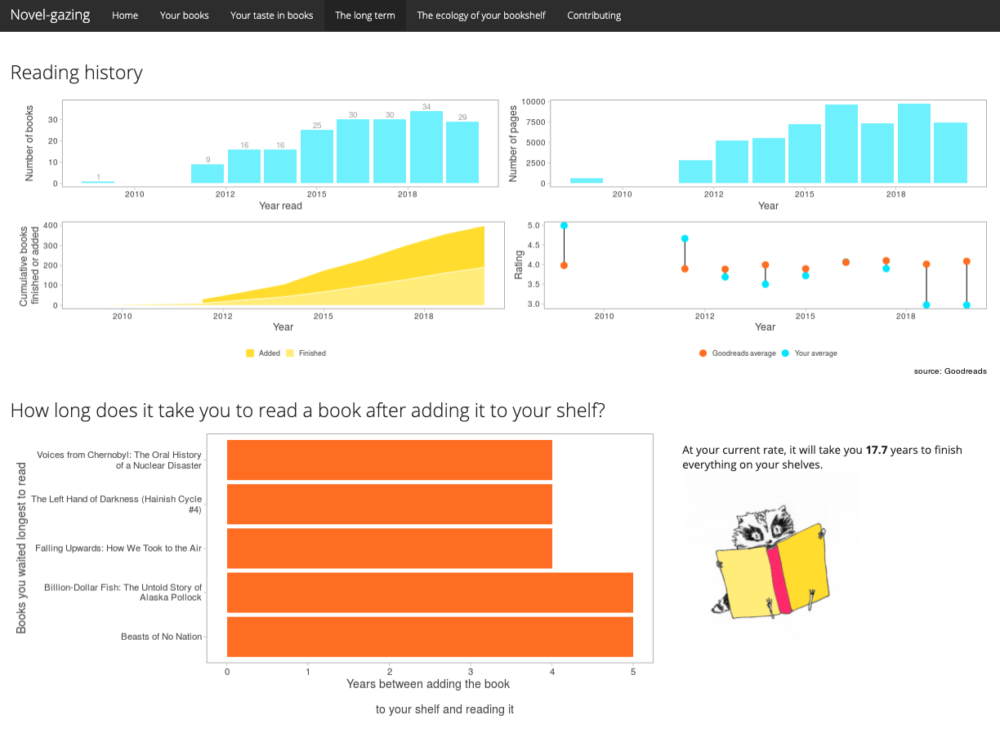

class: center, middle

# Hello again! 


---

# On Monday we talked about

- How to know when a Shiny app is the right tool for the job

--

- How to build a basic Shiny app and get data in and out


---

# Today (Wednesday) we will cover

- Deploying your Shiny app

--

- Building cool/interactive maps using `{leaflet}`

--

- Using Shiny to make a tutorial in `{learnr}`

--

- ...and then we'll just gaze at some great apps


---

# Deploying your Shiny app

## Deploy to the cloud
- Sign up for a free shinyapps.io account

- Install `{rsconnect}` 

- Configure `rsconnect` to use your account using a token from your shinyapps.io account:


---

# Deploying your Shiny app

## Deploy to the cloud
- If you add a new token and click 'show', you'll get instructions for how to configure `rsconnect` 

- Configure your rsconnect installation. This will link your shinyapps.io account to your local environment:

```{r eval=FALSE}
library(rsconnect)
setAccountInfo(name="<ACCOUNT>", token="<TOKEN>", secret="<SECRET>")`
```

- You can deploy from within RStudio by clicking the 'Publish' button in the RStudio IDE, or use the console:

```{r eval=FALSE}
deployApp(server = "shinyapps.io")`
```

- woo!

---

# Deploying your Shiny app 2

## Other options for deployment

- Deploy to an RStudio Connect account (local, commercial option)

- Publish on Shiny Server (local, open source)

---

# Getting credit for your Shiny development

If you've put a lot of time into making a Shiny app, you should get credit! 
The publication/credit avenues are unconventional for Shiny apps, but they DO exist.

- Publish as a package in an open source software journal (e.g., [JOSS](https://joss.theoj.org/) ) (check out the `{golem}` pkg for structuring your files and streamlining production) `r emo::ji("package")`

- Publish code straight from GitHub with a DOI from Zenodo ( [here](https://www.rinproduction.com/en/posts/005-8-tips-for-a-production-ready-shiny-application/) are some good tips for preparing your app for production )

- (for "just for fun" apps): submit your Shiny app to the RStudio [Shiny contest](https://community.rstudio.com/t/shiny-contest-2020-is-here/51002)
<!-- see if you can get some data on citation rates for JOSS vs zenodo github entry -->

---

# Maps in Shiny with `leaflet`

Leaflet is an open-source JavaScript library that makes interactive maps.

It's *very cool*! And the `leaflet` R package integrates well with Markdown files and Shiny apps so you can show spatial data.

It gets fancy very fast. [Here](https://rstudio.github.io/leaflet/) is the guide for using `leaflet` in R and integrating it with Shiny.

---

class: center, middle

# 0n_maps/app.R


---

class: center, middle, inverse

# `learnr` demo


---

class: center, middle, inverse

# Some cool Shiny apps

A cool example of how to use Shiny instead of a lengthy paper appendix to illustrate a point: [Beyond Temperature](https://heatherwelch.shinyapps.io/beyond_temperature/) by Jennifer McHenry, Heather Welch, Sarah E. Lester, and Vincent Saba

A use of Shiny to aggregate useful stuff (and it uses an API!): [tidytuesday.rocks](https://nsgrantham.shinyapps.io/tidytuesdayrocks/) by Neal Grantham

Use Shiny to provide effective data viz on large datasets: [Sentify](https://rcharlie.shinyapps.io/sentify/) by Charlie Thompson

---

class: center, middle


---

class: center, middle



---

class: center, middle

# Fin!

### contact

`r emo::ji("email")`: mcsiple@gmail.com
`r emo::ji("bird")`: @margaretsiple

### **More Shiny resources:**

[Mastering Shiny](https://mastering-shiny.org/) by Hadley Thee Wickham 

Colin Fay has several [talks](https://colinfay.me/talks-publications/) on Shiny app workflow and production

We love a [cheatsheet](https://shiny.rstudio.com/images/shiny-cheatsheet.pdf)


### Some of my Shiny apps

The [Marine Mammal Bycatch Impacts Exploration Tool](https://msiple.shinyapps.io/mmrefpoints/) (link to paper [here](https://joss.theoj.org/papers/10.21105/joss.03888))

[Novel-gazing](https://msiple.shinyapps.io/NovelGazingApp/) (for Goodreads users) 

[Adopt Don't Shop](https://nsilbiger.shinyapps.io/AdoptDontShop/) (collaboration with Nyssa Silbiger)

***

Slides created using the R package [**xaringan**](https://github.com/yihui/xaringan).
