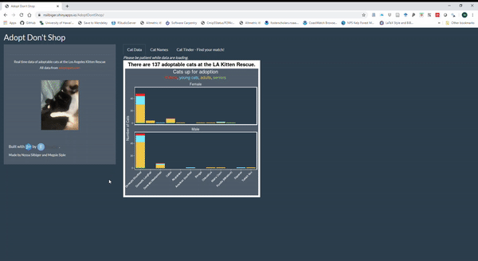

```{r xaringan-themer, include=FALSE, warning=FALSE}
library(xaringanthemer)
style_mono_accent(
  base_color = "#2a5674",
  header_font_google = google_font("Source Sans Pro"),
  text_font_google   = google_font("Source Sans Pro", "500", "500i"),
  code_font_google   = google_font("Fira Mono"),
  code_font_size = "0.7rem"
)
```

```{r setup, include=FALSE, warning=FALSE, message = FALSE}
knitr::opts_chunk$set(warning = FALSE, message = FALSE) 
```

---

# On Monday we talked about

- Shiny: when should we use it?

- How to build a basic Shiny app


---

# Today (Wednesday) we will cover

- Building interactive maps with `{leaflet}` (shiny code example: *website/lectures/week_09/mapExample/*
)

- More basic shiny principles: reactive elements, using modules, etc.

--

- ...and some cool app examples

---

# Maps in Shiny with `leaflet`

Leaflet is an open-source JavaScript library that makes interactive maps.

It's *very cool*! And the [`leaflet`](https://rstudio.github.io/leaflet/articles/leaflet.html) R package integrates well with Markdown files and Shiny apps so you can show spatial data in an interactive way.

It gets fancy very fast.

---

# Demo: mackerel eggs

Basic leaflet code has this 'layered' style:

```{r eval=FALSE}
          library(leaflet)
          library(gamair) # mack dataset (mackerel eggs)
          
          data(mack)
          x <- mack
          fishpal <- RColorBrewer::brewer.pal(6, name = "YlOrRd")
          dat2plot <- mack |>
            dplyr::filter(egg.dens > 0 & !is.na(vessel))
          
          
*          leaflet(data = dat2plot) |>
*            addTiles() |>
*            addCircleMarkers(
*              ~lon, ~lat,
*              radius = ~ egg.dens / 30,
*              color = ~ fishpal,
*              stroke = FALSE,
*              fillOpacity = 0.5
*            ) |>
*            addProviderTiles("Esri.WorldImagery")

```

---

# Demo: mackerel eggs 

```{r eval=TRUE, echo = FALSE}
library(leaflet)
library(gamair) # mack dataset

data(mack)
x <- mack
fishpal <- RColorBrewer::brewer.pal(6, name = "YlOrRd")
dat2plot <- mack |>
  dplyr::filter(egg.dens > 0 & !is.na(vessel))

leaflet(data = dat2plot) |>
  addTiles() |>
  addCircleMarkers(
    ~lon, ~lat,
    radius = ~ egg.dens / 30,
    color = ~ fishpal,
    stroke = FALSE,
    fillOpacity = 0.5
  ) |>
  addProviderTiles("Esri.WorldImagery")

```

--- 

# If you already have a {leaflet} script that generates HTML:

You can show this code inside a Shiny app with the function `renderLeaflet()`


---

class: center, middle, inverse

# website/lectures/week_09/mapExample

---


---

class: center, middle, inverse

# More Shiny basics


---

class: center, middle, inverse

# Some cool Shiny apps


---

# Some cool Shiny apps

A cool example of how to use Shiny instead of a lengthy paper appendix to illustrate a point: [Beyond Temperature](https://heatherwelch.shinyapps.io/beyond_temperature/) by Jennifer McHenry, Heather Welch, Sarah E. Lester, and Vincent Saba

A use of Shiny to aggregate useful stuff (and it uses an API!): [tidytuesday.rocks](https://nsgrantham.shinyapps.io/tidytuesdayrocks/) by Neal Grantham

Use Shiny to provide effective data viz on large datasets: [Sentify](https://rcharlie.shinyapps.io/sentify/) by Charlie Thompson

A whole gallery of great apps, complete with source code (and a great way to get recognized for your Shiny work!) All the submissions are [here](https://community.rstudio.com/c/shiny/shiny-contest/30) and the winners from the last contest (2021) are [here](https://posit.co/blog/winners-of-the-3rd-annual-shiny-contest/).

---

class: center, middle



---

class: center, middle


---

class: center, middle

# Fin

#### Today's Shiny-relevant code treats `r emoji::emoji("pastry")`

`Ctl-P` shortcut jumps to the close parentheses of the statement you're in. Extremely useful for Shiny. 

`r emoji::emoji("rain")` You can also enable rainbow parentheses in Global Options by going to `Code --> Display--> Rainbow parentheses`

#### contact
`r emoji::emoji("email")`: margaret.siple@noaa.gov

If you're developing a Shiny app for a project, I would love to help you! Send me questions, issues, use code from the `shinyoverview` repo, whatever you want!

#### For Friday!
Eli Holmes will introduce Scrum and how to do a Scrum Sprint with GitHub Project pages and GitHub issues.  To prepare, you can watch [**this**](https://www.youtube.com/watch?v=sLK3EHPCw14) ~5-min video on scrum style workflows.


***

Slides created using the R package [**xaringan**](https://github.com/yihui/xaringan).

---

class: center, middle

# Extra slides (deployment & getting credit for your Shiny dev work)

---

# Deploying your Shiny app

## Deploy to the cloud
- Sign up for a free shinyapps.io account

- Install `{rsconnect}` 

- Configure `rsconnect` to use your account using a token from your shinyapps.io account:


---

# Deploying your Shiny app

## Deploy to the cloud
- If you add a new token and click 'show', you'll get instructions for how to configure `rsconnect` 

- Configure your rsconnect installation. This will link your shinyapps.io account to your local environment:

```{r eval=FALSE}
library(rsconnect)
setAccountInfo(name="<ACCOUNT>", token="<TOKEN>", secret="<SECRET>")`
```

- You can deploy from within RStudio by clicking the 'Publish' button in the RStudio IDE, or use the console:

```{r eval=FALSE}
deployApp(server = "shinyapps.io")`
```

- woo!

---

# Deploying your Shiny app 2

## Other options for deployment

- Deploy to an RStudio Connect account (local, commercial option)

- Publish on Shiny Server (local, open source)

---

# Getting credit for your Shiny development

If you've put a lot of time into making a Shiny app, you should get credit! 
The publication/credit avenues are unconventional for Shiny apps, but they DO exist.

- Publish as a package in an open source software journal (e.g., [JOSS](https://joss.theoj.org/) ) (check out the `{golem}` pkg for structuring your files and streamlining production) `r emoji::emoji("package")`

- Publish code straight from GitHub with a DOI from Zenodo ( [here](https://www.rinproduction.com/en/posts/005-8-tips-for-a-production-ready-shiny-application/) are some good tips for preparing your app for production )

- (for "just for fun" apps): submit your Shiny app to the RStudio [Shiny contest](https://community.rstudio.com/t/shiny-contest-2020-is-here/51002)
<!-- see if you can get some data on citation rates for JOSS vs zenodo github entry -->

---
