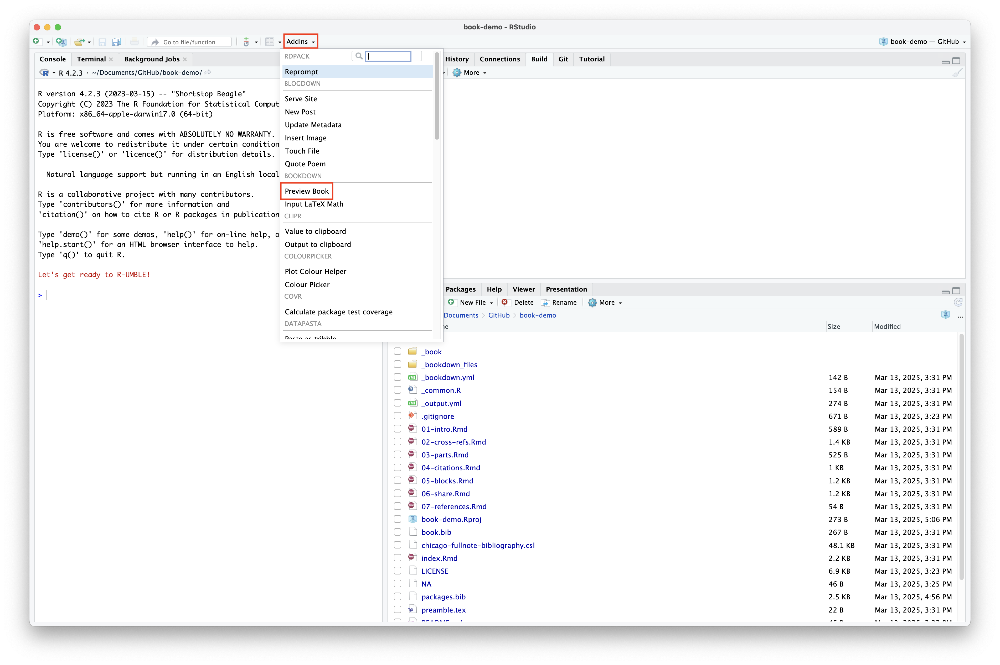
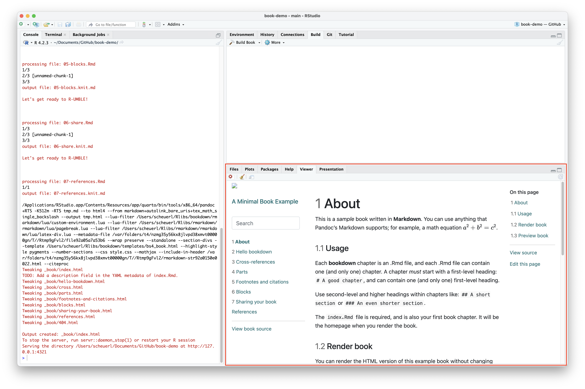

```{r setup, include=FALSE}
knitr::opts_chunk$set(echo = TRUE, message = FALSE)
library(magrittr)
```

***

# Publishing an e-book

Now that we've seen how to create a simple HTML report using R Markdown and display it online, let's build upon those skills and see how to publish an electronic book ("e-book") so that it can be shared with and viewed by others. To do so, we'll make use of the [{bookdown}](https://bookdown.org/) package, which is what Mark uses for his [lab guide](https://scheuerell-lab.github.io/lab-book/index.html). You can see many other examples of different books written with {bookdown} [here](https://bookdown.org/home/archive/).

<div class="boxy boxy-blue boxy-clipboard-list">
**Task:** If you haven't done so already, install the {bookdown} package. Load it when done.
</div>

```{r install_bookdown}
## install bookdown if necessary
## install.packages("bookdown")

## load bookdown
library("bookdown")
```


## Create a new repo

<div class="boxy boxy-blue boxy-clipboard-list">
**Task:** Navigate to GitHub and create a new _public_ repo called `book-demo`. Add a `README.md` file and an R `.gitignore` file as well (you can skip a license file). CLick the green **Create repository** button when you're ready.
</div>


<div class="boxy boxy-blue boxy-clipboard-list">
**Task:** Click on the **Settings** button in the upper right.
</div>


<div class="boxy boxy-blue boxy-clipboard-list">
**Task:** Click on the **Pages** button on the left side.
</div>


<div class="boxy boxy-blue boxy-clipboard-list">
**Task:** Click on the **None** button under the **Branch** heading and swith it to **main**.
</div>


<div class="boxy boxy-blue boxy-clipboard-list">
**Task:** Click on the **/ (root)** button under the **Branch** heading and swith it to **/docs**.
</div>


<div class="boxy boxy-blue boxy-clipboard-list">
**Task:** When you're ready, click on the **Save** button.
</div>


<div class="boxy boxy-success boxy-check">
**Success:** Your repo is now set to use GitHub Pages for displaying HTML files.
</div>


## Create an RStudio project

<div class="boxy boxy-blue boxy-clipboard-list">
**Task:** Create a new project in RStudio from the `book-demo` repo you just created.
</div>

```{r, echo = FALSE, out.width = "70%", fig.align = "center"}

```

<div class="boxy boxy-blue boxy-clipboard-list">
**Task:** Create **another** project in RStudio but this time select the option for **New Directory**.
</div>

```{r, echo = FALSE, out.width = "70%", fig.align = "center"}

```

<div class="boxy boxy-blue boxy-clipboard-list">
**Task:** From the **Project Type** window, select "Book project using bookdown".
</div>

```{r, echo = FALSE, out.width = "70%", fig.align = "center"}

```

<div class="boxy boxy-blue boxy-clipboard-list">
**Task:** Set the directory name and location to anything you'd like (eg, `tmp`). This will be a temporary folder/directory to hold a few files.
</div>

<div class="boxy boxy-blue boxy-clipboard-list">
**Task:** Select `bs4_book` from the dropdown menu for HTML book format.
</div>

```{r, echo = FALSE, out.width = "70%", fig.align = "center"}

```

<div class="boxy boxy-blue boxy-clipboard-list">
**Task:** Check the box for "Open in a new session" and click the **Create Project** button.
</div>

```{r, echo = FALSE, out.width = "70%", fig.align = "center"}

```

<div class="boxy boxy-blue boxy-clipboard-list">
**Task:** Navigate to the temporary project/folder/directory you create above and move **all** of the files **except** the `.Rproj` file to the folder/directory where your `book-demo` project lives.
</div>

```{r, echo = FALSE, out.width = "80%", fig.align = "center"}

```

<div class="boxy boxy-success boxy-check">
**Success:** You now have a template for creating and publishing an HTML e-book!
</div>

```{r, echo = FALSE, out.width = "70%", fig.align = "center"}

```

<div class="boxy boxy-blue boxy-clipboard-list">
**Task:** Click on the **Addins** button at the top of your RStudio window and select "Preview Book" under "BOOKDOWN".
</div>

<div class="boxy boxy-orange boxy-lightbulb">
**Tip:** You can also type `bookdown:::serve_book()` at the command prompt to preview your book.
</div>

```{r, echo = FALSE, out.width = "100%", fig.align = "center"}

```

<div class="boxy boxy-success boxy-check">
**Success:** You can now see a preview of your book in the **Viewer** pane!
</div>

```{r, echo = FALSE, out.width = "100%", fig.align = "center"}

```

<br>

# Editing your book


<br>

# Viewing your document

Now that we've pushed our basic HTML report to GitHub, we should be able to view it online.

<div class="boxy boxy-blue boxy-clipboard-list">
**Task:** Navigate back your `book-demo` repo on GitHub and you'll see the `/docs` folder containing the various HTML and other associated files.
</div>


<div class="boxy boxy-orange boxy-lightbulb">
**Tip:** Recall that GitHub cannot render HTML files in a normal repo, but you can view your book by navigating to `https://USERNAME.github.io/book-demo/` where `USERNAME` is your GitHub username.
</div>


<div class="boxy boxy-success boxy-check">
**Success:** You now have an online book that you can update by making changes in your RStudio project and pushing them to GitHub.
</div>

<div class="boxy boxy-orange boxy-lightbulb">
**Tip:** You can add a link to your newly rendered document by edited the main page of your repo.
</div>

<div class="boxy boxy-blue boxy-clipboard-list">
**Task:** Click on the small gear icon in the upper right, which will bring up a window to edit some aspects of your repo.
</div>


<div class="boxy boxy-blue boxy-clipboard-list">
**Task:** In the **Website** field, type or copy/paste the link to your rendered site, which should be `https://USERNAME.github.io/book-demo/` where `USERNAME` is your GitHub username. Click on the green **Save changes** button when you're done.
</div>


<div class="boxy boxy-success boxy-check">
**Success:** Your repo has now been updated to include a direct link to your properly rendered HTML report.
</div>


